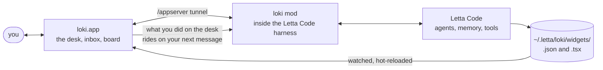

<p align="center">
  
</p>

<h1 align="center">loki</h1>

<p align="center">
  <b>A memory palace your agent builds.</b><br>
  A macOS desk for <a href="https://docs.letta.com">Letta Code</a> agents: live widgets the agent writes as files,
  an inbox of everything waiting on you, a shared task board, flashcards from your conversations, and your phone
  as a remote.
</p>

<p align="center">
  <a href="https://github.com/AlmondLabs/loki/actions/workflows/ci.yml"></a>
  
  
</p>

<p align="center">
  
</p>

Agents talk in text. loki gives yours a desk. Ask for a chart, a checklist, a slider, a plan for the day, and
the agent writes a small file; a second later it is on the desk, and you can drag it, tick it, slide it. What
you did rides along on your next message, so the agent sees the desk the way you left it.

> Not [Grafana Loki](https://grafana.com/oss/loki/), the log system.

Cloned the repo and want it running? Three tools, then two commands:

```bash
xcode-select --install                                              # Xcode's command line tools, once
curl -fsSL https://bun.sh/install | bash                            # Bun
curl --proto '=https' --tlsv1.2 -sSf https://sh.rustup.rs | sh      # Rust; then open a new terminal
bun install && bun start
```

Letta Code need not be installed first: the window uses the `letta` already on your Mac, or installs it with
`npm install -g @letta-ai/letta-code` using the Node you have (`brew install node` if none; Vite and the Tauri CLI
themselves run under Bun). `bun start` says what is missing before it builds. The first start compiles the shell,
a few minutes, and installs Letta Code if need be; the window then asks for a model provider key: one you already
have with Anthropic, OpenAI, Google, OpenRouter, Ollama for local models, or another of the providers Letta Code
connects to. Letta checks the key with the provider and keeps it; loki never sees it, and each turn costs whatever
that provider charges. Everything else, including the Homebrew install of the finished app, is under
[Install](#install) and [Development](#development).

## What you get

| | | |
|---|---|---|
| **Desk** | ⌘1 | One desk per conversation, furnished by the agent: five kit widgets from a line of JSON, or any React component it cares to write. Pan, zoom, arrange, undo. |
| **Inbox** | ⌘2 | Every conversation that is waiting on you, as cards, highest score first: blocked agents, then warm replies to you (their prompt is still cached, so answering now is cheap), then the rest. Approve and reply inline; a reply keeps the card while the answer streams in. ⌥Space opens it from anywhere on the Mac. |
| **Board** | ⌘3 | Tasks for later on one board shared by you and every agent. Select, assign to a desk, or dispatch so the agent starts now. |
| **Agents** | ⌘4 | A page per agent: profile and model, its memory files as a tree, what it learned as a timeline of commits, and its skills with one-click refresh from upstream. |
| **Learn** | ⌘5 | Spaced-repetition cards a background writer distils from quiet conversations, and **leads**: concepts that went by without being understood, each one click from a `[Learn]` lesson the agent teaches on a desk of its own. Off until you switch it on; how often it sweeps and how many cards a day are yours to set. Deleting a card is the feedback. [How it works](docs/learn.md). |
| **Phone** | | The inbox and the desks on your phone over Wi‑Fi or Tailscale, nothing to install: scan a QR, add to the home screen. |

<p align="center">
  
</p>

<p align="center">
  
</p>

## Install

**Homebrew** is the recommended way. Two lines, because loki is not signed with an Apple Developer ID and macOS
calls an unsigned download "damaged" until its quarantine flag is cleared once:

```bash
brew install --cask almondlabs/loki/loki
xattr -dr com.apple.quarantine /Applications/loki.app
```

Upgrades are `brew upgrade --cask loki`, followed by the same `xattr` line.

**The `.dmg`** from the [latest release](https://github.com/AlmondLabs/loki/releases/latest): drag loki to
Applications, then clear the flag once:

```bash
xattr -dr com.apple.quarantine /Applications/loki.app
```

**From source**: Bun, Rust and Xcode's command line tools, then `bun start` to run the checkout, or
`bun run desktop:build` for a `.app` and `.dmg` of your own. A build made on your own Mac never carries the flag.

You need macOS 13 or later. The cask brings Node; the `.dmg` route needs a Node 22 or newer on the Mac
(`brew install node`) only if no `letta` is installed yet. On first launch loki uses the Letta Code already on
your Mac — the same `letta` a terminal runs — or installs it with `npm install -g @letta-ai/letta-code`, asks for
a model provider key (Anthropic, OpenAI, Google, OpenRouter, Ollama and others; you pay that provider, loki never
sees the key), and helps you name your first agent. Then ask it to put something on the desk. If Letta Desktop
or a `letta server` is already running, loki attaches to that harness instead of launching one. loki runs
whatever Letta Code is on the Mac; it was last tested with 0.32.10, and Settings › letta says where yours stands
against that and offers the update.

## Your first widget

Say, in the chat:

> put my runs this week on the desk as a bar chart

The agent writes one file:

```json
// ~/.letta/loki/widgets/<desk>/runs.json
{ "type": "chart-card", "title": "Runs this week",
  "data": { "kind": "bar", "yLabel": "km", "points": [ { "x": "Mon", "y": 5.2 }, { "x": "Wed", "y": 8.1 } ] } }
```

and the chart is on the desk before the reply finishes. Five kit widgets need only JSON (`stat`, `list-card`,
`chart-card`, `slider-control`, `info-card`); anything else is a `.tsx` file with a default-exported React
component. Editing the file changes the widget; deleting it removes it. The [skill](skills/loki/SKILL.md)
the agent reads is the whole contract.

## How it works



Three parts, one repo: a **Letta mod** that runs inside the harness and owns the files, a **Rust shell** that
finds or installs Letta Code, launches or attaches to the harness and hosts the window, and a **React app** that
renders the desk. The mod streams conversations to the app through a tunnel, the app watches the widget files
through Vite, and your gestures on the desk go back to the agent as context on the next turn. Every Letta
harness on the Mac loads the mod, but only the one hosting an app-server serves the desk; a terminal `letta`
session logs one line and stands down. Nothing leaves your machine except your messages to the provider you
chose. [docs/architecture.md](docs/architecture.md) has the long version.

## Layout

```text
mod/            Letta mod, plain TypeScript; boot.ts bundles it fresh on each /reload (no manual build)
core/           desk-core (types + the pure gesture reducer both halves use), attention, recall — portable, no browser globals
app/            Vite + React canvas
skills/loki/    the vocabulary the agent reads (kit types, .tsx contract, rules)
src-tauri/      the macOS shell (Rust): finds or installs Letta Code, launches or attaches to the harness, hosts the canvas
scripts/        build-mod (the bundle the app ships), harness (run the mod without Letta), cask (Homebrew)
test/           bun tests
docs/           the manual, learn (the mental model), architecture, design direction, dated plans; CONTRIBUTING, SECURITY and RELEASING
```

## Development

You need [Bun](https://bun.sh), Rust from [rustup](https://rustup.rs) (stable; open a new terminal after installing
it) and Xcode's command line tools (`xcode-select --install`). Not Letta Code: the window uses the `letta` on
your Mac or installs it with npm on first launch, the same way the app does (that needs a Node 22 or newer
somewhere; Vite and the Tauri CLI themselves run under Bun). On a Mac that has never run loki, `bun start`
also points Letta at your checkout — a shim at `~/.letta/mods/loki.ts` importing `mod/boot.ts`, and
`~/.agents/skills/loki` as a symlink to `skills/loki` — and leaves anything already there alone.

```bash
bun install
bun start                                         # Vite on 127.0.0.1:5173 plus the Tauri window; Ctrl-C stops both
bun run dev                                       # Vite alone, for a browser tab
bun run desktop:dev                               # the Tauri window against a Vite already running
bun test && bun run typecheck && bun run lint     # bun tests, tsc, eslint (typescript-eslint + React compiler rules)
cargo test --manifest-path src-tauri/Cargo.toml   # the shell
bun run desktop:build                             # the .app and .dmg
```

The app is built with the React Compiler, so memo boundaries hold without hand-written `useCallback`;
`LOKI_COMPILER_LOG=1 bun run build:app` lists what it declined to compile. In development, `?scan` on the dev
URL loads React Scan and outlines every needless re-render. To point a running Letta at your checkout instead
of the installed mod, see the manual's [Install (development)](docs/manual.md#install-development).

## Read on

- [The manual](docs/manual.md): every view, every key, every file loki writes.
- [Learn](docs/learn.md): the mental model for the card writer, leads and lessons, and what a sweep costs.
- [Architecture](docs/architecture.md): Letta's four layers and the journey of a message.
- [Design](docs/design.md): a drafting table at night, and the token contract that keeps it so.
- [Contributing](docs/CONTRIBUTING.md), [Security](docs/SECURITY.md), [Releasing](docs/RELEASING.md).

Two rules hold everywhere: no real money amounts on screen, in the repo or in recordings, ever; and widget code
runs with the page's full trust, because this is your machine and your agent, not a sandbox.

## Licence

Apache-2.0. See [LICENSE](LICENSE).
