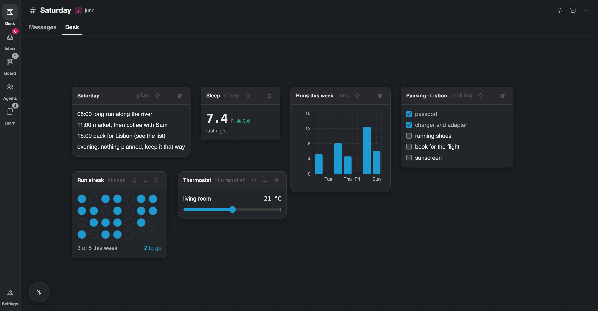
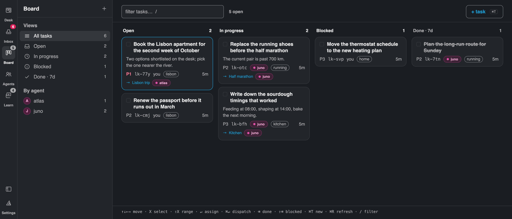
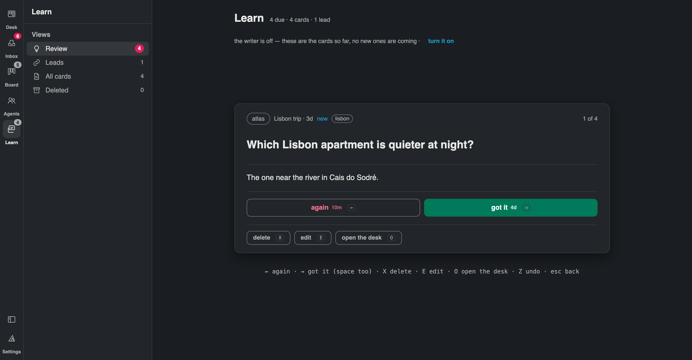
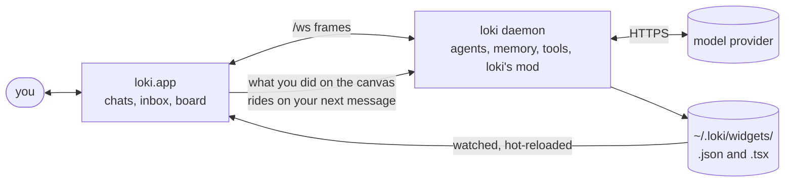

<p align="center">
  
</p>

<h1 align="center">loki</h1>

<p align="center">
  <b>A memory palace your agent builds.</b><br>
  Your own AI agents on macOS, with Windows and Linux in preview, each chat with a canvas:
  live widgets the agent writes as files, an inbox of everything waiting on you, a shared task board, flashcards
  from your conversations, and your phone as a remote.
</p>

<p align="center">
  <a href="https://github.com/AlmondLabs/loki/actions/workflows/ci.yml"></a>
  
  
  
</p>

<p align="center">
  
</p>

Agents talk in text. loki gives yours a canvas. Ask for a chart, a checklist, a slider, a plan for the day, and
the agent writes a small file; a second later it is on the canvas, and you can drag it, tick it, slide it. What
you did rides along on your next message, so the agent sees the canvas the way you left it.

> Not [Grafana Loki](https://grafana.com/oss/loki/), the log system.

Cloned the repo and want it running on a Mac? Four tools, then two commands (Windows and Linux need other
tools first; see [Development](#development)):

```bash
xcode-select --install                                              # Xcode's command line tools (and git), once
brew install node                                                   # Node 22.19 or newer, for loki's daemon
curl -fsSL https://bun.sh/install | bash                            # Bun
curl --proto '=https' --tlsv1.2 -sSf https://sh.rustup.rs | sh      # Rust; then open a new terminal
bun install && bun start
```

loki runs its agents in its own daemon, a Node process the window starts; that is what Node is for (Vite and the
Tauri CLI themselves run under Bun). git keeps each agent's memory. `bun start` says what is missing before it
builds. The first start compiles the shell, a few
minutes; the window then asks for a model provider: an API key you already have with Anthropic, OpenAI, Google,
OpenRouter, Ollama for local models, or another provider, or signing in with ChatGPT. loki checks the key with the
provider and keeps it in your system's keychain; each turn costs whatever that provider charges. Everything else,
including the Homebrew install of the finished app, is under [Install](#install) and [Development](#development).

## What you get

| | | |
|---|---|---|
| **Chats** | ⌘1 | One chat per conversation, its canvas furnished by the agent: five kit widgets from a line of JSON, or any React component it cares to write. Chats sit in a Slack-style sidebar (Pinned, one section per agent, Archived) and open like a channel: **Messages** is the conversation, with a line each time a widget changes; **Canvas** holds the widgets, to pan, zoom, arrange, undo. ⌘K finds any chat, agent or page. |
| **Inbox** | ⌘2 | Every chat you haven't archived, as cards, highest score first: blocked agents, then what's new, then the chats you have been working in, learned from what you do (a task you move on from fades on its own). Approve and reply inline; a reply keeps the card while the answer streams in. **Next** moves on and the chat comes back next visit; **Archive** is done. ⌥Space opens it from anywhere on the Mac. |
| **Board** | ⌘3 | Tasks for later on one board shared by you and every agent. Select, assign to a chat, or dispatch so the agent starts now. |
| **Agents** | ⌘4 | Your agents listed like Slack's direct messages, with live state and what waits on you. Each has a profile and model, its memory files as a tree, what it learned as a timeline of commits, its reflection settings, and its skills with one-click refresh from upstream. |
| **Learn** | ⌘5 | Spaced-repetition cards a background writer distils from quiet conversations — only concepts and knowledge that last, never the details of a task — and **leads**: concepts that went by without being understood, each one click from a `[Learn]` lesson the agent teaches in a chat of its own. Off until you switch it on; how many cards a day is yours to set. Deleting a card is the feedback. [How it works](docs/learn.md). |
| **Phone** | | The inbox, every chat, your agents and Learn on your phone, in Slack's mobile layout, over Wi‑Fi or Tailscale, nothing to install: scan a QR, add to the home screen. Viewed and read agree with the Mac. Mac only for now. |

Keys are written the Mac's way. On Windows and Linux ⌘ is Ctrl and ⌥ is Alt, and loki shows them that way; the
phone, ⌥Space, dictation and the menu-bar item are not there yet ([the manual](docs/manual.md#windows-and-linux)
lists what differs).

<p align="center">
  
</p>

<p align="center">
  
</p>

## Install

**Homebrew** is the recommended way. Two lines, because loki is not signed with an Apple Developer ID and macOS
calls an unsigned download "damaged" until its quarantine flag is cleared once:

```bash
brew install --cask almondlabs/loki/loki
xattr -dr com.apple.quarantine /Applications/loki.app
```

Upgrades are `brew upgrade --cask loki`, followed by the same `xattr` line. Versions are dates: `2026.9.28` is
the stable that shipped on that day.

**Nightly**, if you want every merge about twenty minutes after it lands (Mac only; one loki at a time, so this
replaces the stable install; `brew uninstall --cask loki` first, or the other way round to go back):

```bash
brew install --cask almondlabs/loki/loki-nightly
xattr -dr com.apple.quarantine /Applications/loki.app
```

**The `.dmg`** from the [latest release](https://github.com/AlmondLabs/loki/releases/latest): drag loki to
Applications, then clear the flag once:

```bash
xattr -dr com.apple.quarantine /Applications/loki.app
```

**From source**: Bun, Rust and Xcode's command line tools, then `bun start` to run the checkout, or
`bun run desktop:build` for a `.app` and `.dmg` of your own. A build made on your own Mac never carries the flag.

**Windows and Linux are a preview:** built and tested in CI, not yet tried on real machines. They come on stable
releases only, published on their own, before or after the `.dmg` of the same version, so a release may carry the
Mac's file, the Windows and Linux files, or both (nightlies are Mac-only). Please [report what you find](https://github.com/AlmondLabs/loki/issues)
([what to try](docs/preview-checklist.md)).
Like the Mac's, these files are unsigned, so each system asks for one extra step the first time.

**Windows** (64-bit Windows 10 or 11), `loki_<version>_x64-setup.exe` from the newest
[release](https://github.com/AlmondLabs/loki/releases) that has one:

1. Run it. SmartScreen says "Windows protected your PC" (an unknown publisher): choose **More info**, then
   **Run anyway**.
2. Finish the installer and open loki from the Start menu.

**Linux** (64-bit, built on Ubuntu 22.04 so it runs on newer releases too). On Debian or Ubuntu, the `.deb`:

```bash
sudo apt install ./loki_*_amd64.deb
```

On any other distribution, the AppImage, which needs its executable bit and FUSE 2 (`libfuse2`; on Ubuntu 24.04 the package is
`libfuse2t64`):

```bash
sudo apt install libfuse2
chmod +x loki_*_amd64.AppImage && ./loki_*_amd64.AppImage
```

On both, upgrades are the next file from the releases page; Settings › loki links the one for your system when a
newer release carries it. There is no Homebrew, winget or Flatpak package yet.

You need macOS 13 or later, 64-bit Windows 10 or 11, or a current 64-bit desktop Linux, and:

1. **Node 22.19 or newer**, which runs loki's daemon. The cask brings it; for the `.dmg`, Windows and Linux,
   install one yourself (`brew install node`, `winget install OpenJS.NodeJS.LTS`, or your distribution's
   package). loki never downloads Node; if it finds none new enough, Welcome says what to run and checks again.
2. **git**, which keeps each agent's memory as a repo with history (Xcode's command line tools bring it on a Mac).
3. **bd** ([beads](https://github.com/steveyegge/beads)), optional, for the board.

On first launch loki asks for a model provider: an API key (Anthropic, OpenAI, Google, OpenRouter, Ollama and
others) or signing in with ChatGPT. Anthropic's subscription sign-in is not offered; use an Anthropic API key. The
key is checked with the provider and kept in your system's keychain, and you pay that provider for what you use.
Then loki helps you name your first agent; ask it to put something on the canvas.

### Coming from Letta

loki used to run on Letta Code. On a Mac that ran it there, the first start brings your agents over by itself:
each agent with its memory and its history, every conversation under its old id (so canvases, pins and board tasks
still find it), your provider keys, permission modes, folders and scheduled tasks. Quit Letta first; the import
refuses while it runs and tries again at the next start, or from Settings › loki › Import. Letta's own files are
only read, never changed, and the import can run again to pick up what is missing. loki's folder moves from
`~/.letta/loki` to `~/.loki` on its own, with a link left at the old path.

## Your first widget

Say, in the chat:

> put my runs this week on the canvas as a bar chart

The agent writes one file:

```json
// ~/.loki/widgets/<desk>/runs.json   (<desk> is the chat's id)
{ "type": "chart-card", "title": "Runs this week",
  "data": { "kind": "bar", "yLabel": "km", "points": [ { "x": "Mon", "y": 5.2 }, { "x": "Wed", "y": 8.1 } ] } }
```

and the chart is on the canvas before the reply finishes. Five kit widgets need only JSON (`stat`, `list-card`,
`chart-card`, `slider-control`, `info-card`); anything else is a `.tsx` file with a default-exported React
component. Editing the file changes the widget; deleting it removes it. The [skill](skills/loki/SKILL.md)
the agent reads is the whole contract.

## How it works


```mermaid
flowchart LR
  you([you]) <--> app[loki.app<br/>chats, inbox, board]
  app <-->|"/ws frames"| daemon[loki daemon<br/>agents, memory, tools, loki's mod]
  daemon <-->|HTTPS| provider[(model provider)]
  daemon --> files[("~/.loki/widgets/<br/>.json and .tsx")]
  files -->|"watched, hot-reloaded"| app
  app -->|"what you did on the canvas<br/>rides on your next message"| daemon
```

Three parts, one repo. A **Rust shell** opens the window and keeps loki's **daemon** running: one Node process,
built on Earendil's Pi libraries (pi-durable for the agent loop, pi-ai for the models), that holds every agent's
chats in a SQLite store per agent, runs the tools under your permission mode, keeps memory as git repos, and saves
each step before it shows it, so a turn cut off by a crash picks up where it stopped. Inside the daemon runs
**loki's mod**, which owns the canvas, the board and Learn and serves the **React app** over one WebSocket. The app
watches the widget files, and your gestures on the canvas go back to the agent as context on the next turn.
Nothing leaves your machine except your messages to the provider you chose. [docs/architecture.md](docs/architecture.md)
has the long version.

## Layout

```text
daemon/         loki's daemon (Node): the agent stores on pi-durable, providers and keychain, approvals, tools, memory,
                reflection, skills, subagents, background and scheduled tasks, the mod registry, the import from Letta
mod/            loki's own mod, run inside the daemon: canvas, gestures, board, Learn, the sockets for app and phone;
                boot.ts re-bundles it on each change in a checkout (no manual build)
core/           desk-core (types + the pure gesture reducer both halves use), the frame table, attention, recall —
                portable, no browser globals
app/            Vite + React: the desktop views, the canvas and the phone
skills/loki/    the vocabulary the agent reads (kit types, .tsx contract, rules)
src-tauri/      the desktop shell (Rust; macOS, Windows, Linux): finds Node, starts and supervises the daemon, hosts the
                canvas
scripts/        dev (`bun start`), build-mod (the daemon and mod bundles the app ships), trial (the timing trial), cask
                (Homebrew), release (date versions, notes), analytics (the local usage report)
test/           bun tests; test-node/ the tests that need Node (SQLite stores, resuming after a crash)
docs/           the manual, learn (the mental model), architecture, design direction, dated plans and research; CONTRIBUTING, SECURITY and RELEASING
```

## Development

You need [Bun](https://bun.sh), Rust from [rustup](https://rustup.rs) (stable; open a new terminal after installing
it), Xcode's command line tools (`xcode-select --install`), and a Node 22.19 or newer for the daemon (Vite and the
Tauri CLI themselves run under Bun). A development window runs the checkout's own daemon, `daemon/main.ts` with
`mod/boot.ts`, so an edit to the mod reloads it in place. On a machine that has never run loki, it also links
`~/.agents/skills/loki` to `skills/loki`, and leaves anything already there alone.

```bash
bun install
bun start                                         # Vite on 127.0.0.1:5173, the Tauri window, and app/dist rebuilt for the phone as you edit; Ctrl-C stops all three
bun run dev                                       # Vite alone, for a browser tab
bun run desktop:dev                               # the Tauri window against a Vite already running
bun test && bun run typecheck && bun run lint     # bun tests, tsc, eslint (typescript-eslint + React compiler rules)
bun run test:node                                 # the tests that need Node: SQLite stores, resuming after a crash, mod reloads
bun run build:mod                                 # the daemon and mod bundles the app ships (tauri runs it before dev and build)
cargo test --manifest-path src-tauri/Cargo.toml   # the shell
bun run desktop:build                             # the .app and .dmg
```

The app is built with the React Compiler, so memo boundaries hold without hand-written `useCallback`;
`LOKI_COMPILER_LOG=1 bun run build:app` lists what it declined to compile. In development, `?scan` on the dev
URL loads React Scan and outlines every needless re-render.

On **Windows**, install the Microsoft C++ Build Tools (the "Desktop development with C++" workload) and the
WebView2 runtime (Windows 11 has it) in place of Xcode's tools, and run the commands from Git Bash. On
**Linux**, Tauri's WebKitGTK build packages; on Ubuntu 22.04 the list is the one in
[`.github/workflows/ci.yml`](.github/workflows/ci.yml). On every system `cargo test` wants
`bun run build:app && bun run build:mod` first (the shell embeds the built app). [Contributing](docs/CONTRIBUTING.md) has the rest.

## Read on

- [The manual](docs/manual.md): every view, every key, every file loki writes.
- [Learn](docs/learn.md): the mental model for the card writer, leads and lessons, and what a run costs.
- [Architecture](docs/architecture.md): the processes that run, what the daemon holds, and the journey of a message.
- [Design](docs/design.md): Slack's look on the desktop and the phone, and the token contract that keeps it so.
- [Contributing](docs/CONTRIBUTING.md), [Security](docs/SECURITY.md), [Releasing](docs/RELEASING.md).

Two rules hold everywhere: no real money amounts on screen, in the repo or in recordings, ever; and widget code
runs with the page's full trust, because this is your machine and your agent, not a sandbox.

## Licence

Apache-2.0. See [LICENSE](LICENSE).
