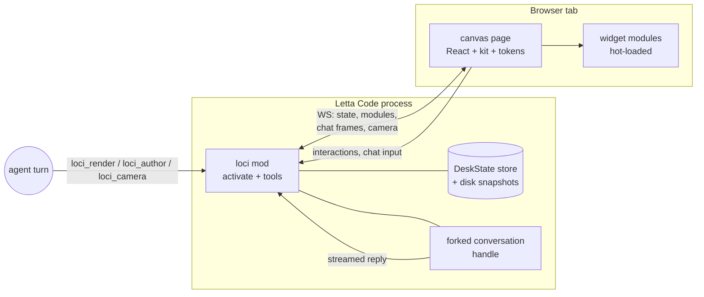

# Loci - Plan

> Name: **loci** (chosen 2026-09-02). The memory-palace term — the *places* where
> memories are set down. Fits the product exactly: your life arranged spatially,
> walked by camera. Earlier working name was "holodesk"; hologram aesthetic dropped.

## Goal Capsule

**Objective.** A Letta Code mod that turns a browser tab into an interactive widget desk shared by the agent (Ira) and Deepak: draggable/closable widgets, a floating chat, live agent-authored visualizations, and a camera that glides to new widgets. Built as a demo: a 30-60s clip for X first, repo depth for interviewers second.

**Authority.** Deepak owns product decisions and taste. This plan carries the architecture decisions from the 2026-08-31/09-02 design dialogue and the verified mod-API grounding in `docs/research/mod-api-grounding.md`.

**Stop conditions.** Phase 1 (spike, U1-U4) ends in an explicit go/no-go review with Deepak before Phase 2 begins. If the forked-conversation streaming path (U3) proves unworkable, stop and re-plan the chat design rather than working around it silently.

**Product Contract preservation.** Content unchanged from the brainstorm; restructured with R-IDs and AE-IDs. One addition at plan time: mod build output is a self-contained bundle so the `~/.letta/mods` shim needs no dependency resolution (K2).

---

## Product Contract

### Summary

Build the loci mod and canvas web app in one repo, in two phases: a spike proving the four risky integrations end-to-end (server+page, WS+widget, streamed chat fork, agent tool → canvas), then the demo build-out (widget kit, authoring pipeline, camera, persistence, polish) leading to the recorded clip.

### Problem Frame

The chat transcript is a straw: every input serialized to sentences, every output static text. Deepak wants the agent to express in live, operable UI and to express back through gestures — and he wants a public artifact proving he builds frontier-adjacent things. A demo is the honest scope: optimize for one great clip and an interview-walkable repo, not a daily driver.

### Requirements

**Canvas and widgets**
- R1. `/canvas` opens a browser tab showing the canvas page served by the mod on localhost.
- R2. The surface pans and zooms; widgets are windows with drag handles, close buttons, position and z-order.
- R3. Two widget kinds: info units (display only) and controls (interactions write to state paths).
- R4. Widget and camera state live in a mod-owned store, snapshotted to disk; an app restart restores the desk.

**Chat**
- R5. A floating chat bubble opens a chat window; messages run on a mod-driven forked conversation with streamed replies rendered in the canvas.

**Agent expression**
- R6. The agent can land a kit widget on the canvas with data via a mod tool.
- R7. The agent can author a new widget as a React module composed from the house kit; the mod bundles it and the canvas hot-loads it; bundle/runtime errors round-trip to the agent as tool results.
- R8. When a new widget lands, the camera glides to it.

**Data policy (hard rule, survives the demo)**
- R9. Real data in safe domains only (Spain trip, chores, sleep/gym). Finances synthetic. No real money amounts on screen, in the repo, or in recordings — ever.

### Acceptance Examples

- AE1 (the clip, defines done): In the Letta Code app Deepak types `/canvas` → tab opens with several live widgets → he drags one and operates a control → opens the chat bubble, sends a message, reply streams in → asks for a new visualization → widget materializes and the camera glides to it. 30-60s, recorded (retakes and edits acceptable; authoring latency may be cut in edit).
- AE2 (restart): quit and reopen Letta Code → `/canvas` → the desk renders the same widgets and positions from the snapshot.
- AE3 (authoring failure): an authored module that throws renders an error boundary in its frame, not a blank canvas, and the agent receives the error text in the tool result.

### Scope Boundaries

**Out of scope for v1** (designed in dialogue, deliberately deferred): presence cursors, follow mode, human focus tracking, tiered wake/commit buttons, home canvas, per-conversation multi-canvas, dwell-time triggers, screenshot feedback, hologram aesthetic, packaged-mod distribution (`letta install npm:`).

**Deferred to follow-up work**: several of the above return if loci graduates from demo to daily driver; `letta mods package` distribution is a natural post-clip beat.

### Success criteria

Clip posted on X; repo clean enough to walk an interviewer through; AE1 reproducible twice in a row before recording.

---

## Planning Contract

### Key Technical Decisions

- K1. **One repo, thin shim.** All source in `~/Documents/personal/loci` (this repo). A 3-line file in `~/.letta/mods/loci.ts` imports the built mod bundle. Reason: everything in `~/.letta/mods` gets loaded by the harness; a project can't live there.
- K2. **Self-contained mod bundle.** `esbuild` bundles `src/mod.ts` (with dependencies) to `dist/mod.js`; the shim imports that absolute path. Avoids node_modules resolution inside the Letta loader. Node 22 confirmed on machine; esbuild enters as a project dep.
- K3. **Single server, room-keyed store.** The mod owns one HTTP+WS server on `127.0.0.1` with a random URL token. Store is `Map<scopeId, DeskState>` from day one (cheap), but v1 uses a single scope; per-conversation rooms stay out of scope per the Product Contract.
- K4. **Widgets are React.** Best LLM codegen quality. The host page ships React and the widget kit once; authored modules are bundled with `external: [react, @loci/kit]` and resolve them from host-provided globals (import map or window bridge — settle exact mechanism in U6).
- K5. **Styling: CSS-variable design tokens + house kit, no Tailwind in authored modules.** Confirmed by research (`docs/research/stack-research.md`): the thesys C1 pattern — `:root` token sheet (`--loci-*`), LLM emits structure only; no CSS build step exists at runtime. Kit components carry their own styles; authored code composes kit + tokens. Charts: Recharts v3 (shadcn Charts and post-Vercel Tremor build on it; dominates LLM training data).
- K6. **Chat runs on a conversation fork.** Verified in `docs/research/mod-api-grounding.md`: mod-driven forks are the supported path with streaming (`ctx.conversation.fork()` → `sendMessageStream`), while direct sends to the live conversation bypass the app's turn loop. The undocumented `turn_end {continue}` injection path is not used in v1.
- K7. **Viewport via `react-zoom-pan-pinch` v4** (confirmed by research: actively maintained, `zoomToElement`/`setTransform` are exactly the glide primitives, native trackpad pinch). Camera glide through its programmatic zoom-to-element API. Widget drag is pointer-event-based and stops propagation so dragging a widget never pans the canvas.
- K8. **State snapshots** debounced (~200ms) to `~/.letta/loci/state/<scope>.json`; loaded on mod activate. Browser reconnect loop with a visible disconnected state.
- K9. **Lean tool surface, four tools**: `loci_render` (instantiate kit widget with data), `loci_author` (write+bundle+load a widget module), `loci_state` (read desk state), `loci_camera` (glide/zoom to widget). Conversation id comes from tool `ctx`, never from the model.

### Assumptions

- A1. *Resolved 2026-09-02:* stack research (`docs/research/stack-research.md`) confirmed all three defaults — CSS tokens (K5), Recharts v3, react-zoom-pan-pinch v4 (K7).
- A2. `activate()` idempotency and port-rebind behavior on `/reload` works as documented in the creating-mods skill; verified live in U1.

### High-Level Technical Design

Authoring sequence (U6): agent calls `loci_author(id, source)` → mod writes `widgets/<id>.tsx` → esbuild bundles with kit/React external → on success, module pushed over WS, canvas dynamic-imports blob, camera glides (K7); on failure, esbuild/runtime error text returns in the tool result and the agent revises.

---

## Implementation Units

### Phase 1 — Spike (go/no-go gate)

### U1. Repo scaffold, mod shim, `/canvas` command, static page
**Goal:** `/canvas` in Letta Code opens a browser tab served by the mod.
**Requirements:** R1. **Dependencies:** none.
**Files:** `package.json`, `tsconfig.json`, `src/mod.ts`, `src/server.ts`, `web/index.html`, `web/main.tsx`, `scripts/build.ts`, plus machine-local shim `~/.letta/mods/loci.ts` (install note in README, path not repo-tracked).
**Approach:** esbuild builds mod bundle and web bundle (K2). `activate()` registers the `/canvas` command, starts the server (K3), returns a cleanup disposer that closes it. `/reload` twice must not EADDRINUSE (A2).
**Test scenarios:** command opens tab serving the page (manual smoke); `/reload` twice → server still healthy; `letta --no-mods` unaffected.
**Verification:** demo-path smoke on Deepak's machine; diagnostics clean in `~/.letta/mods/diagnostics/latest.json`.

### U2. WS, state store, one hardcoded draggable widget
**Goal:** A widget on screen whose drag/close round-trips through the mod store.
**Requirements:** R2 (partial), R3 (partial), R4 (store in memory; disk lands in U8). **Dependencies:** U1.
**Files:** `src/store.ts`, `src/ws.ts`, `web/canvas/Surface.tsx`, `web/canvas/WidgetFrame.tsx`, `test/store.test.ts`.
**Approach:** WS protocol v0: `state_sync`, `patch` (client→server on interaction), `broadcast` (server→clients). Store is the single source of truth; the page renders from synced state. Widget chrome: drag handle, close, z-order on focus.
**Test scenarios:** store unit tests — patch application, z-order, close semantics; two tabs open → drag in one moves in the other (manual).
**Verification:** drag/close survive page refresh (state re-syncs from mod memory).

### U3. Chat bubble streaming from a forked conversation
**Goal:** Send a message from the canvas, watch the reply stream in.
**Requirements:** R5. **Dependencies:** U1. **The riskiest unit — schedule first among peers.**
**Files:** `src/chat.ts`, `web/chat/ChatBubble.tsx`, `web/chat/ChatWindow.tsx`.
**Approach:** On first chat open, mod forks the active conversation (K6), holds the handle; canvas messages → `sendMessageStream`; stream chunks forwarded over WS as `chat_delta` frames. Show a thinking state from send until first delta.
**Test scenarios:** reply streams incrementally (manual); second message continues same fork (context retained); fork failure → visible error in chat window, not silence.
**Execution note:** validate the fork+stream API shape against `docs/research/mod-api-grounding.md` quotes before building UI around it; if the API disagrees, stop and surface it — this is the spike's go/no-go core.
**Verification:** a 3-turn conversation held entirely in the canvas.

### U4. `loci_render`: agent lands a widget
**Goal:** During a normal turn, the agent places a data-filled widget on the canvas.
**Requirements:** R6. **Dependencies:** U2.
**Files:** `src/tools.ts`, `web/kit/InfoCard.tsx` (first kit component).
**Approach:** Register `loci_render` (K9) accepting `{type, title, data, position?}`; validates against registered kit types; writes store; broadcasts. Conversation id from `ctx` (K9).
**Test scenarios:** tool call → widget appears without page refresh; invalid type → tool result carries a usable error; tool works when no canvas tab is open (state applied, renders on next open).
**Verification:** ask Ira "put a card on the canvas" in a live session; **then hold the Phase 1 go/no-go review with Deepak.**

### Phase 2 — Demo build-out

### U5. Widget kit v1 + tokens
**Goal:** The component vocabulary that keeps authored code lean.
**Requirements:** R2, R3 (complete both). **Dependencies:** U4; fold in research findings (A1).
**Files:** `web/kit/` (tokens.css, WidgetFrame, InfoCard, Stat, SliderControl, ListCard, ChartCard, MapCard?), `web/kit/index.ts` (public kit API), `docs/kit.md` (the API the authoring agent reads).
**Approach:** CSS-variable tokens (K5): clean modern, regular colors, dark-friendly, light used for meaning (fresh vs stale, agent-touched). Controls write `patch` to state paths (R3). Chart component wraps the researched pick (recharts default).
**Test scenarios:** each component renders from a JSON fixture; a control's interaction lands in the store as a patch; token sheet swap changes all components (manual).
**Verification:** a seeded desk of 4-5 widgets looks coherent at one glance (Deepak taste check — the agent cannot see pixels).

### U6. Authoring pipeline
**Goal:** `loci_author` — the demo's signature move.
**Requirements:** R7. **Dependencies:** U5.
**Files:** `src/author.ts`, `src/bundler.ts`, `web/canvas/ModuleHost.tsx`, `widgets/` (runtime dir, gitignored), `test/bundler.test.ts`.
**Approach:** Tool takes `{id, source}`; writes `widgets/<id>.tsx`; esbuild bundles with `external: [react, @loci/kit]` (K4); serves bundle; canvas dynamic-imports and mounts inside an error boundary (AE3). Bundle errors and runtime errors (boundary catch → WS → mod) return to the agent. Host-global mechanism (import map vs window bridge) settled here.
**Test scenarios:** valid module → mounts; syntax error → tool result carries esbuild message, canvas untouched; runtime throw → error boundary + error round-trip (AE3); re-author same id → hot-replaces cleanly.
**Execution note:** build the error round-trip before the happy path — authored code that fails silently makes the agent write blind.
**Verification:** in a live session, ask for a visualization the kit has no preset for; agent authors it; it mounts.

### U7. Camera: viewport, glide, `loci_camera`
**Goal:** The canvas moves the way the clip needs.
**Requirements:** R2 (pan/zoom), R8. **Dependencies:** U2; library pick per research (A1).
**Files:** `web/canvas/Viewport.tsx`, `src/tools.ts` (add `loci_camera`).
**Approach:** Pan/zoom via chosen library (K7); glide = eased zoom-to-widget-bounds; auto-glide on new widget (R8) with a "don't yank while interacting" guard (no camera move while a pointer is down or within 2s of an interaction). Drag-vs-pan disambiguation at the widget frame (K7).
**Test scenarios:** trackpad pinch and drag-pan feel right (manual, Deepak); glide lands with the widget fully in view; interaction guard holds during a slider drag.
**Verification:** the AE1 closing beat — author → materialize → glide — feels like one motion.

### U8. Persistence and restart
**Goal:** AE2 — the desk survives a Letta Code restart.
**Requirements:** R4. **Dependencies:** U2.
**Files:** `src/persist.ts`, `web/canvas/ConnectionState.tsx`, `test/persist.test.ts`.
**Approach:** Debounced snapshots (K8); load on activate; authored widget sources persist in `widgets/` and re-bundle on demand. Browser: reconnect loop with backoff, gray-out disconnected state, interaction queue flushed on reconnect.
**Test scenarios:** kill and restart app → desk restores (AE2); edits made during disconnect apply after reconnect; corrupt snapshot file → fresh desk plus a diagnostics report, not a crash.
**Verification:** AE2 performed live twice.

### U9. Demo polish and the clip
**Goal:** Everything AE1 needs, recorded.
**Requirements:** R9, AE1. **Dependencies:** U5, U6, U7, U8.
**Files:** `scripts/seed.ts` (safe-domain seed data: Spain itinerary, tasks, sleep/gym, synthetic portfolio), `docs/demo-runbook.md`, `README.md`.
**Approach:** Seed script builds the opening desk (R9 policy enforced in data, not just intention: seed contains no real financial figures). Runbook = shot list + reset procedure. Look pass with Deepak. Record, cut, post.
**Test scenarios:** Test expectation: none — content and recording unit; R9 enforced by review of seed data and repo grep for real amounts.
**Verification:** AE1 clean twice in a row; clip posted.

---

## Verification Contract

- `npm test` (or `bun test`) — store, bundler, persist unit tests (U2, U6, U8). Keep fast; no browser automation in v1.
- `npm run build` — mod bundle + web bundle compile clean; the shim loads without diagnostics errors.
- Manual demo-path checklist (`docs/demo-runbook.md`) — the AE1 sequence plus AE2/AE3; run at each phase boundary and before recording.
- Phase gate: U4 ends in the spike go/no-go review with Deepak; Phase 2 does not start without it.
- Data policy gate (R9): grep repo, seed data, and snapshots for real financial figures before any recording or publishing.

## Definition of Done

- Spike: U1-U4 demonstrated end-to-end on Deepak's machine; go decision recorded (with a realistic clip date).
- v1: AE1 reproducible twice consecutively; AE2 and AE3 pass; clip recorded and posted; README lets a stranger install (shim note included); no abandoned experiments left in the diff; R9 verified against repo and recordings.

---

## Sources & Research

- `docs/research/mod-api-grounding.md` — verified mod-API facts with file:line quotes (conversation id in ctx, fork+stream path, turn_end injection, panels). Load-bearing for K6, K9.
- Letta mods documentation: https://docs.letta.com/configuration/mods/ — loader behavior, `/reload`, diagnostics, packaged mods (deferred).
- `docs/research/stack-research.md` — stack picks with primary-source evidence (npm registry, GitHub API, thesys/shadcn docs). Load-bearing for K5, K7.
- Design dialogue 2026-08-31 → 2026-09-02 (this conversation): surface rejections (tldraw: edit-verb grammar; react-flow: connect-verb grammar), return-path tiers (deferred), presence design (deferred).
