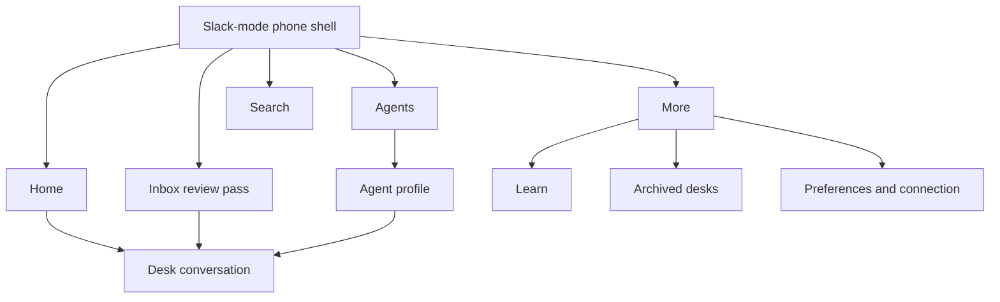
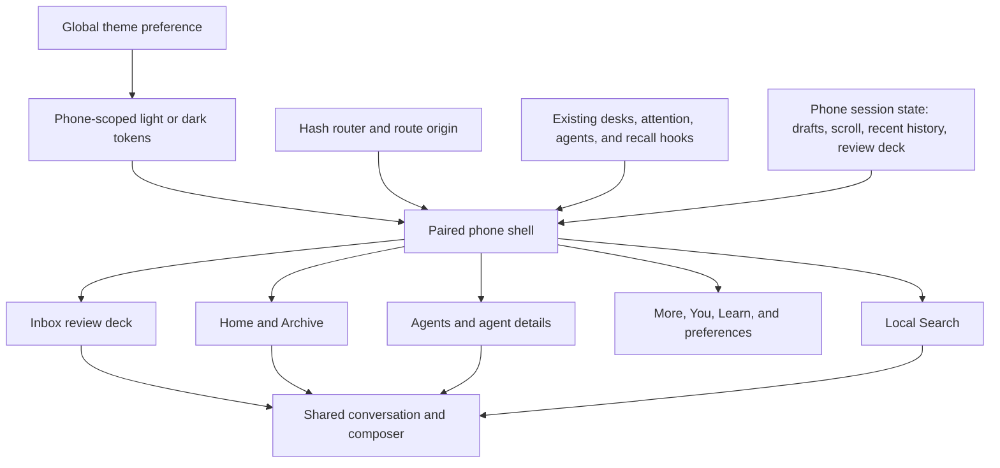
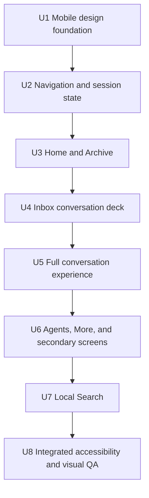

# Loki Slack-Mode Mobile UX - Plan

## Goal Capsule

- **Objective:** Rebuild Loki's phone experience in full Slack mode while preserving Loki's agent, desk, Inbox, Learn, and device capabilities.
- **Product authority:** This Product Contract supersedes the earlier direction to preserve Loki's existing mobile visual identity. Slack's September 2026 mobile experience is the binding reference for the phone UI and interaction grammar.
- **Open blockers:** None. The product direction and primary behavior are settled.
- **Execution profile:** Deep, cross-cutting mobile frontend work delivered in dependency order, with existing behavior preserved behind a new phone-only presentation layer.
- **Authority hierarchy:** Product Contract first; supplied Slack screenshots second; official Slack, Apple, MDN, and WCAG guidance third; existing phone behavior and repository conventions fourth.
- **Stop conditions:** Stop for user input only if implementation requires a new Mac-side data contract, removes an existing phone capability, changes desktop behavior, or contradicts the Product Contract. Resolve ordinary layout and component details using the defaults in this plan.
- **Tail ownership:** The implementing workflow owns code changes, tests, browser QA, regression cleanup, and removal of abandoned experiments. It should not publish or open a pull request unless separately requested.

---

## Product Contract

### Summary

Loki's phone client will closely reproduce Slack's mobile UI and UX while displaying Loki's own agents, desks, review queue, learning cards, and device state. Slack's visual system and interaction patterns become the mobile design language; Loki's existing serif, mono, brass, and palette-led styling no longer shapes the phone interface.

### Problem Frame

The current phone experience behaves like a narrow version of the desktop product. Its typography, outlined controls, compact metadata, and independent screen treatments prevent it from feeling like a coherent mobile application. The prior redesign improved information architecture but kept too much of that visual language, so the result remained recognizably Loki rather than delivering the familiar, content-first mobile experience the user wanted.

The supplied Slack references demonstrate the desired standard: large sans-serif titles, avatar-led rows, strong unread states, dense edge-to-edge content, floating navigation, focused review cards, full-screen sheets, and message composers that remain stable around safe areas and the keyboard. The redesign must adopt that system across the whole phone client rather than applying it only to Inbox.

### Key Decisions

- **Full Slack mode on mobile.** Match Slack's mobile typography, color relationships, spacing, surfaces, corner radii, icon weight, navigation, lists, sheets, composers, badges, motion, and state treatments as closely as Loki's product model permits.
- **Loki content inside Slack structure.** Keep Loki's terminology and capabilities. Do not introduce Slack workspaces, team channels, social presence, or collaboration features merely to make the interface look familiar.
- **Four primary destinations plus Search.** The persistent navigation contains Home, Inbox, Agents, and More. Search is a separate circular control beside the navigation capsule.
- **Preserve capability through hierarchy.** Every current phone capability remains reachable, but lower-frequency destinations move under More instead of competing for permanent navigation space.
- **Keep Loki's Inbox semantics.** The two review actions are Later and Mark as Read. Later applies Loki's existing snooze behavior; Mark as Read clears the item from the actionable queue.
- **Make Inbox conversational.** The active Inbox card contains the readable conversation and a working composer, so the user can understand and answer the item without leaving the review pass.
- **Use Slack-like light and dark themes.** System, light, and dark appearance modes remain. Legacy Loki palette variants do not alter the mobile visual system.

### Actors

- A1. The Loki user reviews agent work and continues conversations from a paired phone.
- A2. A Loki agent produces messages, questions, approvals, failures, completed work, memories, and learning material.
- A3. The paired Mac supplies phone data, connection state, settings, and actions.

### Requirements

**Visual system**

- R1. Every phone screen uses a sans-serif, Slack-like type system with comparable hierarchy, weight, density, and line length.
- R2. The phone uses Slack-like light and dark color roles for backgrounds, raised surfaces, borders, primary text, secondary text, links, unread badges, presence, and affirmative actions.
- R3. The phone does not render Loki's serif display type, mono presentation labels, brass accents, ornamental dividers, or palette-specific styling.
- R4. Icons use one consistent outlined family and weight rather than text glyphs, emoji, or screen-specific substitutes.
- R5. Layouts use edge-to-edge lists, meaningful section separation, and restrained rounding; cards appear only where Slack's reference pattern uses a card or raised surface.
- R6. Motion follows Slack-like sheet, navigation, swipe, and state transitions while respecting reduced-motion preferences.

**Application shell and navigation**

- R7. The persistent phone navigation contains Home, Inbox, Agents, and More in that order, followed by a separate Search control.
- R8. The navigation uses Slack's floating capsule pattern, active-tab treatment, unread dots, and bottom safe-area placement without leaving an empty band underneath it.
- R9. Primary conversations may retain the navigation, while focused review modes and modal sheets hide it when the reference pattern gives the task the full viewport.
- R10. Titles, profile controls, back controls, contextual actions, and large-header collapse behavior follow one shared Slack-like grammar.
- R11. Moving between primary tabs, conversations, sheets, and Inbox preserves scroll position, draft text, and the current review card.
- R12. Legacy phone routes continue to land on the equivalent destination so saved links and installed clients do not strand the user.

**Home**

- R13. Home uses a Slack-like workspace header with the Loki identity, connection-aware profile control, and contextual menu access.
- R14. Home begins with a horizontally scrolling shortcut rail for Inbox, Learn, Agents, and Archive, including current counts or states when meaningful.
- R15. Home follows the shortcut rail with attention and desk sections rendered as avatar-led or icon-led rows with titles, previews, timestamps, and unread counts.
- R16. Home does not repeat the same actionable item in multiple adjacent sections merely to increase its prominence.
- R17. Create, pin, archive, filter, and agent-scoping capabilities remain reachable through touch-appropriate controls and menus without recreating the current filter-heavy header.

**Inbox**

- R18. Inbox opens as a focused review pass with a visible remaining count, one dominant conversation card, and a restrained stacked-card cue.
- R19. The dominant card includes the source identity, dated conversation history, current unread boundary, agent or user messages, status notices, and a working composer.
- R20. The composer supports every reply, structured-answer, approval, and attachment capability already available from the phone conversation surface.
- R21. Later and Mark as Read remain large persistent actions below the card and have equivalent directional swipe gestures.
- R22. Later keeps the item actionable after applying Loki's existing snooze schedule; Mark as Read removes it from the actionable queue.
- R23. Approval items require explicit approve or deny actions and cannot be dismissed through Later, Mark as Read, or an accidental swipe.
- R24. Reversible review actions offer Undo without obscuring the next card or colliding with the composer and action buttons.
- R25. Opening a related desk and returning restores the same Inbox pass, card order, conversation draft, and remaining count.
- R26. Empty, loading, disconnected, deferred, failed, and caught-up states use the same visual grammar and explain the next available action.

**Desks and conversations**

- R27. A desk conversation uses Slack's mobile message layout: avatar-led chronology, strong author names, quiet timestamps, link treatment, day separators, unread boundaries, and a bottom-anchored composer.
- R28. The conversation header presents the agent, desk name, live state, and contextual actions using Slack-like pills and sheets rather than desktop-style chrome.
- R29. Reply, structured question, approval, image attachment, pin, seen, live-streaming, and back behavior remain available wherever the current phone client supports them.
- R30. The composer, status notice, content viewport, and navigation occupy separate layout regions and never overlap at supported viewport or keyboard sizes.

**Agents**

- R31. Agents is a permanent tab using the visual grammar of Slack's mobile DM list: avatar-forward rows, clear live state, compact previews, filters, and unread indicators.
- R32. Agent profiles use Slack-like full-screen pages or sheets with readable sections for memory, skills, changes, files, and related conversations.
- R33. Every existing agent-management and inspection action remains reachable without crowding the primary list.

**More, Learn, Archive, and settings**

- R34. More uses Slack's profile-sheet and utility-list grammar, led by the user's profile and paired-Mac status.
- R35. More provides access to Learn, archived desks, pairing and connection details, preferences, updates, About, and every other current secondary phone capability.
- R36. Learn remains a complete mobile experience and is reachable from both Home's shortcut rail and More.
- R37. Archived desks remain browsable and reopenable through Home or More without appearing as a permanent primary tab.
- R38. Appearance settings offer System, Light, and Dark modes using the Slack-like mobile themes; legacy Loki palette choices do not recolor the phone interface.
- R39. Destructive, unpairing, permission-changing, or connection-changing actions use explicit rows, confirmation, and recovery behavior.

**Search**

- R40. Search opens from its separate circular control into a Slack-like full-screen search surface with autofocus, keyboard-safe layout, recent searches, and recently visited destinations.
- R41. Search covers desks, agents, and other content already exposed to the phone without implying a new server-side index or message-search capability.
- R42. Search results use the same row anatomy and open the same destinations as Home, Inbox, Agents, and More.

**Quality and accessibility**

- R43. Primary controls meet a 44 by 44 CSS-pixel touch target, remain keyboard reachable, and expose meaningful screen-reader names and states.
- R44. Text and controls meet WCAG AA contrast, and status is never communicated by color alone.
- R45. Screens remain usable at 320 CSS pixels wide, in portrait and landscape, with large safe-area insets, long titles, large counts, increased text size, and the on-screen keyboard visible.
- R46. No supported state may produce overlapping controls, clipped primary content, stranded composers, inaccessible actions, or unintended empty viewport bands.
- R47. Loading, transition, and navigation responses feel immediate and do not cause layout jumps or move the user's current task unexpectedly.
- R48. The final interface is visually compared against the supplied September 2026 Slack mobile screenshots for Home, DMs, Activity, Catch Up, Search, More, You, and Preferences.

The load-bearing mobile hierarchy is:

### Key Flows

- F1. Daily orientation
  - **Trigger:** A1 opens Loki on a paired phone.
  - **Actors:** A1, A3
  - **Steps:** Home shows shortcut counts, attention rows, and recent desks; A1 opens the next useful destination or starts a new desk.
  - **Outcome:** The user understands current work without scanning every tab.
  - **Covered by:** R7-R17, R43-R48
- F2. Inbox review and reply
  - **Trigger:** A1 opens Inbox with actionable work waiting.
  - **Actors:** A1, A2, A3
  - **Steps:** A1 reads the conversation in the active card, replies if needed, then chooses Later or Mark as Read; the next card arrives and the remaining count updates.
  - **Outcome:** The user can complete a one-handed review pass without losing conversation context.
  - **Covered by:** R18-R26, R43-R48
- F3. Continue a desk conversation
  - **Trigger:** A1 opens a desk from Home, Inbox, Agents, or Search.
  - **Actors:** A1, A2
  - **Steps:** The full conversation opens, A1 reads or replies, live state remains visible, and returning restores the originating screen.
  - **Outcome:** Mobile conversation work feels continuous and native.
  - **Covered by:** R11, R27-R33, R40-R47
- F4. Reach a secondary capability
  - **Trigger:** A1 needs Learn, Archive, pairing, appearance, update, or connection controls.
  - **Actors:** A1, A3
  - **Steps:** A1 opens More, selects a Slack-like utility row, completes the task in a page or sheet, and returns to the same primary-tab state.
  - **Outcome:** Full capability is preserved without crowding primary navigation.
  - **Covered by:** R34-R39, R43-R47

### Acceptance Examples

- AE1. **Covers R7-R12 and R46.** Given a phone with a large bottom safe area, when Home opens, the floating navigation and Search control sit above the safe area without leaving a second empty band or covering the final list row.
- AE2. **Covers R18-R25.** Given three actionable items, when the user replies to the first card and taps Later, the reply remains sent, the item is snoozed, the remaining count becomes two, and the next card appears without resetting the pass.
- AE3. **Covers R23.** Given an approval card, when the user swipes or taps a generic review action, the card remains; only explicit approve or deny resolves it.
- AE4. **Covers R25 and R30.** Given a drafted Inbox reply, when the user opens the related desk and returns, the same card and draft are restored and no composer, status notice, or action overlaps another.
- AE5. **Covers R34-R39.** Given a user needs an existing secondary feature, when they open More, the feature is reachable through a named row without adding another permanent tab.
- AE6. **Covers R38.** Given the phone follows the system appearance, when the operating system changes between light and dark, Loki switches between the Slack-like light and dark themes without applying a legacy palette.
- AE7. **Covers R43-R48.** Given a 320 CSS-pixel viewport with increased text size and reduced motion, when the user visits every primary destination, all controls remain reachable, text reflows without clipping, and state changes remain understandable without animation.
- AE8. **Covers R26 and R47.** Given the paired Mac becomes unreachable, when the user is reading an Inbox card, the content remains readable, a connection state appears without displacing the task, and reconnection does not reset the card order.

### Success Criteria

- The phone interface is immediately recognizable as Slack-like when compared side by side with the supplied reference screenshots.
- Home, Inbox, Agents, More, Search, and conversations share one consistent visual and interaction system.
- Every existing phone capability remains reachable despite the reduced primary navigation.
- A complete Inbox pass can be read, answered, deferred, and cleared one-handed without leaving the card stack.
- Visual QA finds no overlapping controls, clipped primary content, unsafe bottom spacing, stranded composers, or unexplained viewport gaps at representative iPhone and narrow Android sizes.
- A returning user can identify the next useful action from Home without reconstructing agent work from desktop or terminal context.

### Scope Boundaries

- The desktop interface is unchanged except where shared behavior must remain compatible.
- Loki does not copy Slack logos, product naming, workspace concepts, team channels, social presence, or collaboration features.
- The redesign does not add a new search index, native push notifications, background synchronization, or the desktop canvas to the phone.
- Existing attention priority, snooze ladder, seen markers, approval rules, agent model, conversation transport, and paired-Mac authority remain the domain baseline.
- Visual compatibility with the previous Loki phone UI is not a goal.

### Dependencies / Assumptions

- The paired Mac remains the source of phone data and actions.
- Existing phone capabilities define the feature-parity baseline even when their destination or presentation changes.
- The user-supplied September 2026 Slack screenshots are the visual acceptance reference for this redesign.
- Slack's mobile shell may evolve after this plan; implementation should match the captured reference set rather than chase unrelated later changes during the same effort.

### Sources / Research

- `PRODUCT.md` defines Loki's product purpose, users, and accessibility expectations.
- `app/src/phone/` contains the current phone capabilities that must remain reachable.
- User-supplied Slack mobile screenshots cover Home, DMs, Activity, Catch Up, Search, More, You, and Preferences in dark mode.
- [Slack: Customize the mobile app](https://slack.com/help/articles/29788684062739-Customize-the-Slack-mobile-app) documents Home shortcuts and mobile conversation organization.
- [Slack: Get your work done from Activity](https://slack.com/help/articles/19693583638803-Get-your-work-done-from-the-Activity-view) documents mobile Activity, reply, filtering, and clearing behavior.
- [Slack: Send and read messages](https://slack.com/help/articles/201457107-Send-and-read-messages) documents mobile unread and Catch Up behavior.
- [Slack accessibility changelog](https://slack.com/help/articles/50668520513939-Accessibility-changelog) records recent mobile focus, message-preview, action-label, and Catch Up accessibility changes.

---

## Planning Contract

The Product Contract above is preserved as the source of truth; this section adds implementation decisions without changing its requirements, flows, acceptance examples, or scope boundaries.

### Key Technical Decisions

- KTD1. **Scope the Slack-mode design system to the phone root.** Introduce a phone stylesheet whose token overrides and component selectors live beneath one phone-root class. Reuse the existing `--loki-*` semantic roles inside that boundary so shared controls inherit the mobile treatment, but define their phone values independently for light and dark themes. Do not change desktop token values, and do not let `data-palette` alter the phone result.
- KTD2. **Keep `Phone.tsx` as the state and integration owner.** The current paired-phone shell already owns desks, attention, review deck, Learn state, analytics, connection state, and routing. Extend that seam instead of creating a second store or duplicating transport logic inside screens.
- KTD3. **Make navigation route-driven and origin-aware.** The canonical tabs become Home, Inbox, Agents, and More. Search, Learn, Archive, preferences, agent details, files, and focused conversations are child routes with explicit owning destinations and safe direct-link fallbacks. Legacy `#/you` and `#/settings` addresses resolve to the equivalent More/preferences destination.
- KTD4. **Preserve primary-screen state by lifetime, not by reconstruction.** Keep primary destinations mounted or provide explicit keyed restoration for their scroll/filter state. Keep the Inbox deck above route rendering. Store phone drafts by conversation identity so Inbox and full conversation routes share the same text and attachments and survive navigation.
- KTD5. **Reuse the shared conversation engine in both Inbox and desk pages.** Extend the shared conversation surface with optional controlled draft state and phone-specific composition hooks while keeping its existing uncontrolled desktop behavior. The Inbox card gets a bounded transcript, structured answers, approval controls, attachments, and composer without reimplementing send or decision semantics.
- KTD6. **Keep Search client-side and honest about its coverage.** Search only data already available to the phone: desk titles and agent scope, agent names and descriptions, loaded actionable Inbox items, and named secondary destinations. It does not search transcript bodies or trigger a new Mac-side index. Recent searches and recently visited destinations are small device-local histories with bounded retention.
- KTD7. **Use one canonical secondary hierarchy.** More is the utility hub, with an internal You/profile section and links to Learn, Archive, preferences, connection/pairing, updates, and About. Archive is one reusable screen linked from both Home and More; Learn keeps its current review model and remains reachable from both places.
- KTD8. **Give each screen one vertical scroll owner.** The fixed phone shell uses dynamic viewport units and safe-area variables. Lists own their scroll; conversation transcripts own their scroll; composers, Inbox decisions, and floating navigation occupy separate non-scrolling layout regions. `visualViewport` compensation is added only where the on-screen keyboard changes the visible height.
- KTD9. **Treat accessibility behavior as part of navigation and review state.** Every swipe has visible button equivalents. Route changes restore focus to their launcher or the destination heading, review actions announce outcomes and the next item, and reduced motion removes spatial transitions without hiding state change.
- KTD10. **Use the supplied screenshots as a visual contract, not as a source of product semantics.** Match their hierarchy, density, geometry, type, surfaces, and interaction grammar with Loki content and labels. Do not copy Slack trademarks, private assets, workspace concepts, or unsupported collaboration behavior.

### High-Level Technical Design

The phone root establishes viewport, safe-area, theme, and typography rules. `Phone.tsx` continues to acquire domain data and retains state whose lifetime must span routes. Route-backed screen components receive data and actions rather than fetching duplicate copies. Shared chat components remain the only place that interprets drafts, attachments, structured questions, approvals, and send behavior.

### State and Navigation Model

- **Primary destinations:** Home, Inbox, Agents, and More retain their local filters and scroll positions across tab changes. Inbox additionally retains card order, current card, pass summary, undo state, and the active draft.
- **Child routes:** Search, Learn, Archive, preferences, conversations, agents, and files record an owning or originating destination. Browser Back and iOS swipe-back use history when possible; a direct link falls back to the owning destination.
- **Drafts:** Text and image attachments are keyed by agent and conversation. Sending clears only the submitted conversation's draft. Later, Mark as Read, tab changes, child routes, disconnects, and theme changes do not clear it.
- **Recent history:** Successful searches and opened destinations populate bounded local histories. Missing or stale entities are discarded during read rather than becoming broken rows.
- **Theme:** The existing global System/Light/Dark preference remains authoritative. The phone ignores legacy palette choice through scoped overrides; desktop continues using the selected palette.

### Layout and Interaction Invariants

- Exactly one component owns each bottom inset. The floating navigation reserves content clearance once, while full-screen routes and the Inbox action region apply their own safe-area padding only when navigation is hidden.
- The phone shell uses `100dvh` with a sensible `100svh`/fixed fallback. Keyboard-open layouts derive usable height from `visualViewport` where supported and remain functional without it.
- The Inbox card is a flex column with `min-height: 0`: header and status content are intrinsic, transcript takes the remaining height and scrolls internally, composer remains visible, and decision buttons sit outside the card's transcript.
- The Search field stays visible above the keyboard; results scroll independently beneath it. Clearing Search does not close the route.
- Navigation, sheets, cards, and rows use the same phone-local icon registry and accessible labels. Text glyphs and emoji are not used as controls.
- All touch targets are at least 44 by 44 CSS pixels even where the visible icon or row is smaller.

### Implementation Constraints

- Preserve the existing attention priority, snooze ladder, seen/unseen behavior, approval refusal, conversation transport, pairing authority, and Learn review logic.
- Preserve the shared chat surface's desktop contract. New controlled-draft or phone-composition inputs must remain optional and default to current desktop behavior.
- Do not add a UI framework, icon package, search service, persistence service, or server endpoint for this redesign. A small phone-local SVG icon module and device-local history are sufficient.
- Use classes and the phone stylesheet for the visual system instead of expanding the current inline-style approach. Keep one-off dynamic values inline only when they genuinely depend on runtime state.
- Preserve unrelated worktree changes. Existing uncommitted phone changes may be reworked where the Product Contract supersedes their presentation, but their valid behavior must not be discarded without replacement.
- Avoid broad changes to `app/src/kit/tokens.css`, `app/src/theme.tsx`, or shared desktop primitives unless a narrow compatibility change is necessary and covered by desktop regression checks.

### System-Wide Impact

- **Composition and callbacks:** `app/src/phone/Phone.tsx` remains the only phone composition root for desks, attention, review deck, Learn, routing, analytics, and connection state. Home, Inbox, Agents, More, Search, Learn, and conversations continue receiving data and callbacks from that root rather than becoming new transport owners.
- **Public mobile URLs:** `app/src/phone/router.ts` is a compatibility boundary for installed home-screen clients and saved links. Canonical routes, legacy redirects, ownership, browser Back, direct-link fallback, and iOS history navigation must evolve together.
- **Attention lifecycle:** Inbox presentation must preserve the ordering and callback semantics of Later, Mark as Read, Undo, approve, deny, answer, and send. Local card dismissal cannot become a second source of truth or outrun marker reconciliation from `useAttention`.
- **Conversation lifecycle:** Transcript data remains owned by the attention layer; scroll behavior remains owned by the shared conversation; phone draft persistence is an optional host-controlled extension. Pending questions, approvals, queued replies, and errors must survive reconnects and route changes.
- **Learn and Agents lifetimes:** Learn review state must remain above a remounting route boundary, while Agents continues using its existing cache and inflight request pattern. Search consumes those surfaces but does not introduce another cache.
- **Failure propagation:** Existing connection banners, retry affordances, conversation error state, pairing gate, unpair confirmation, and Learn notices remain the recovery paths. A disconnect should annotate readable content rather than replace it or reset in-progress work.
- **Desktop boundary:** `app/src/components/index.tsx`, `app/src/chat/Conversation.tsx`, `app/src/chat/ChatInput.tsx`, `app/src/chat/chat.css`, `app/src/theme.tsx`, and `app/src/kit/tokens.css` are shared. Phone-only geometry stays in the phone wrapper/style layer; any required shared extension is optional, backward-compatible, and covered by a desktop conversation and theme smoke test.

### Research Basis

- Current state ownership and route composition are centered in `app/src/phone/Phone.tsx`, `app/src/phone/router.ts`, and `app/src/phone/Inbox.tsx`; retaining those seams minimizes domain regression.
- `app/src/chat/Conversation.tsx`, `app/src/chat/ChatInput.tsx`, and `app/src/chat/useDraft.ts` already centralize transcript, composer, attachment, question, and approval behavior and should remain the shared engine.
- [Slack's mobile updates](https://slack.com/help/articles/115004846068-Slack-updates-and-changes.) and [mobile search guidance](https://slack.com/help/articles/202528808-Search-in-Slack) support persistent bottom navigation, compose affordances, and globally available Search.
- [Slack Catch Up guidance](https://slack.com/help/articles/226410907-View-all-your-unread-messages) supports the remaining-count deck and paired swipe/button actions; Loki retains Later and Mark as Read rather than adopting Slack's labels.
- [Slack's accessibility changelog](https://slack.com/help/articles/50668520513939-Accessibility-changelog) makes focus restoration, screen-reader action labels, text scaling, and reduced motion acceptance concerns rather than follow-up polish.
- [MDN safe-area environment variables](https://developer.mozilla.org/en-US/docs/Web/CSS/Reference/Values/env), [MDN viewport units](https://developer.mozilla.org/en-US/docs/Web/CSS/Reference/Values/length), and [Apple layout guidance](https://developer.apple.com/design/human-interface-guidelines/layout) inform the bottom-inset and keyboard strategy.
- [WCAG 2.2](https://www.w3.org/TR/WCAG22/) requires non-drag alternatives and establishes the accessibility floor; this plan keeps Loki's stricter 44-pixel target requirement.

### Sequencing

Build the design foundation and route/state contract first. Land later units serially because they share `app/src/phone/Phone.tsx`, and make U5 follow U4 because both extend shared draft and conversation behavior. Search follows once canonical destinations and row anatomy exist. The final unit validates the assembled application rather than deferring basic unit-level verification until the end.

### Risks and Mitigations

- **Shared chat regression:** Optional controlled draft state or layout hooks could affect desktop conversations. Preserve current defaults, add pure-state tests, and smoke-test a desktop conversation before completion.
- **Nested scrolling and keyboard overlap:** An outer scroll around a transcript can strand the composer or interfere with swipe recognition. Enforce one scroll owner per region and test real keyboard-open states at narrow and landscape sizes.
- **Safe-area double counting:** The current shell, conversation gutter, update bar, and tab bar each apply bottom spacing. Centralize inset ownership and validate the final row, composer, decisions, and navigation together.
- **Route return drift:** Search and More introduce more entry points into conversations and settings. Record origin explicitly and test direct links, browser Back, swipe-back, and reload fallbacks.
- **State reset on remount:** Agents, Settings, Learn, and drafts currently have different lifetimes. Keep primary tabs mounted or restore their state explicitly, and retain Learn's pass above route-specific presentation.
- **Visual drift from the reference:** Generic components can retain Loki typography or excessive borders. Use phone-scoped tokens/classes and perform side-by-side reviews against every supplied reference screen.
- **Search overpromising:** Local data may not include transcript bodies or unloaded agents. State the coverage through result categories and empty-state copy; do not present the feature as global message search.

---

## Implementation Units

### U1. Establish the phone-only Slack visual foundation

- **Goal:** Replace legacy mobile typography, color, spacing, icon, viewport, and safe-area rules with one scoped Slack-like system without changing desktop presentation.
- **Requirements:** R1-R6, R8, R10, R38, R43-R48; F1-F4; AE1, AE6, AE7.
- **Files:** `app/src/phone/phone.css` (new), `app/src/phone/icons.tsx` (new), `app/src/phone/ui.tsx`, `app/src/phone/Phone.tsx`, `app/src/styles.css`, `test/tokens.test.ts`.
- **Patterns:** Follow semantic token roles from `app/src/kit/tokens.css`, safe-area ownership from `app/src/phone/ui.tsx`, and accessible touch primitives from `app/src/components/index.tsx`. Scope all overrides beneath the phone root.
- **Approach:** Add phone light/dark token overrides, typography, focus, motion, layer, radius, and spacing rules. Move repeated static phone styles from inline objects into named classes. Replace `PhoneStyles` with the stylesheet, add a consistent SVG icon registry, and establish shell height and safe-area primitives before individual screens are recomposed.
- **Test Scenarios:**
  1. Dark and light modes resolve complete phone token sets with AA foreground/background relationships.
  2. Changing the legacy palette changes desktop tokens but leaves computed phone presentation unchanged.
  3. A 320-pixel-wide phone, a large bottom inset, and landscape each retain reachable content with no second safe-area band.
  4. Reduced motion disables decorative transitions while focus, selection, and state changes remain visible.
  5. Keyboard and pointer focus indicators remain visible on every shared phone control.
- **Verification:** Extend token tests for phone-scoped roles and prohibited legacy mobile fonts; run `bun test test/tokens.test.ts`, `bun run typecheck`, and a light/dark shell browser smoke test.
- **Dependencies:** None.

### U2. Replace the shell navigation and preserve phone session state

- **Goal:** Deliver Home, Inbox, Agents, and More in a floating navigation capsule with separate Search, stable route ownership, and state restoration across navigation.
- **Requirements:** R7-R12, R30, R40, R43-R47; F1-F4; AE1, AE4, AE7.
- **Files:** `app/src/phone/router.ts`, `app/src/phone/TabBar.tsx`, `app/src/phone/Phone.tsx`, `app/src/phone/ui.tsx`, `app/src/phone/session.ts` (new), `test/phone-router.test.ts`, `test/phone-session.test.ts` (new), `test/analytics.test.ts`.
- **Patterns:** Extend the pure parse/format/ownership contract in `app/src/phone/router.ts`; retain deck, recall, transport, and data-hook ownership in `app/src/phone/Phone.tsx`.
- **Approach:** Replace You with More in canonical tabs; add child routes for Search, Archive, preferences, and More destinations; redirect legacy You/Settings routes; and carry origin information for child pages. Keep primary screens alive or restore their scroll state. Add a small phone-session layer for keyed drafts, recent histories, focus return, and scroll restoration without duplicating domain data.
- **Test Scenarios:**
  1. Every canonical and legacy route parses, formats, and falls back to its correct owning destination.
  2. Direct-linked Search, Archive, preferences, conversation, agent, and file pages have deterministic Back fallbacks.
  3. Switching among all four tabs retains each tab's scroll/filter state and the Inbox's current card.
  4. Opening and closing a child route restores focus to its launcher or a stable destination heading.
  5. Navigation labels, `aria-current`, Inbox counts, and Search labels are correct at zero, one, and more than 99 items.
  6. Analytics reports stable names for More, Search, Archive, preferences, and existing destinations without entity identifiers.
- **Verification:** Run `bun test test/phone-router.test.ts test/phone-session.test.ts test/analytics.test.ts`, then exercise deep links and browser Back in the local phone shell.
- **Dependencies:** U1.

### U3. Recompose Home and add the canonical Archive screen

- **Goal:** Make Home the Slack-like orientation surface and provide one reusable Archive destination without duplicate actionable rows.
- **Requirements:** R13-R17, R34-R37, R42-R48; F1, F3, F4; AE1, AE5, AE7, AE8.
- **Files:** `app/src/phone/Home.tsx`, `app/src/phone/Archive.tsx` (new), `app/src/phone/model.ts`, `app/src/phone/Phone.tsx`, `test/phone.test.ts`.
- **Patterns:** Preserve the current desk derivations, create flow, pin/archive actions, and `catchUpQueue` priority. Reuse shared row/avatar anatomy instead of creating screen-specific card styles.
- **Approach:** Build a workspace/profile header, horizontal Inbox/Learn/Agents/Archive shortcut rail, attention summary, and recent-desk sections. Exclude actionable conversations from the immediately adjacent desk list or represent attention as a summary so content is not duplicated. Move archived-desk rendering into a dedicated route used by both Home and More while preserving reopen and pin behavior.
- **Test Scenarios:**
  1. Shortcut counts and destinations reflect waiting Inbox items, due Learn items, Agents, and archived desks.
  2. An actionable desk appears once in adjacent Home sections and still opens the correct conversation.
  3. Create, pin, archive, refresh, filter, and agent-scope actions remain reachable through touch controls or menus.
  4. Archive handles zero, many, long-title, disconnected, and reopened desk states and returns to its origin.
  5. Home preserves scroll and filter state after visiting a conversation, Learn, Archive, Search, and another primary tab.
- **Verification:** Add pure grouping/filtering/duplication tests to `test/phone.test.ts`; run that test and compare Home/Archive in both themes at narrow and standard widths.
- **Dependencies:** U2.

### U4. Turn Inbox into a complete conversational review deck

- **Goal:** Let the user read, answer, attach, approve or deny, defer, clear, and undo from the active Inbox card without leaving the pass.
- **Requirements:** R18-R26, R29-R30, R43-R48; F2, F3; AE2-AE4, AE7, AE8.
- **Files:** `app/src/phone/Inbox.tsx`, `app/src/phone/deck.ts`, `app/src/phone/Phone.tsx`, `app/src/phone/session.ts`, `app/src/chat/Conversation.tsx`, `app/src/chat/useDraft.ts`, `test/deck.test.ts`, `test/phone-session.test.ts`.
- **Patterns:** Preserve `useDeck`, pure swipe decisions, undo timing, `catchUpQueue`, and the existing shared Conversation action contract. Keep `Phone.tsx` as deck and loaded-history owner.
- **Approach:** Render the current item as a bounded conversation surface with identity header, dated history, unread boundary, notices, structured questions, approval controls, attachments, and controlled composer. Keep Later and Mark as Read as persistent buttons outside the transcript with matching swipe directions. Block generic decisions for approval cards, add screen-reader review announcements, and place Undo so it cannot cover the composer or decision row.
- **Test Scenarios:**
  1. Sending text, a structured answer, or attachments clears only the submitted draft and leaves the review pass stable.
  2. Later applies existing unread/snooze semantics, advances once, updates the count, and can be undone.
  3. Mark as Read applies existing seen semantics, advances once, updates the count, and can be undone.
  4. Approval cards ignore both generic buttons and swipes; only explicit approve or deny resolves them.
  5. Opening the related desk and returning restores the same card, order, count, transcript position, and draft.
  6. Empty, loading, disconnected, deferred, failed, and caught-up states preserve a usable action and do not collapse the layout.
  7. Keyboard-open and short-landscape states keep transcript, composer, Undo, and both decision buttons reachable without overlap.
- **Verification:** Extend `test/deck.test.ts` and `test/phone-session.test.ts`; run them plus an Inbox browser pass with three representative item types and reduced motion enabled.
- **Dependencies:** U3.

### U5. Align full desk conversations with Slack mobile message anatomy

- **Goal:** Make every full conversation use the same mobile hierarchy and keyboard-safe composer behavior as Inbox while retaining all Loki chat capabilities.
- **Requirements:** R9-R12, R27-R30, R43-R48; F2, F3; AE4, AE7, AE8.
- **Files:** `app/src/phone/Conversation.tsx`, `app/src/phone/Phone.tsx`, `app/src/chat/Conversation.tsx`, `app/src/chat/ChatInput.tsx`, `app/src/chat/Transcript.tsx`, `app/src/chat/chat.css`, `app/src/phone/session.ts`, `test/phone-session.test.ts`.
- **Patterns:** Keep `ConversationScreen` as the phone wrapper and shared `Conversation` as the behavior engine. Preserve transcript-following logic in `app/src/chat/useTranscriptScroll.ts` and the current route-to-thread derivation.
- **Approach:** Introduce a Slack-like compact header and participant/status surface, avatar-led chronology, date and unread dividers, link styles, notices, and an anchored composer. Feed the same keyed draft state used by Inbox. Separate transcript, pending question/approval content, composer, optional status notice, and navigation clearance into explicit flex regions.
- **Test Scenarios:**
  1. Home, Inbox, Agents, and Search each open the same conversation and Back returns to the originating state.
  2. Text, dictation, images, structured questions, approvals, pinning, seen state, queued replies, and live streaming remain available.
  3. Draft text and attachments survive tab changes, child routes, disconnect/reconnect, and Inbox/full-page transitions, then clear after successful send.
  4. Long names, long links, long messages, code blocks, and large text wrap without horizontal page scrolling or hidden controls.
  5. Keyboard appearance, orientation change, and safe-area changes keep the composer and latest-message affordance visible.
  6. A desktop conversation still renders and behaves as before when controlled phone draft inputs are absent.
- **Verification:** Run relevant phone session and chat tests through `bun test`; smoke-test one desktop conversation and all phone conversation entry paths in the browser.
- **Dependencies:** U4.

### U6. Recompose Agents, More, Learn, and preferences

- **Goal:** Preserve every secondary phone capability in a coherent Slack-like Agents tab and More hierarchy.
- **Requirements:** R31-R39, R43-R48; F1, F3, F4; AE5-AE8.
- **Files:** `app/src/phone/Agents.tsx`, `app/src/phone/Agent.tsx`, `app/src/phone/More.tsx` (new), `app/src/phone/Settings.tsx`, `app/src/phone/Recall.tsx`, `app/src/phone/Pair.tsx`, `app/src/phone/Phone.tsx`, `app/src/phone/model.ts`, `test/phone.test.ts`, `test/bridge.test.ts`.
- **Patterns:** Retain the Agents module cache and inflight request pattern, agent memory/file routes, Learn deck behavior, and explicit unpair confirmation. Use shared phone rows, section headers, sheets, and icons.
- **Approach:** Rebuild Agents as an avatar-forward filtered list with state and unread indicators. Recompose agent profiles into readable sections and child pages. Add More with profile/paired-Mac status, a You/profile section, and named utility rows for Learn, Archive, preferences, connection/pairing, updates, and About. Restrict phone appearance controls to System/Light/Dark and keep destructive or connection-changing actions behind clear confirmations.
- **Test Scenarios:**
  1. Agent loading, empty, error, long-name, live, and unread states use consistent row anatomy and retain list position after detail navigation.
  2. Agent memory, skills, changes, files, and related conversations remain reachable and Back follows the route hierarchy.
  3. Learn retains the current card and pass when opened from Home or More and returns to its origin.
  4. More exposes every capability formerly available through You/Settings plus Learn and Archive without adding a primary tab.
  5. System/Light/Dark update the phone immediately; legacy palette controls are absent on phone and remain intact on desktop.
  6. Unpair, reload/update, route switching, and permission-changing actions show explicit state, confirmation, and recovery paths.
- **Verification:** Extend `test/phone.test.ts` for More/appearance derivations and keep `test/bridge.test.ts` green; browser-check Agents, agent details, More, Learn, preferences, Pair, and destructive confirmations.
- **Dependencies:** U5; U3 supplies the shared Archive destination.

### U7. Add local Search with recent context

- **Goal:** Provide an immediately available, keyboard-safe Search surface over content already known to the phone.
- **Requirements:** R40-R47; F1-F4; AE4, AE5, AE7, AE8.
- **Files:** `app/src/phone/Search.tsx` (new), `app/src/phone/search.ts` (new), `app/src/phone/Phone.tsx`, `app/src/phone/router.ts`, `app/src/phone/session.ts`, `test/phone-search.test.ts` (new), `test/phone-router.test.ts`.
- **Patterns:** Reuse canonical row/avatar components and route destinations from Home, Agents, More, and Archive. Keep search ranking and history transformations pure for Bun tests.
- **Approach:** Autofocus a full-screen search field; show recent searches and visited destinations before input; group matching desks, agents, loaded Inbox items, and utility destinations after input; and route selections to existing screens while retaining Search as their origin. Rank exact/prefix matches before substring matches and use stable recency as the final tie-breaker. Bound and sanitize local history.
- **Test Scenarios:**
  1. Empty query shows bounded recent searches and valid recently visited destinations.
  2. Matching is case-insensitive, deterministic, category-aware, and limited to declared local fields.
  3. Selecting each result type opens its canonical destination and Back restores the query and results position.
  4. Removed or stale desks/agents disappear from recent history without creating broken links.
  5. No results, disconnected, partial-data, long-query, large-text, and keyboard-open states remain usable.
  6. Clearing the query retains Search focus and does not navigate away.
- **Verification:** Run `bun test test/phone-search.test.ts test/phone-router.test.ts`; browser-check autofocus, keyboard clearance, result routing, and return-state restoration on iPhone-sized viewports.
- **Dependencies:** U6.

### U8. Complete integrated accessibility, responsive, and visual-reference QA

- **Goal:** Prove the assembled phone experience is clean, non-overlapping, accessible, and recognizably Slack-like across the required state matrix while desktop remains unchanged.
- **Requirements:** R1-R48; F1-F4; AE1-AE8.
- **Files:** All changed `app/src/phone/` and narrowly changed `app/src/chat/` files, `test/tokens.test.ts`, `test/phone-router.test.ts`, `test/phone-session.test.ts`, `test/phone-search.test.ts`, `test/deck.test.ts`, `test/phone.test.ts`, `test/analytics.test.ts`, `test/bridge.test.ts`, `docs/design.md`.
- **Patterns:** Use the supplied screenshots as side-by-side references, existing repository accessibility conventions, and the Verification Contract below.
- **Approach:** Audit landmarks, labels, announcements, focus order/restoration, gesture alternatives, contrast, text scaling, reduced motion, loading/error copy, viewport geometry, and keyboard behavior. Compare all primary and secondary screens in dark and light themes against the references. Fix integration defects in their owning unit rather than layering compensating offsets into the shell. Document the phone-only design boundary and layout invariants.
- **Test Scenarios:**
  1. Complete every key flow at 320×568, 390×844, and a representative landscape viewport in both themes.
  2. Repeat navigation, Inbox, Search, and conversation flows with the keyboard open, large safe-area insets, increased text size, and reduced motion.
  3. Exercise zero, one, and 99+ counts; long names/messages; empty/loading/offline/error states; and reconnect during an Inbox pass.
  4. Complete every gesture-driven action with keyboard and visible controls, with understandable focus and live-region announcements.
  5. Compare Home, Agents/DM-like lists, Inbox/Catch Up, Search, More/You, preferences, and conversations against all supplied screenshots and record any intentional Loki-specific divergence.
  6. Smoke-test desktop Home, a desktop conversation, theme/palette switching, and shared controls for visual or behavioral regressions.
  7. From Home, enter Inbox with multiple items, create a text or attachment draft, open the related full conversation, then return and verify card identity, draft, order, count, transcript position, and origin state.
  8. Open Archive and Learn from both Home and More, act within each destination, then verify Back, reload, and direct-link behavior preserve the correct origin and review state.
  9. With an Inbox or conversation composer open, disconnect and reconnect the Mac in portrait and landscape; verify draft/attachment retention, card position, visible recovery state, keyboard clearance, and safe-area geometry.
- **Verification:** Run every automated gate in the Verification Contract and complete the browser matrix with no unexplained overlap, clipping, hidden action, duplicate inset, or desktop regression.
- **Dependencies:** U3-U7.

---

## Verification Contract

| Gate | Command or method | Proves | Applies |
|---|---|---|---|
| Focused routing/state | `bun test test/phone-router.test.ts test/phone-session.test.ts test/phone-search.test.ts` | Route compatibility, ownership, restoration, local Search, and recent-history behavior | U2, U7 |
| Focused Inbox/model | `bun test test/deck.test.ts test/phone.test.ts test/analytics.test.ts test/bridge.test.ts` | Review semantics, Home/More derivations, analytics names, and authority boundaries | U3, U4, U6 |
| Token contract | `bun test test/tokens.test.ts` | Phone token completeness, light/dark behavior, focus/contrast guardrails, and desktop token compatibility | U1, U8 |
| Full test suite | `bun test` | Repository-wide behavioral regression coverage | All units before completion |
| Type safety | `bun run typecheck` | React props, route unions, state adapters, and shared-chat compatibility | After each feature-bearing unit and final |
| Lint | `bun run lint` | Hooks, accessibility-adjacent JSX, imports, and code-quality conventions | Final |
| Production build | `bun run build:app` | Vite/CSS asset integration and production compilation | Final |
| React audit | `bun run doctor` | React structure and performance regressions introduced by the screen/state changes | Final; investigate new findings |
| Browser QA | Run `bun run dev`, pair or use the existing local phone test data path, and inspect the viewport matrix below | Safe areas, keyboard, scrolling, focus, motion, theme, screenshot fidelity, and desktop isolation | Each unit smoke; full matrix in U8 |

### Browser QA Matrix

| Dimension | Required coverage |
|---|---|
| Viewports | 320×568 portrait, 390×844 portrait, representative phone landscape, and large bottom safe-area emulation |
| Themes | System-following light and dark, explicit light, explicit dark, and a legacy desktop palette selected while phone remains unchanged |
| Input | Touch/pointer, keyboard-only, screen-reader labels/actions, composer keyboard open, dictation control where supported |
| Motion and text | Default motion, reduced motion, increased browser text size, long titles/messages/links |
| Data states | Loading, empty, one item, many items, 99+ badge, disconnected, reconnecting, failed, deferred, approval, question, streaming |
| Navigation | Fresh deep link, tab switching, child route, browser Back, iOS-style history back where available, reload, return to origin |
| Reference comparison | Home, list rows, Inbox review, conversation, Search, More/You, preferences, Agents, Learn, and Archive against the supplied Slack references |

Automated tests are necessary but not sufficient for this plan because the highest-risk failures are spatial and keyboard-dependent. Browser QA must inspect the final composed screens, not isolated components or the earlier static sketch.

---

## Definition of Done

- The Product Contract's requirements and acceptance examples pass without introducing a new server API, search index, or desktop visual redesign.
- Home, Inbox, Agents, More, Search, Archive, Learn, agent details, preferences, Pair, and full conversations use one phone-only Slack-like visual and interaction system.
- The bottom navigation has no unexplained band beneath it, never covers the last usable content, and remains correct with safe-area insets.
- Inbox supports complete read/reply/structured-answer/attachment/approval/deny/Later/Mark-as-Read/Undo flows inside the review pass, with explicit approval safety.
- Drafts, review position, scroll position, filters, and navigation origin survive the transitions specified by this plan.
- Search accurately limits itself to locally available phone data and opens only canonical destinations.
- Every gesture has an equivalent visible control; focus, announcements, contrast, 44-pixel targets, large text, and reduced motion meet the accessibility contract.
- The required viewport, theme, keyboard, state, and screenshot-comparison matrix has no overlapping controls, clipped primary content, stranded composer, hidden action, or duplicate safe-area gap.
- `bun test`, `bun run typecheck`, `bun run lint`, `bun run build:app`, and `bun run doctor` complete without new unresolved failures.
- Shared desktop conversations, global themes/palettes, and reusable controls pass targeted smoke checks and remain visually and behaviorally compatible.
- `docs/design.md` records the phone-only Slack-mode boundary, token ownership, safe-area ownership, and one-scroll-owner rule.
- Abandoned experiments, obsolete mobile inline styling, unused icons, dead routes, superseded components, and temporary visual-QA files are removed from the final diff.
