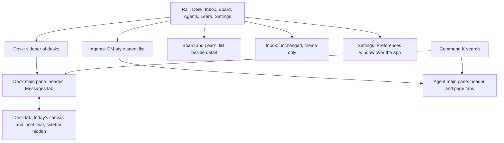
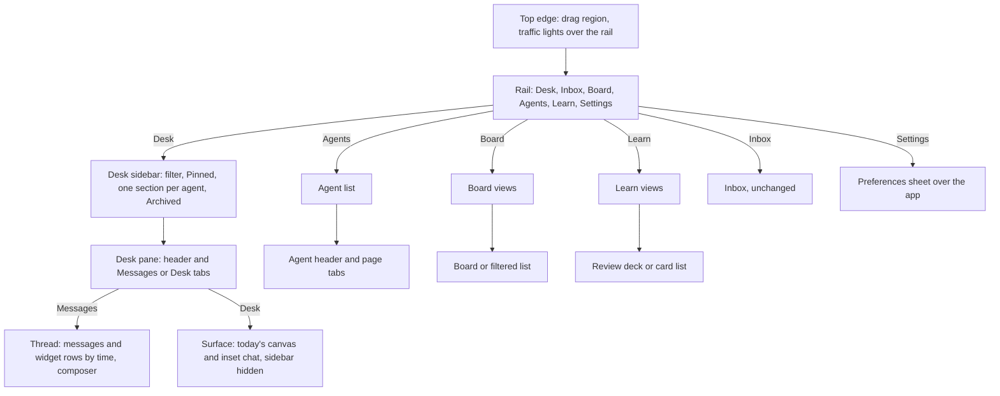
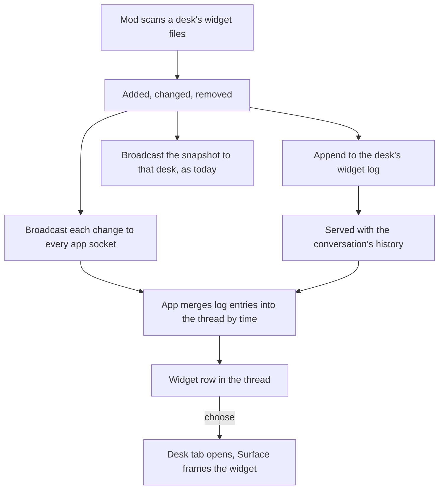
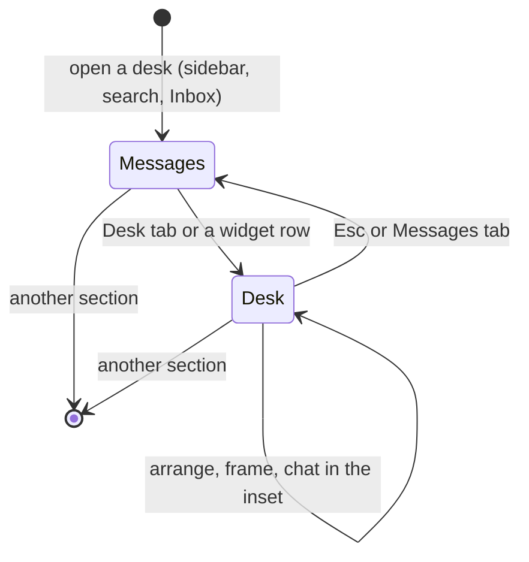
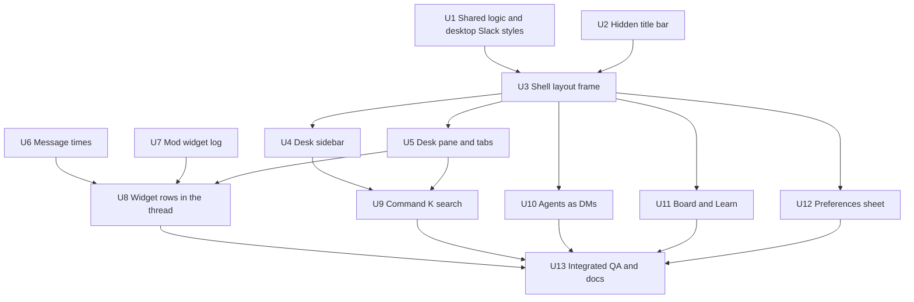

# Loki Slack-Mode Desktop UX - Plan

## Goal Capsule

- **Objective:** Give loki's desktop Slack's structure and feel: a list-and-detail layout per rail section, desks read as Slack channels, and today's canvas kept as each desk's immersive Desk tab.
- **Product authority:** The user's decisions in the 2026-09-23 brainstorm; the user-supplied Slack desktop screenshots of 2026-09-23 are the visual yardstick; the Slack theme already on the desktop (commits c1df3bf, 2b40d25, f5b42e2) and the Slack-mode phone (docs/plans/2026-09-22-012) are the baseline.
- **Open blockers:** None.
- **Execution profile:** Deep, cross-cutting desktop frontend work plus one small mod contract (the widget change log), delivered in dependency order behind the existing shell state.
- **Stop conditions:** Stop for the user only if a unit would remove an existing desktop capability without a named replacement, change the phone's shipped behaviour, or need a Mac-side contract beyond the widget change log and message times named here.
- **Tail ownership:** The implementing workflow owns code, tests, browser QA and cleanup, and commits on the current branch. It does not push or open a pull request unless asked.
- **Product Contract preservation:** changed R3 (hidden title bar, chosen after research), R13 and R15 (message times and a persisted widget log, chosen after research), the sidebar Key Decision (per-agent grouping is new, not today's), and the R15 dependency (now resolved by U7). Everything else unchanged.

---

## Product Contract

### Summary

Each rail section shows its own list in a second column and the chosen item in the main pane. In Desk, that list is a sidebar of desks under Pinned and one section per agent; opening a desk shows it as a Slack channel with a header, a Messages | Desk tab switch, a Slack-anatomy thread and a composer, where the Desk tab is today's canvas with the chat on it. Agents takes Slack's DMs layout, Board and Learn take the same list-and-detail pattern, Settings becomes a Preferences window, and ⌘K opens app-wide search.

### Problem Frame

The desktop already wears Slack's colours and type, but its structure is still the drafting table: one view per rail segment, desks reached through a tree drawer over the canvas, and the chat floating on the widgets. The user lives in the Inbox and in desk conversations, yet a desk always opens as a canvas first, and switching desks means summoning a drawer. The phone now feels like Slack; the desktop reads as a different product.

### Key Decisions

- **Conversation first, canvas one tab away.** A desk opens on its Messages tab; the canvas and inset chat the user has today become the Desk tab (immersive mode). The canvas is never lost, only no longer the default.
- **List and detail per rail section.** Slack's second column changes with the rail item (channels, DMs, Later, Files); loki does the same, so each section is a list beside the thing it lists.
- **Sidebar by agent, pinned on top.** Desks group under one section per agent, with a Pinned section first. Grouping by agent is new: today's tree groups by state (waiting, pinned, recent, everything else) and filters by agent.
- **A loki header in the conversation, and the sidebar replaces the tree drawer.** Both reverse recorded rules (docs/design.md: the native title bar is the only header; the tree is a drawer over the sheet). The user approved both reversals on 2026-09-23.
- **The rail stays.** Slack's desktop keeps a labelled icon rail, so loki's rail maps onto it rather than going away.
- **⌘K becomes app-wide search.** It stops toggling the desk tree and opens search over what the app already knows; there is no top bar.
- **Widget news lives in the thread.** Agents keep building on the canvas while the user reads the conversation; each change surfaces as a row in the thread, as Slack posts canvas updates.

### Actors

- A1. The loki user, reading agent work and replying at the desktop.
- A2. A Loki agent, writing messages and building widgets on its desk.
- A3. The Mac-side mod and harness, supplying desks, conversations, widgets and state.

### Requirements

**Shell and rail**

- R1. The rail keeps loki's six sections (Desk, Inbox, Board, Agents, Learn, Settings) in Slack's labelled-icon style, with red count badges for what needs the user.
- R2. Every rail section except Inbox and Settings shows a second column listing that section's items, and a main pane showing the chosen item.
- R3. There is no top bar of search or history; as in Slack, the native title bar is hidden, the window's traffic lights sit over the rail, and loki draws its own top edge.
- R4. With nothing chosen in a section, the main pane shows a quiet empty state with one line about what to pick, in Slack's manner.

**Desk sidebar**

- R5. The Desk sidebar lists desks in a Pinned section followed by one collapsible section per agent.
- R6. A desk row shows the desk's name, bold when it has unread agent output, a red badge when it needs the user, and a live indicator while its agent is working.
- R7. A filter field at the top narrows the sidebar by desk or agent name.
- R8. Creating a desk, pinning, unpinning, archiving and reopening archived desks remain reachable from the sidebar (section header actions, row menus, and an Archived entry).
- R9. When a desk that needs the user is scrolled out of view, a floating pill at the sidebar's top or bottom edge says so and scrolls to it, as Slack's "Unread mentions" pills do.
- R10. The sidebar keeps its scroll position and collapsed sections across navigation and restarts.

**Desk conversation (Messages tab)**

- R11. The desk header shows the desk name, the agent with its live state, and the desk's actions (pin, archive, and the other actions the current desk offers).
- R12. Under the header, a tab row offers Messages and Desk, with Messages chosen when a desk opens.
- R13. The thread uses Slack's message anatomy: avatar, bold author, the message's time, sticky day pills, and a red "New" line at the first unread message; a message with no known time shows none.
- R14. Hovering a message shows a small action toolbar holding only actions loki already supports on messages.
- R15. Whenever an agent adds, changes or removes a widget, the thread shows a row, placed by time among the messages and kept in the conversation's history, naming the agent, the change and the widget; choosing it opens the Desk tab framed on that widget.
- R16. The composer keeps every current capability (text, images, slash commands, model and permission-mode pickers, dictation, queued replies, structured answers, approvals) in Slack's composer layout.
- R17. Opening a desk from the Inbox lands on its Messages tab with the composer focused.

**Desk tab (immersive)**

- R18. The Desk tab is today's canvas and inset chat, with today's camera, arrange, framing and widget keys.
- R19. The Desk tab hides the sidebar to give the canvas the window; the rail stays.
- R20. The chat on the Desk tab is the same conversation as the Messages tab, with the same draft.
- R21. Esc or the Messages tab returns to the conversation at the scroll position it was left at.

**Search**

- R22. ⌘K opens app-wide search from anywhere, replacing its current job of toggling the desk tree.
- R23. Search covers desks, agents, waiting Inbox items and the app's pages, from data the app already has; it does not search message text.
- R24. With an empty query, search shows recently visited desks and pages; Enter opens the top result.

**Agents**

- R25. The Agents second column lists agents Slack-DMs style: avatar, name, live state, a one-line preview, and a red badge for waiting items.
- R26. The main pane shows the chosen agent with a header and a tab row for its pages (profile, memory, skills, changes, reflection), keeping every current agent capability.

**Board, Learn and Preferences**

- R27. Board and Learn take the list-and-detail pattern and Slack's list and card grammar, with their current behaviour unchanged.
- R28. Settings opens as a Preferences window over the app: a named section list on the left, the chosen section on the right, sentence case throughout, and confirmations as sheets.
- R29. ⌘, opens Preferences from anywhere.

**Quality**

- R30. Every existing keyboard shortcut still works or has a documented Slack-style replacement shown in the keys sheet.
- R31. The layout stays usable from 1100 × 700 upward, with the second column resizable and collapsible.
- R32. Focus, screen-reader names, contrast and reduced motion meet the rules in docs/design.md and PRODUCT.md.
- R33. Each screen is compared side by side with the user's Slack desktop screenshots, and intentional divergences are recorded.

### Key Flows

- F1. Switch desks and reply
  - **Trigger:** A1 wants to answer an agent on another desk.
  - **Actors:** A1, A2
  - **Steps:** A1 clicks the desk in the sidebar (or ⌘K and types its name); its Messages tab opens at the "New" line; A1 replies in the composer.
  - **Outcome:** Switching and replying never pass through the canvas or a drawer.
  - **Covered by:** R5-R7, R11-R16, R22-R24
- F2. Go immersive and back
  - **Trigger:** The thread shows "friday added Revenue chart".
  - **Actors:** A1, A2
  - **Steps:** A1 chooses the row; the Desk tab opens framed on the chart with the sidebar hidden; A1 arranges widgets and talks in the inset chat; Esc returns to Messages at the same place.
  - **Outcome:** The canvas is one step from the conversation and the conversation survives the round trip.
  - **Covered by:** R15, R18-R21
- F3. Review from the Inbox
  - **Trigger:** A1 opens an item in the Inbox.
  - **Actors:** A1, A3
  - **Steps:** Enter/O opens the item's desk on the Messages tab with the composer focused; A1 answers or opens the Desk tab if the widgets matter.
  - **Outcome:** Inbox review lands in the Slack conversation.
  - **Covered by:** R17, R12
- F4. Inspect an agent
  - **Trigger:** A1 wants to see what an agent remembers.
  - **Actors:** A1, A3
  - **Steps:** A1 chooses Agents on the rail, picks the agent in the list, and switches to its memory tab.
  - **Outcome:** Agents read like Slack DMs with a profile behind each.
  - **Covered by:** R25-R26

The shape each rail section takes:

### Acceptance Examples

- AE1. **Covers R12, R17.** Given the Inbox shows a waiting item, when the user presses Enter, the desk opens on Messages with the composer focused, not on the canvas.
- AE2. **Covers R15, R18.** Given the user is on Messages, when the agent adds a widget, a row appears in the thread; choosing it opens the Desk tab framed on that widget.
- AE3. **Covers R20, R21.** Given a half-written reply on Messages, when the user switches to the Desk tab and back, the draft and the thread's scroll position are unchanged.
- AE4. **Covers R9.** Given a desk that needs the user sits below the visible part of the sidebar, a pill at the bottom edge says so; clicking it scrolls the desk into view.
- AE5. **Covers R22, R23.** Given the user presses ⌘K and types part of a desk's title, the desk appears in results; typing a word that appears only in a message body finds nothing.
- AE6. **Covers R19.** Given the Desk tab is open, the sidebar is hidden and the rail still shows; leaving the tab restores the sidebar at its previous scroll position.

### Success Criteria

- Side by side with the user's Slack screenshots, the desk sidebar, desk conversation, Agents, and Preferences read as the same product family.
- The user can switch desks and reply without seeing the canvas, and reach the canvas from any conversation in one step.
- No current desktop capability is lost; every removed path (the tree drawer, ⌘K as tree toggle) has a named replacement.

### Scope Boundaries

- The Inbox keeps its current screen and gets only the theme; its Slack Activity / Catch Up redesign is a separate pass.
- No top bar, no global message-text search, no back/forward history.
- No right-hand panel for threads, profiles or widget details.
- No emoji reactions, threads, huddles, or other Slack collaboration features.
- The phone is unchanged; shared pieces may be reused but the phone's behaviour stays as shipped.
- The canvas itself (widgets, camera, arranging, the widget kit) is unchanged inside the Desk tab.

### Dependencies / Assumptions

- The user-supplied Slack desktop screenshots of 2026-09-23 (channel view with sidebar sections, DMs, Activity, Later, Files, Preferences) are the visual reference; they contain personal and workplace content and stay out of the repository.
- Widget change rows (R15) are recorded by loki's own mod as a per-desk change log, kept with the conversation's history; desks show widget rows only from the day the log ships.
- Search (R23) uses data already loaded in the app, as the phone's search does.

### Outstanding Questions

**Deferred to Implementation**

- Which desk actions sit in the header and which in its overflow menu, decided against the current desk's full action set.
- How the Desk tab remembers camera framing per desk between visits, if the Surface's current per-scope camera state is not already enough.
- The widget log's exact bound and collapse window, tuned once real desks are measured.

### Sources / Research

- docs/design.md: the Shell and Signature sections record the rail, the tree drawer, the chat inset and the title-bar rule this plan changes.
- app/src/shell/keymap.ts: `tree.toggle` is bound to `cmd+k` today.
- app/src/shell/Shell.tsx, app/src/shell/views.tsx, app/src/shell/DeskTree.tsx, app/src/shell/Sidebar.tsx: the current rail, views and tree.
- app/src/chat/ChatWindow.tsx and app/src/desk/useChatInset.ts: the chat as a viewport inset on the canvas, which the Desk tab keeps.
- docs/plans/2026-09-22-012-feat-loki-slack-mobile-ux-plan.md: the phone's Slack grammar, search coverage rule and review semantics.
- docs/research/2026-09-08-ui-review.md: the inbox at 1100 wide clipped the rail; the chat panel covered 38% of the canvas at 1100.

---

## Planning Contract

The Product Contract above is the source of truth; this section adds how to build it.

### Key Technical Decisions

- KTD1. **Shell state stays in `app/src/shell/Shell.tsx`.** It already owns segment, desk switching, chat layout and the pickers. The new layout is a presentation change over that state: each segment gets a list column and a main pane, and no second store is introduced.
- KTD2. **The Surface stays mounted and hidden.** Today the canvas is kept alive behind other views so the desk link and camera keep their state (`Shell.tsx` hides it with `visibility`). The Desk tab shows that same Surface; the Messages tab and every other section hide it. Framing a widget from a thread row therefore needs a way into the Surface's camera, exposed as a frame request from the shell.
- KTD3. **One conversation, two views, one draft.** The Messages tab renders the shared `Conversation` from `useDeskChat`, the Desk tab keeps `ChatWindow`. Both take the controlled `draft` prop backed by one keyed drafts store, lifted from `app/src/phone/session.ts` into a shared module so phone and desktop use the same code. Only the visible view mounts its composer, so the composer's accessible names never appear twice.
- KTD4. **Desktop Slack styles live beside the primitives, not in phone.css.** `phone.css` is scoped to `.loki-phone` and only the phone imports it. The desktop gets its own rules for rows, sections, message anatomy, the header and tabs, in `app/src/components/components.css` and `app/src/chat/chat.css`, using the desktop tokens. Pure logic (drafts, recents, search ranking, unread boundary, day labels) moves to shared modules; the phone re-imports them unchanged.
- KTD5. **The mod keeps a per-desk widget change log.** `mod/widgets-fs.ts` already computes added, changed and removed widgets per scan, and `mod/index.ts` logs the diff but broadcasts only the full snapshot to that desk's sockets. The mod appends each change (time, widget id, name, title, kind) to a small log stored with the desk, broadcasts each change to every app socket, and serves the log alongside history. The log is append-only and bounded per desk; it starts empty on existing desks.
- KTD6. **Message times come from where they already exist.** Harness history carries `at`, which `loadThread` in `core/attention/useAttention.ts` drops; it is carried through to `TranscriptRow` as an optional time. Live rows are stamped when they arrive. The mod's own local history rows gain a time when written from now on. Rows without a time render without one, and the "New" line keeps the phone's turn-based placement when times are missing.
- KTD7. **Widget rows merge by time.** The thread is the transcript rows plus the widget log entries for that desk, ordered by time; entries without a time sit where they arrived. Choosing a widget row switches to the Desk tab and asks the Surface to frame that widget after the tab's layout settles, since hiding the sidebar changes the canvas width.
- KTD8. **The native title bar is hidden, Slack style.** The window builder in `src-tauri/src/lib.rs` switches to an overlay title bar with a hidden title, so the traffic lights sit over the rail. loki draws a thin top edge that is a drag region, and the rail starts below the lights. The window title stays set (for the Window menu, Mission Control and screen readers) but is no longer visible chrome.
- KTD9. **⌘K becomes search; the tree becomes the board's picker only.** `tree.toggle` on `cmd+k` becomes `search.open`. The desk tree component survives as the Board's assign-to-desk picker (`PickerTree`), and its derivations move into the sidebar model. The Agents "show desks" and rail "Desk click toggles tree" paths go away because the sidebar is always there.
- KTD10. **Search generalises the phone's index.** The phone's matching and ranking in `app/src/phone/searchIndex.ts` is split into a route-agnostic core and a phone adapter; the desktop adds its own destinations (desks, agents, waiting items, rail sections, Preferences pages) with desktop recents under new storage keys.
- KTD11. **Preferences is a sheet that does not swallow shell keys.** Settings renders inside the existing `Sheet` primitive at a large size. `useShellKeys` treats that sheet as a known dialog: ⌘, and ⌘1-6 still work and close it, and ⌘[ ⌘] step its pages. Every other dialog keeps blocking shell keys as today.
- KTD12. **Board and Learn gain a list column without new behaviour.** Board's list column holds views (all tasks, each status with its count, each agent); the main pane shows the four-column board for "all" and a single list otherwise, with today's keys. Learn's list column holds its four views (review, leads, all, deleted), which today are tabs.

### High-Level Technical Design

The window after the change:

The widget change path, end to end:

The desk pane's modes:

### Implementation Constraints

- Preserve every shortcut in `app/src/shell/keymap.ts` or replace it with a named Slack-style binding shown in the keys sheet; the keymap tests keep checking conflicts and menu labels.
- Keep the phone's shipped behaviour: moving shared logic out of `app/src/phone/` keeps the phone's imports and tests green, and `phone.css` stays phone-only.
- Keep the shared chat's desktop defaults: new props stay optional.
- Every new style passes `test/tokens.test.ts` (tokens only, type and radius scales, no tracking or uppercase, named radii, `.loki-meta` for small lines).
- No new dependencies.
- The widget log is the only new mod contract; it follows the existing frame conventions in `mod/bridge.ts` and is covered by mod tests.

### System-Wide Impact

- **Window and native menu:** the title bar change touches `src-tauri/src/lib.rs`; the menu built from `KEYMAP` changes where ⌘K now reads "Search".
- **Shell keys:** `useShellKeys` gains the Preferences exception and a desk-level Esc from the Desk tab.
- **Chat:** chat keys (⌘L, ⌘F, ⌘⇧M, ⌘⇧P, ⌘/) route to whichever desk view is showing; `useDeskChat` loads the thread whenever the desk pane shows, not only when the inset chat is open.
- **Mod and phone:** the widget change event reaches phone sockets too; the phone ignores frames it does not know, which must stay true.
- **Tray and catch-up:** ⌥Space and the tray still toggle the Inbox; opening an item lands on Messages.

### Risks and Mitigations

- **Hidden title bar regressions:** window dragging, double-click to zoom and fullscreen can break. Mitigate with an explicit drag region on the top edge and the header, and a manual check in the built app.
- **Two chat views drifting:** the Messages tab and the Desk tab's inset could diverge in draft, scroll or pending question. Mitigate with one draft store, one `useDeskChat` source, and a test that a draft survives the switch.
- **Widget log growth:** a busy desk writes many changes. Bound the log per desk and collapse rapid changes to the same widget into one entry.
- **Shell refactor breadth:** `Shell.tsx` is the composition root for every section. Land the layout frame first with today's views inside it, then recompose section by section.
- **Search expectations:** users may expect message search. The empty state says what search covers, as on the phone.

### Sequencing

U6 and U7 do not depend on the shell and can run alongside U1-U3. U10, U11 and U12 are independent of each other once U3 lands.

---

## Implementation Units

### U1. Share the phone's logic and add desktop Slack building blocks

- **Goal:** Give the desktop the rows, sections, headers, tabs and message anatomy it needs, and make the phone's pure logic shared.
- **Requirements:** R1, R6, R13, R32; supports every later unit.
- **Dependencies:** None.
- **Files:** `app/src/phone/session.ts`, `app/src/phone/searchIndex.ts`, `app/src/phone/deck.ts` (move the shared parts out, keep re-exports), a shared module for drafts, recents, search core, unread boundary and day labels (for example under `app/src/chat/` or a new `app/src/shared/`), `app/src/phone/icons.tsx` (shared icon set), `app/src/components/index.tsx`, `app/src/components/components.css`, `app/src/chat/chat.css`, `app/src/chat/Transcript.tsx`, `test/phone-session.test.ts`, `test/phone-search.test.ts`, `test/tokens.test.ts`, a new test for the shared search core.
- **Approach:** Move drafts, recents, the search matcher and ranker, `unreadBoundary` and `dayLabel` into shared modules and re-export them from the phone paths. Add desktop primitives: a list row (avatar or icon, title bold when unread, preview, time, red badge, live dot), a collapsible section header with actions, a pane header with a tab row, and an empty state. Add desktop rules for the avatar-led message layout the shared Transcript already renders when given `layout.people`.
- **Patterns to follow:** `app/src/phone/rows.tsx` for row anatomy; the existing primitives and their CSS-only states in `app/src/components/`.
- **Test scenarios:**
  1. The phone's session and search tests pass unchanged against the shared modules.
  2. The shared search core ranks exact, prefix, word-start and substring matches in that order for a route-agnostic hit type.
  3. The token fence passes for every new desktop rule.
  4. A desktop row renders an unread title bold and a waiting badge with an accessible label that does not rely on colour.
- **Verification:** Phone tests, token tests and typecheck pass; a desktop row, section and message render in both themes.

### U2. Hide the native title bar, Slack style

- **Goal:** Put the traffic lights over the rail and let loki draw its own top edge.
- **Requirements:** R3, R31.
- **Dependencies:** None.
- **Files:** `src-tauri/src/lib.rs`, `app/src/shell/Sidebar.tsx`, `app/src/shell/Shell.tsx`, `app/src/shell/useWindowChrome.ts`, `app/src/components/components.css`.
- **Approach:** Build the main window with an overlay title bar and hidden title. Reserve the lights' height at the top of the rail, make the top edge and pane headers drag regions, and keep interactive controls out of them. Keep setting the window title for the Window menu and assistive tech. Keep the minimum window size; below 1100 wide the second column collapses.
- **Execution note:** Mostly native configuration; prove it with a built-app check of dragging, double-click zoom, fullscreen and the traffic lights, not unit tests.
- **Test scenarios:** Test expectation: none -- native window configuration; verified manually in the built app (drag from the top edge and a header, double-click to zoom, enter and leave fullscreen, lights never overlap a control).
- **Verification:** The built app shows no native title bar, the lights sit over the rail, and dragging and zoom work.

### U3. Build the list-and-detail shell frame

- **Goal:** Give every rail section a list column and a main pane, with today's views placed inside, before any section is recomposed.
- **Requirements:** R1, R2, R4, R30, R31.
- **Dependencies:** U1, U2.
- **Files:** `app/src/shell/Shell.tsx`, `app/src/shell/views.tsx`, `app/src/shell/Sidebar.tsx`, `app/src/shell/keymap.ts`, `app/src/shell/useShellKeys.ts`, `test/keymap.test.ts`, a new test for the column's width and collapse persistence.
- **Approach:** Add the frame: rail, a resizable and collapsible list column whose width and collapsed state persist, and the main pane. Desk, Board, Agents and Learn fill the column; Inbox and Settings do not. The Surface stays mounted and hidden per KTD2. Rail badges use the red attention tokens. The rail's Desk item no longer toggles a tree.
- **Patterns to follow:** The current `Shell.tsx` view switching and `visibility`-hidden Surface.
- **Test scenarios:**
  1. Switching sections keeps each section's column scroll and selection.
  2. The column width is clamped, persists across reloads, and collapses below 1100 wide.
  3. The keymap still has no conflicts, and ⌘1-6 still reach each section.
  4. The Surface keeps its camera when the user leaves Desk and returns.
- **Verification:** Every section still works inside the new frame; keymap tests pass.

### U4. Desk sidebar

- **Goal:** Replace the tree drawer with a permanent Slack sidebar of desks.
- **Requirements:** R5, R6, R7, R8, R9, R10; F1; AE4.
- **Dependencies:** U3.
- **Files:** a new sidebar component and a pure sidebar model under `app/src/shell/`, `app/src/shell/DeskTree.tsx` (keep only what the Board picker needs), `app/src/shell/Shell.tsx`, `test/desk-tree.test.ts`, a new `test/desk-sidebar.test.ts`.
- **Approach:** Derive sections: Pinned, then one section per agent ordered by recent activity, each desk once, with the agent's main chat first in its section. Reuse `deskMark` for waiting, finished-unread and running. Add the filter field, section header actions (new desk for that agent, collapse), row menus (pin, archive, restore), an Archived entry, and the floating "needs you" pills. Persist scroll and collapsed sections. Keep `PickerTree` for the Board's assign flow.
- **Patterns to follow:** `sectionDesks`, `deskMark`, `canPinDesk` and `canArchiveDesk` in `app/src/shell/DeskTree.tsx`.
- **Test scenarios:**
  1. A pinned desk appears only under Pinned; every other live desk appears once, under its agent.
  2. The filter matches desk titles and agent names, case-insensitively, and shows an empty state with a clear action.
  3. Waiting, finished-unread and running desks get the red badge, bold title and live dot.
  4. The main chat cannot be archived and deleted desks cannot be pinned, as today.
  5. Covers AE4. A waiting desk below the fold produces a bottom pill; above the fold, a top pill; choosing it scrolls the desk into view.
  6. Collapsed sections and scroll restore after a reload.
- **Verification:** Every tree capability has a sidebar home; the Board picker still assigns tasks.

### U5. Desk pane: header, Messages and Desk tabs

- **Goal:** Open desks as Slack channels with the canvas one tab away.
- **Requirements:** R11, R12, R14, R16, R17, R18, R19, R20, R21; F1, F2, F3; AE1, AE3, AE6.
- **Dependencies:** U3.
- **Files:** a new desk pane component under `app/src/desk/` or `app/src/shell/`, `app/src/desk/Surface.tsx`, `app/src/desk/useDeskChat.ts`, `app/src/chat/Conversation.tsx`, `app/src/chat/ChatWindow.tsx`, `app/src/shell/Shell.tsx`, `app/src/shell/useShellKeys.ts`, `app/src/shell/keymap.ts`, the shared drafts module, a new test for the pane's tab state and draft sharing.
- **Approach:** The header shows the desk name, the agent pill with live state, and the desk's actions. The Messages tab renders `Conversation` with the Slack layout and the controlled draft; the Desk tab shows the Surface with the sidebar hidden and the inset chat on the same draft. Esc on the Desk tab returns to Messages at its scroll. Route chat keys to the visible view. Load the thread whenever the pane shows. Opening from the Inbox, search or a Learn source lands on Messages with the composer focused. The hover toolbar holds only actions loki already has on messages.
- **Patterns to follow:** `app/src/phone/Conversation.tsx` for header and draft wiring; `DeskChat` in `app/src/desk/Surface.tsx`.
- **Test scenarios:**
  1. Covers AE1. Opening an Inbox item selects Messages and focuses the composer.
  2. Covers AE3. A draft typed on Messages is present in the Desk tab's inset chat and back again.
  3. Covers AE6. The Desk tab hides the sidebar; leaving it restores the sidebar at its scroll.
  4. Esc from the Desk tab returns to Messages; Esc while typing does not.
  5. ⌘L, ⌘F, ⌘⇧M and ⌘⇧P act on the visible view.
  6. A pending question or approval shows in whichever view is visible and resolves once.
  7. An empty desk opens on Messages and does not auto-centre a hidden chat.
- **Verification:** Every current chat capability works from Messages; the Desk tab behaves as today's desk.

### U6. Message times

- **Goal:** Show each message's time, day pills between days, and the "New" line.
- **Requirements:** R13.
- **Dependencies:** None.
- **Files:** `core/attention/transcript.ts`, `core/attention/useAttention.ts`, `core/attention/model.ts`, `mod/desks.ts`, `app/src/chat/Transcript.tsx`, the shared day-label module, `test/attention-model.test.ts`, a new transcript timing test.
- **Approach:** Add an optional time to transcript rows. Carry the harness history's `at` through `loadThread`, stamp live rows on arrival, and record a time in the mod's local history from now on. Render times on author rows, sticky day pills where the day changes, and the "New" line at the first unread message, falling back to turn-based placement when times are missing.
- **Test scenarios:**
  1. History with times yields rows with times; history without times yields rows without.
  2. Live rows get a time on arrival and keep it after the thread reloads from history.
  3. Day pills appear only where the calendar day changes, in the user's time zone.
  4. The "New" line sits before the first unread assistant message, and falls back to the phone's rule when rows lack times.
- **Verification:** A desk's thread shows real times for new messages and old harness messages.

### U7. Mod widget change log

- **Goal:** Record every widget change per desk and send it to the app.
- **Requirements:** R15.
- **Dependencies:** None.
- **Files:** `mod/widgets-fs.ts`, `mod/index.ts`, `mod/bridge.ts`, `mod/desks.ts` or a new mod module for the log, `core/desk-core.ts` (the entry type), `test/widgets-fs.test.ts`, a new `test/widget-log.test.ts`, `test/bridge.test.ts`.
- **Approach:** On each scan diff, append entries (time, desk scope, widget id, name, title, kind) to a bounded per-desk log stored with the desk's data, collapsing rapid repeat changes to one widget. Broadcast each change to every app socket. Serve the log with a desk's history. Leave the existing snapshot and camera broadcasts unchanged.
- **Execution note:** Start with failing tests for the log's append, bound and collapse rules before wiring broadcasts.
- **Patterns to follow:** The existing `WidgetsDiff` in `mod/widgets-fs.ts` and frame handling in `mod/bridge.ts`.
- **Test scenarios:**
  1. Adding, editing and deleting a widget file appends added, changed and removed entries with times.
  2. Three edits to one widget within a short window collapse to one changed entry.
  3. The log stays within its bound, dropping the oldest entries.
  4. A change on desk A reaches a socket connected to desk B.
  5. History for a desk includes its log; a desk with no log returns an empty list.
  6. A phone socket receiving the new frame is unaffected.
- **Verification:** Mod tests pass and the app receives change frames for any desk.

### U8. Widget rows in the thread

- **Goal:** Show widget changes in the conversation and open the canvas on them.
- **Requirements:** R15; F2; AE2.
- **Dependencies:** U5, U6, U7.
- **Files:** `app/src/chat/Transcript.tsx`, `app/src/desk/useDeskChat.ts`, `app/src/desk/useDesk.ts`, `app/src/desk/useDeskSocket.ts`, `app/src/desk/Surface.tsx`, `app/src/desk/useCamera.ts`, `app/src/shell/Shell.tsx`, a new merge test.
- **Approach:** Merge the desk's widget log into the thread by time. Render a compact row: agent, what changed, widget title. Choosing it switches to the Desk tab and sends a frame request the Surface honours once the tab's layout settles. A removed widget's row explains it is gone and does not frame.
- **Test scenarios:**
  1. Covers AE2. A widget added while Messages is open appears as a row after the latest message.
  2. Log entries interleave with messages by time after a reload.
  3. Choosing a row for an existing widget opens the Desk tab and frames it; for a removed widget it opens nothing and says so.
  4. A widget change on another desk updates that desk's thread when it next opens.
- **Verification:** Widget rows persist across reloads and frame the right widget.

### U9. ⌘K search

- **Goal:** Replace the tree toggle with app-wide search.
- **Requirements:** R22, R23, R24; F1; AE5.
- **Dependencies:** U1, U4, U5.
- **Files:** a new desktop search component under `app/src/shell/`, the shared search core, `app/src/shell/keymap.ts`, `app/src/shell/KeysSheet.tsx`, `test/keymap.test.ts`, a new desktop search test.
- **Approach:** ⌘K opens a search sheet from anywhere. Before typing it shows recent desks and pages; after typing it groups desks, agents, waiting items and pages. Enter opens the top result; results open on the right section and, for desks, on Messages. The coverage line says message text is not searched.
- **Patterns to follow:** `app/src/phone/Search.tsx` and `app/src/phone/searchIndex.ts`.
- **Test scenarios:**
  1. Covers AE5. A desk found by part of its title opens on Messages; a word only in a message finds nothing.
  2. Recents are bounded, deduplicated, and drop desks and agents that no longer exist.
  3. ⌘K while typing in the composer opens search.
  4. The native menu lists ⌘K as Search.
- **Verification:** Every former tree-switching path has a search or sidebar replacement.

### U10. Agents as DMs

- **Goal:** List agents in the column and show the chosen agent with page tabs.
- **Requirements:** R25, R26; F4.
- **Dependencies:** U3.
- **Files:** `app/src/agents/Agents.tsx`, `app/src/agents/pages.ts`, `app/src/agents/ProfilePage.tsx` and the other page components as needed, `test/agents-pages.test.ts`.
- **Approach:** Move the agent tablist into the column as DM-style rows with live state, preview and waiting badge; move the page list into a tab row under the agent's header. Keep ⌘[ ⌘] stepping agents, the new-agent flow, and every page's behaviour.
- **Test scenarios:**
  1. The chosen agent and page persist across section switches, as today.
  2. An agent with waiting items shows a badge with an accessible count.
  3. The new-agent flow is reachable from the column header.
  4. No agents shows the existing empty state inside the new layout.
- **Verification:** Every agent page and action still works.

### U11. Board and Learn as list and detail

- **Goal:** Give Board and Learn a list column without changing what they do.
- **Requirements:** R27.
- **Dependencies:** U3.
- **Files:** `app/src/board/Board.tsx`, `app/src/board/model.ts`, `app/src/recall/Recall.tsx`, `app/src/recall/RecallParts.tsx`, `test/board.test.ts`.
- **Approach:** Board's column lists views per KTD12 with counts; "all" keeps the four-column board, a status or agent view shows a single list with the same keys. Learn's column lists its four views; the main pane is today's deck or list.
- **Test scenarios:**
  1. Board view counts match the tasks shown in the pane.
  2. Board keys (select, assign, dispatch, done, blocked, column step) behave the same in the "all" view and a filtered view.
  3. Learn's views switch from the column and by ⌘[ ⌘] as today.
- **Verification:** Board and Learn behave as before in the new layout.

### U12. Preferences sheet

- **Goal:** Open Settings as a Slack Preferences window.
- **Requirements:** R28, R29, R30.
- **Dependencies:** U3.
- **Files:** `app/src/settings/Settings.tsx`, `app/src/components/index.tsx` (Sheet sizing), `app/src/shell/useShellKeys.ts`, `app/src/shell/keymap.ts`, `app/src/shell/Shell.tsx`, `test/keymap.test.ts`.
- **Approach:** Render Settings inside a large Sheet with its page list on the left and the page on the right, sentence-case page names, and confirmations as sheets. The rail's Settings item and ⌘, open it; per KTD11, ⌘, ⌘1-6 and ⌘[ ⌘] keep working while it is open, and Esc closes it.
- **Test scenarios:**
  1. ⌘, opens Preferences from any section and closes it when already open.
  2. ⌘2 while Preferences is open closes it and shows the Inbox.
  3. ⌘[ ⌘] step Preferences pages while it is open.
  4. Other dialogs still block shell keys.
  5. Focus moves into the sheet on open and returns to the launcher on close.
- **Verification:** Every Settings page works inside the sheet.

### U13. Integrated QA, cleanup and docs

- **Goal:** Prove the assembled desktop against the reference and remove what the change replaced.
- **Requirements:** R30-R33; all flows and acceptance examples.
- **Dependencies:** U8, U9, U10, U11, U12.
- **Files:** `docs/design.md` (Shell and Signature sections), `docs/manual.md`, `app/src/shell/KeysSheet.tsx`, any dead code left by the tree drawer and old layouts.
- **Approach:** Drive the real shell on fake transport data at 1100 × 700 and 1440 × 900, in both themes, and compare each screen side by side with the user's Slack screenshots, recording intentional divergences. Check the built Tauri app for the title bar. Rewrite the Shell and Signature sections of `docs/design.md` for the new layout, and update the manual's keys and navigation.
- **Test scenarios:**
  1. Complete F1-F4 by mouse and by keyboard only.
  2. Every former shortcut still works or its replacement is listed in the keys sheet.
  3. No overlap, clipped control or horizontal scroll at 1100 × 700 with the column open and collapsed.
- **Verification:** Every gate in the Verification Contract passes and the screenshot comparison is recorded.

---

## Verification Contract

| Gate | Command or method | Proves | Applies |
|---|---|---|---|
| Unit and model tests | `bun test` | Sidebar model, search, drafts, message times, widget log, keymap, token fence, phone unchanged | Every unit |
| Type safety | `bun run typecheck` | Shell, chat and mod contracts | Every unit |
| Lint | `bun run lint` | No new errors | Final |
| Web build | `bun run build:app` | CSS and bundle integrate | Final |
| React audit | `bun run doctor` | No new findings in changed files | Final |
| Native build | `cargo check` in `src-tauri` (or the desktop build) | The title bar change compiles | U2, final |
| Browser QA | Vite on a spare port with the mod proxy pointed away from the user's stack, fake transport data, chrome-devtools | Layout, keys, flows, both themes, 1100 × 700 and 1440 × 900 | Each unit, full pass in U13 |
| Built app check | The user's built desktop app | Traffic lights, dragging, zoom, fullscreen | U2, U13 |
| Reference comparison | Side by side with the user's Slack desktop screenshots | Slack feel | U13 |

---

## Definition of Done

- R1-R33 hold, and AE1-AE6 pass.
- The rail, desk sidebar, desk pane with Messages and Desk tabs, ⌘K search, Agents, Board, Learn and Preferences all use the Slack layout; the Inbox and the phone are unchanged.
- Widget rows appear in every desk's thread from the change log, by time, and open the Desk tab on the widget.
- Messages show their times where known, with day pills and the "New" line.
- The native title bar is hidden and dragging, zoom and fullscreen work.
- Every former shortcut works or has a listed replacement; the keys sheet and native menu match.
- `bun test`, `bun run typecheck`, `bun run lint`, `bun run build:app` and `bun run doctor` finish without new failures.
- `docs/design.md` and `docs/manual.md` describe the new shell; the tree drawer's dead code is gone.
