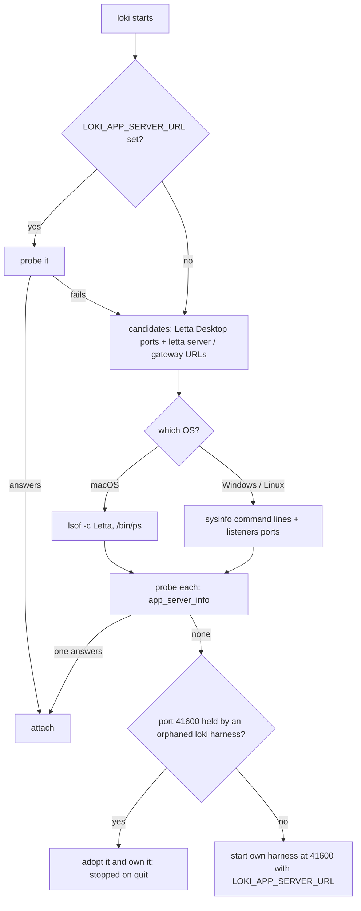
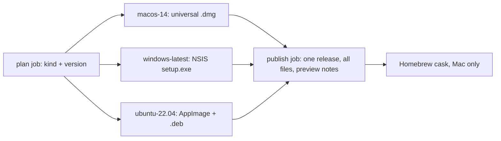

# Loki on Windows and Linux - Plan

## Goal Capsule

- **Objective:** Someone on Windows or Linux can download loki from its GitHub release, install it, and use the same desk, inbox, board, agents and Learn as a Mac user, with the builds clearly marked as a preview until people confirm they work.
- **Means:** One codebase with small per-OS seams: the OS told to the page once (KTD1), Mac extras compiled only on macOS (KTD3), loki's own title strip (KTD4), a per-OS harness lookup beside the Mac's unchanged one (KTD5), and per-OS build legs feeding one publish step (KTD10).
- **Product authority:** The user's decisions in the 2026-09-24 brainstorm and the plan-time call-outs confirmed the same day. The macOS app as shipped in stable 2026.9.23 (the Slack layout of plans 012 and 013) is the behaviour to match.
- **Open blockers:** None.
- **Execution profile:** Deep, cross-cutting: Rust shell, mod, web app, CI and release. Nobody can run Windows or Linux here, so CI runners are the only execution proof; units land in dependency order on the Mac and must keep the Mac green at every step.
- **Stop conditions:** Stop for the user if a unit would change Mac behaviour beyond the shared-code edits named here, if the nightly version string cannot be made to build an NSIS installer, or if a hosted runner cannot build or test a leg at all.
- **Tail ownership:** The implementing workflow owns code, tests, CI edits and docs, and commits on the current branch. It does not push or open a pull request unless asked; CI legs are proven when the user pushes.
- **Product Contract preservation:** Product Contract unchanged.

---

## Product Contract

### Summary

Preview builds of loki for Windows and Linux, from the same code and on the same nightly and stable releases as the Mac. They cover the core (Desk, Inbox, Board, Agents, Learn, Preferences and the mod) and behave like the Mac: loki finds a running Letta harness and attaches to it, or starts its own.

### Problem Frame

loki is public on GitHub, but it only runs on macOS 13 or later. Releases build one universal Mac app, CI runs only on macOS, and installs go through a Homebrew tap. The Rust shell and the mod find Letta, Node and a running harness through Mac and Unix paths and tools, the folder picker is AppleScript, and every shortcut is drawn with ⌘. Letta Code itself is a Node program with Windows handling of its own, so the agents loki fronts could run on Windows and Linux; loki is the part that cannot. Nobody on the project has a Windows or Linux machine, so anything shipped for them is tested only by CI runners and by the people who report back.

### Key Decisions

- **Same behaviour on every OS: attach to a running harness, else start one.** Governs R6. (session-settled: user-directed — chosen over loki always starting its own harness on Windows and Linux: one behaviour everywhere, and Letta Desktop users share their agents with loki.)
- **Windows and Linux together, core features first.** Most of the porting (process lookup, install paths, window chrome, packaging) is shared between them. Governs R1, R2, R3. (session-settled: user-directed — chosen over Windows-only core first, and over full parity with the Mac extras: one pass covers both systems.)
- **Unsigned installers on the GitHub release; package managers later.** Matches the Mac, which is unsigned too. Governs R9, R10. (session-settled: user-approved — chosen over adding winget and Flatpak or AUR at launch, and over a code-signed Windows build: no paid signing account or outside review queues for a preview.)
- **Show how to install Node rather than downloading it.** Keeps the promise in docs/SECURITY.md that loki downloads no runtime of its own. Governs R7. (session-settled: user-approved — chosen over loki fetching a private Node, and over installers that bring Node: no runtime for loki to keep patched.)
- **Preview label until users confirm.** Nobody can try these builds on real hardware. Governs R12, R13. (session-settled: user-approved — chosen over nightly-only builds and over shipping them unlabelled: people can install them from stable, and know what they're getting.)
- **The window follows Slack's Windows and Linux layout.** loki draws its own title strip with minimise, maximise and close on the right, as Slack does there, rather than the system title bar; the Slack direction set in plans 012 and 013 applies. Governs R4; the ☰ menu and window controls are KTD4.

### Requirements

**Platforms and scope**

- R1. loki installs and runs on 64-bit Windows 10 and 11 and on current 64-bit desktop Linux (Ubuntu and Debian families first, through the .deb; other distributions through the AppImage).
- R2. On Windows and Linux, Desk, Inbox, Board, Agents, Learn, Preferences, search and the mod behave as they do on the Mac.
- R3. The Mac-only extras (phone pairing over the LAN and Tailscale, dictation, the menu-bar or tray item, the dock badge, and the global Catch Up shortcut) are hidden on Windows and Linux. Where one would appear, loki says it is not on this system yet rather than showing a control that fails.

**Window and keys**

- R4. On Windows and Linux the window has loki's own title strip in the Slack layout: it drags the window, double-click maximises, and minimise, maximise and close sit on the right.
- R5. Every shortcut works with Ctrl in place of ⌘ on Windows and Linux, and every place that shows a shortcut (menus, the keys sheet, Preferences › keys, tooltips, the docs) shows Ctrl there. A shortcut that collides with a system-reserved key on that OS is reassigned there and listed under its new key.

**Harness and first run**

- R6. On launch, loki looks for a Letta harness already running on the machine (Letta Desktop, or a `letta server` the user started) and attaches to it, as it does on the Mac; finding none, it starts its own.
- R7. When Letta Code is missing, loki installs it with npm as on the Mac. When no Node 22 or newer is found, Welcome says Node is needed, links to nodejs.org, names the system's usual install command (winget on Windows, the package manager on Linux), and checks again with one button. loki never downloads Node itself.
- R8. Folder choice works on every system, using that system's own folder dialog.

**Distribution and updates**

- R9. Every nightly and stable release carries a Windows installer and a Linux AppImage and .deb beside the Mac files, built by the same release run.
- R10. The Windows and Linux files are unsigned. The README and manual describe the warning each system shows on first run (Windows' "unknown publisher" SmartScreen screen; the AppImage's executable bit) and how to get past it, as they do for Gatekeeper today.
- R11. The in-app update check tells Windows and Linux users about a newer build on their channel and links to that system's download.

**Preview and confidence**

- R12. Until users confirm, the README, the release notes and loki's About screen call the Windows and Linux builds a preview ("built and tested in CI, not yet tried on real machines") and link to where to report problems.
- R13. CI builds and runs the test suite on Windows and Linux runners on every pull request, and exercises the harness lookup of R6 there against a stand-in harness, not only the build.

### Acceptance Examples

- AE1. **Covers R6.** Given Letta Desktop is running on a Windows PC, when loki launches, then it attaches to that harness and shows the same agents and conversations, and no second harness starts.
- AE2. **Covers R6.** Given nothing Letta is running on a Linux machine, when loki launches, then it starts its own harness and the desk opens once it is ready.
- AE3. **Covers R7.** Given a Windows PC with no Node, when loki first launches, then Welcome says Node 22 or newer is needed, shows the winget command and a link, and after the user installs Node and presses the re-check button, installs Letta Code and continues.
- AE4. **Covers R3.** Given loki on Linux, when the user opens Preferences › phone, then it says phone pairing is not on Linux yet instead of showing a pairing code.
- AE5. **Covers R5.** Given loki on Windows, when the user presses Ctrl+K, then search opens, and the keys sheet lists it as Ctrl K.

### Scope Boundaries

- Phone pairing, Tailscale, dictation, the tray item and the global shortcut on Windows and Linux (deferred; R3 hides them).
- winget, Scoop, Flathub, AUR or Snap packages (deferred).
- Code signing for Windows or Linux (deferred).
- ARM builds for Windows and Linux (deferred; 64-bit x86 only).
- Changing any Mac behaviour, except where shared code must learn about the other systems.

#### Deferred to Follow-Up Work

- Moving the Mac build leg from `tauri-apps/tauri-action@v0` to v1.
- Noticing a Letta Desktop started after loki (no OS re-probes today; the Mac doesn't either).
- Tightening the Windows token file's ACL beyond the per-user profile it lives in.
- Windows 11 snap layouts on hover over loki's maximise button (needs native hit-testing).

### Dependencies / Assumptions

- Letta Code runs on Windows and Linux. The installed 0.32.18 declares no OS restriction and has Windows branches (npm.cmd, PowerShell, drive-letter paths); this is observed, not tested.
- Letta Desktop exists for Windows or Linux and runs the same app-server protocol as on the Mac (unverified). If it doesn't, R6 still holds for a `letta server` the user started.
- GitHub's hosted Windows and Ubuntu runners can build Tauri 2 installers and run the test suite.

### Outstanding Questions

**Deferred to Implementation**

- Whether a nightly version such as `2026.9.24-nightly.abc1234` builds an NSIS installer as is, or needs a numeric-only Windows version beside it (U10; a stop condition if neither works).
- Which mechanism keeps WebView2's own Ctrl+R, Ctrl+F, Ctrl+P and devtools keys from reaching the webview in release builds (U4).
- Whether the `listeners` crate sees another user-level process's sockets without elevation on both systems (U6; the fallback is the per-OS readers the mod uses).

### Sources / Research

- Mac-only paths: `src-tauri/src/appserver.rs` (lsof, ps), `src-tauri/src/bootstrap.rs` and `src-tauri/src/install.rs` (Homebrew and Unix install paths), `src-tauri/src/scratch.rs` and `src-tauri/src/lib.rs` (Unix permissions), `mod/app-server.ts` (lsof, ps), `mod/folders.ts` (AppleScript picker), `mod/tailscale.ts`, `scripts/dev.ts` (`:` PATH separator).
- Shortcuts: `app/src/shell/keymap.ts` already matches "cmd" as Meta or Ctrl; the ⌘ glyph is written into display text across `app/src`.
- Update check: `app/src/shell/useLokiUpdate.ts` reads only the release's tag and name and links to the release page.
- Releases and CI: `.github/workflows/release.yml` and `ci.yml` (macOS only), `scripts/release.ts`, `scripts/cask.ts`.
- Portability guard: `test/core-portability.test.ts` keeps `core/` free of browser and Tauri globals.
- Earlier plans listing Windows and Linux as out of scope: `docs/plans/2026-09-07-006-feat-loki-onboarding-plan.md`, `docs/plans/2026-09-07-007-feat-loki-mobile-plan.md`.

---

## Planning Contract

### Key Technical Decisions

- KTD1. **The page learns the OS once, from the shell.** The init script that already injects `window.__LOKI__` adds `os` (macos, windows, linux); `app/src/desk/env.ts` exports one `platform` value derived from it, falling back to the user agent in a browser tab. Everything OS-shaped in the app (keys, chrome, gating, copy) reads that value; `core/` stays OS-free, as `test/core-portability.test.ts` requires. Serves R2–R5.
- KTD2. **Shortcut text comes from the keymap only.** `formatKeys` in `app/src/shell/keymap.ts` renders per `platform`: ⌘ ⌥ ⇧ ↵ ⌫ on the Mac, `Ctrl`, `Alt`, `Shift`, `Enter`, `Backspace` elsewhere. The ~35 hard-coded ⌘ strings across the app become calls into it by binding id. A reserved-key collision is reassigned in the keymap table per OS, so matching, display and the listed key never disagree. Serves R5.
- KTD3. **Mac extras exist only on macOS.** The tray, dock badge, global shortcut and native menu are compiled for macOS only (target-specific dependencies and `cfg(target_os = "macos")`), so the Linux packages need no appindicator library. The page reads availability from `platform` and shows the existing "available / plain-words fallback" pattern (`app/src/settings/Settings.tsx` shortcut row) with "not on this system yet". Dictation, LAN pairing and Tailscale are hidden the same way. Governs R3.
- KTD4. **Windows and Linux get loki's own title strip, a ☰ menu, and minimise for Hide.** The window is undecorated there; the strip keeps the Slack layout with minimise, maximise and close on the right and a ☰ button on the left that opens the same menus the Mac's menu bar shows, built from `menuSpec()`, with Ctrl keys. No native menu bar is set. "Hide loki" minimises, since no tray or dock can bring a hidden window back. (session-settled: user-approved — chosen over a system menu bar above the strip, and over keeping Hide: a menu bar breaks the Slack strip and a hidden window would be unreachable.) Serves R4, R5.
- KTD5. **The Mac's harness lookup stays; Windows and Linux get their own.** On the Mac nothing changes (`lsof`, `/bin/ps`). On Windows and Linux the shell lists processes and their command lines with `sysinfo` and listening ports with `listeners`, finds Letta Desktop by process name and `letta server` / gateway URLs by command line, and probes each candidate the way `probe_with` already does. The mod's own-port lookup gets per-OS readers (Linux `/proc`, Windows `netstat -ano`). A harness loki launches is told its own URL through `LOKI_APP_SERVER_URL`, so the mod needs no lookup for it. (session-settled: user-approved — chosen over one cross-platform crate for all three systems: no risk to the proven Mac path, at the cost of two code paths.) Implements R6, whose Key Decision is session-settled user-directed.
- KTD6. **On Windows loki runs Letta's node entry directly and owns its process tree.** npm's `letta.cmd` shim is resolved to `node <prefix>/node_modules/@letta-ai/letta-code/letta.js`, started with no console window and inside a Job Object that kills the tree when loki exits, so quitting never leaves a node holding the harness port. Paths are resolved at each start, never cached (Letta Code's open stale-fnm-path bug). Serves R6, R7.
- KTD7. **One loki per user on Windows and Linux.** `tauri-plugin-single-instance` brings the running window forward when loki is launched again, so two shells never race for the harness port. The Mac already has this from the app bundle. (session-settled: user-approved — chosen over allowing several copies: they would start competing harnesses on one port.) Serves R6.
- KTD8. **Linux runs through XWayland.** The shell sets `GDK_BACKEND=x11` before GTK starts unless the user already set it, avoiding the open Wayland bugs with undecorated windows (resize, unresponsive buttons). (session-settled: user-approved — chosen over native Wayland: working chrome over sharper fractional scaling.) Serves R4.
- KTD9. **The folder dialog comes from the shell.** `tauri-plugin-dialog` opens the system's own folder picker from the app, on every OS, so picking works even when the harness is Letta Desktop's; the mod's AppleScript picker stays for browser tabs on the Mac. Folder completion learns drive paths and `~\`. Serves R8.
- KTD10. **Each OS builds on its own runner; one job publishes.** The release workflow builds macOS (unchanged, `tauri-action@v0`), Windows (NSIS) and Linux (AppImage, .deb) as artifacts, then a single publish step runs `scripts/release.ts publish` with every file, because the nightly publish deletes and recreates the rolling release. Serves R9.
- KTD11. **Linux builds on Ubuntu 22.04.** The oldest supported runner gives an AppImage and .deb that run on newer glibc too; the apt step names the 22.04 packages only. Serves R1, R9.
- KTD12. **Line endings are LF everywhere.** A `.gitattributes` with `* text=auto eol=lf` keeps Windows checkouts from breaking the tests that read source files. Serves R13.
- KTD13. **The update check links the asset for this system.** `useLokiUpdate` keeps the release's `assets` and picks the `.dmg`, `-setup.exe`, `.AppImage` or `.deb` for `platform`, falling back to the release page. Serves R11.

### High-Level Technical Design

Harness choice at launch, the same order on every OS (R6); only the lookup source differs (KTD5):

Release run (R9, KTD10):

### Assumptions

- Hosted `windows-latest` runners can create symlinks (they run as administrator); tests that need one use a junction for directories.
- `%USERPROFILE%\.letta` is where Letta Code keeps its home on Windows (inferred from `os.homedir()`; unverified).

### System-Wide Impact

- **The Mac build:** every unit touches code the Mac runs. The Mac paths stay behind `cfg(target_os = "macos")` or `platform === "macos"`, and the Mac CI leg must stay green at each commit.
- **The mod inside other harnesses:** the mod also runs inside Letta Desktop and a user's `letta server`. Its new OS readers run only when `LOKI_APP_SERVER_URL` is absent and fail soft (no URL found), as `lsof` does today.
- **Shared state in `~/.letta`:** Windows paths come from the profile folder, so loki, the mod and Letta Code must agree on it (U1); nothing moves on the Mac.
- **Analytics:** events gain `windows` and `linux` device types (U2); `bun run analytics` reports them with no other change.
- **Release consumers:** the Homebrew tap and `useLokiUpdate` read the release; the tap sees the same `.dmg` name, and the update check learns the new assets (U10).

### Risks & Dependencies

| Risk | Mitigation |
|---|---|
| Nothing is tried on real Windows or Linux hardware | Preview label (R12); CI exercises real OS process and port APIs (U9); a tester checklist ships with the docs (U11) |
| Nightly prerelease version rejected by the Windows installer | Checked in U10 on the first Windows nightly; stop condition if it cannot be made to work |
| WebKitGTK differences (heavier font weight, unreliable backdrop blur, IME preedit) | Listed in the tester checklist; not fixed blind |
| WebView2 browser keys (Ctrl+R reload) dropping the session | Suppressed in U4; a keymap test asserts loki owns those chords |
| Letta Code's own Windows bugs (5–7 s child-process hangs) | Harness lookup and start stay off the UI thread; Welcome shows progress |
| Windows 11 snap layouts not offered by loki's maximise button | Deferred; Win+Z and drag-to-edge still work |

---

## Implementation Units

| U-ID | Title | Key files | Depends on |
|---|---|---|---|
| U1 | The shell builds and runs off the Mac | `src-tauri/src/lib.rs`, `bootstrap.rs`, `install.rs`, `.gitattributes` | — |
| U2 | The page knows the OS; keys read Ctrl | `app/src/desk/env.ts`, `app/src/shell/keymap.ts` | U1 |
| U3 | Mac extras only on the Mac | `src-tauri/src/native.rs`, `src-tauri/Cargo.toml`, Settings | U2 |
| U4 | loki's own title strip on Windows and Linux | `app/src/shell/Sidebar.tsx`, `src-tauri/src/lib.rs` | U2, U3 |
| U5 | Letta Code and Node found, installed and run per OS | `src-tauri/src/bootstrap.rs`, `harness.rs`, `Welcome.tsx` | U1 |
| U6 | A running harness found on Windows and Linux | `src-tauri/src/appserver.rs`, `mod/app-server.ts` | U1, U5 |
| U7 | The system's own folder dialog | `app/src/desk/NewDesk.tsx`, `mod/folders.ts` | U2 |
| U8 | Words for each system | app copy, `scratch.rs` | U2, U5 |
| U9 | CI on Mac, Windows and Linux | `.github/workflows/ci.yml`, tests | U1, U5, U6 |
| U10 | Releases carry Windows and Linux files | `release.yml`, `scripts/release.ts`, `useLokiUpdate.ts` | U4, U9 |
| U11 | Docs and the preview checklist | `README.md`, `docs/*.md` | U3–U10 |

### U1. The shell builds and runs off the Mac

**Goal:** `src-tauri` compiles for Windows and Linux and finds the right home folder and token there, with the Mac unchanged.

**Requirements:** R1, R2, R13.

**Dependencies:** none.

**Files:** `src-tauri/src/lib.rs`, `src-tauri/src/bootstrap.rs`, `src-tauri/src/install.rs`, `src-tauri/src/scratch.rs`, `src-tauri/Cargo.toml`, `.gitattributes` (new), `scripts/dev.ts`, `scripts/harness.ts`, `package.json`.

**Approach:**
1. Gate the Unix-only calls: the SIGTERM/SIGINT task (`tokio::signal::ctrl_c` elsewhere), `mark_executable`, `link_checkout`'s symlink (a directory junction or copy on Windows); mark Unix-only tests `#[cfg(unix)]`.
2. Make the token from the OS random source (the `getrandom` crate or equivalent) instead of reading `/dev/urandom`.
3. Take the home folder from the platform (`USERPROFILE` on Windows, `HOME` elsewhere) so the shell and the mod's `os.homedir()` agree.
4. Scratch validation accepts `~\` and drive-letter absolute paths.
5. Add `.gitattributes` (KTD12); split PATH with the OS delimiter in `scripts/dev.ts`; use `fileURLToPath` in `scripts/harness.ts`; make `desktop:dev`'s quoting work under cmd.exe.

**Patterns to follow:** existing `#[cfg(unix)]` at `lib.rs` token chmod and `scratch.rs`; `std::env::split_paths` already used in `bootstrap.rs`.

**Test scenarios:**
- The token generator returns 32 bytes of hex and two calls differ.
- `home_dir()` with only `USERPROFILE` set (Windows) returns it; with `HOME` set (Unix) returns `HOME`; with neither, the run reports an error rather than using `/`.
- Scratch `validate` accepts `C:\Users\x\.letta\scratch` on Windows and rejects a relative path.
- `bin_dirs` with a platform-joined PATH keeps PATH's own entries first (rewrite of the existing test to build PATH with `join_paths`).

**Verification:** `cargo test` passes on the Mac; `cargo check` passes for the Windows and Linux targets in CI (U9).

### U2. The page knows the OS; keys read Ctrl

**Goal:** Every shortcut matches and reads right on each system (KTD1, KTD2).

**Requirements:** R5, AE5.

**Dependencies:** U1.

**Files:** `src-tauri/src/lib.rs` (init script), `app/src/desk/env.ts`, `app/src/shell/keymap.ts`, `app/src/shell/KeysSheet.tsx`, `app/src/shell/shortcuts.ts`, `app/src/settings/Settings.tsx`, `app/src/desk/DeskPane.tsx`, `app/src/board/Board.tsx`, `app/src/board/BoardColumn.tsx`, `app/src/agents/ProfilePage.tsx`, `app/src/desk/CatchUp.tsx`, `app/src/desk/CatchUpParts.tsx`, `app/src/shell/Sidebar.tsx`, `app/src/chat/ChatInput.tsx`, `core/attention/commands.ts`, `core/analytics.ts`, `test/keymap.test.ts`, `test/tokens.test.ts`.

**Approach:**
1. Add `os` to `__LOKI__` and `platform` to `env.ts`, with a user-agent fallback for browser tabs.
2. `formatKeys` takes the platform (defaulting to the current one) and renders Mac symbols or `Ctrl`/`Alt`/`Shift`/`Enter` words.
3. Replace each hard-coded ⌘ label with a lookup by binding id; derive the segment keys in `shortcuts.ts` from KEYMAP.
4. Reassign per OS: `alt+cmd+left/right` (GNOME workspace switch, Intel rotate on Windows) and `alt+space` (window menu; hidden anyway, R3). Settle the replacements when implementing; list them through `conflicts()`/`takenBy()`.
5. `ChatInput`'s ⌘D check accepts Ctrl too; the `(⌘K)` text in `core/attention/commands.ts` takes the label as input rather than hard-coding it, keeping `core/` OS-free.
6. `DeviceType` in `core/analytics.ts` gains `windows` and `linux`.

**Patterns to follow:** `formatKeys` and `SYMBOL` in `keymap.ts`; `conflicts()`/`takenBy()`; `TAURI_KEY.cmd = "CmdOrCtrl"`.

**Test scenarios:**
- Covers AE5. `formatKeys("cmd+k", "windows")` reads `Ctrl K`; `("cmd+shift+enter", "linux")` reads `Ctrl Shift Enter`; macOS still reads `⌘K`.
- `matches` fires `cmd+k` on a keydown with `ctrlKey` on Windows.
- A reassigned binding matches its new key on Windows and not its Mac key, and the keys sheet lists the new key.
- No user-visible string under `app/src` contains ⌘ outside the keymap's symbol table (a source scan like the existing token tests, comments excluded).
- `platform` is `macos` with no `__LOKI__.os` and a Mac user agent, `windows` with `__LOKI__.os = "windows"`.

**Verification:** the keys sheet rendered with each platform shows the right labels; Mac render output unchanged.

### U3. Mac extras only on the Mac

**Goal:** Tray, dock badge, global shortcut, native menu, dictation, LAN pairing and Tailscale are absent on Windows and Linux, and say so where they'd appear (KTD3).

**Requirements:** R3, AE4.

**Dependencies:** U2.

**Files:** `src-tauri/Cargo.toml`, `src-tauri/src/native.rs`, `src-tauri/src/menu.rs`, `src-tauri/src/lib.rs`, `app/src/shell/useGlobalShortcut.ts`, `app/src/shell/useWindowChrome.ts`, `app/src/shell/useShellKeys.ts`, `app/src/shell/Shell.tsx`, `app/src/chat/useDictation.ts`, `app/src/settings/Settings.tsx`, `app/src/settings/Phone.tsx`, `test/preferences.test.ts`, `test/keymap.test.ts`.

**Approach:**
1. Move `tray-icon` and `tauri-plugin-global-shortcut` to macOS-only dependencies; compile `setup_tray`, `setup_shortcut`, `set_waiting` and `set_menu` for macOS only, with no-op commands elsewhere so the page's invokes don't fail.
2. `available` in `useGlobalShortcut`, the chrome hook and dictation's `supported` also require `platform === "macos"` (don't trust feature detection in WebView2).
3. Preferences › phone shows "Phone pairing isn't on Windows yet" (or Linux) in place of the pairing controls; the global-shortcut row shows the same shape.
4. "Hide loki" minimises on Windows and Linux (KTD4).

**Patterns to follow:** the `available ? <Switch/> : "…"` row in `Settings.tsx`; `scratch.available` fallback facts.

**Test scenarios:**
- Covers AE4. Preferences › phone rendered with `platform = "linux"` shows the not-yet line and no pairing code.
- The global-shortcut row on Windows shows the not-yet line and no switch.
- The mic button is absent in the message box on Linux and Windows, present on the Mac when speech recognition exists.
- The hide action on Windows calls minimise, not hide.

**Verification:** Mac Preferences unchanged; a Linux `cargo build` pulls no appindicator crate.

### U4. loki's own title strip on Windows and Linux

**Goal:** The Slack-layout strip drags, maximises on double-click, carries window controls and the ☰ menu (KTD4, KTD7, KTD8).

**Requirements:** R4, R5.

**Dependencies:** U2, U3.

**Files:** `src-tauri/src/lib.rs`, `src-tauri/src/main.rs`, `src-tauri/Cargo.toml`, `src-tauri/capabilities/default.json`, `app/src/shell/Sidebar.tsx`, `app/src/shell/TitleMenu.tsx` (new), `app/src/components/components.css`, `app/src/shell/Shell.tsx`, `test/title-strip.test.ts` (new).

**Approach:**
1. Build the window undecorated on Windows and Linux, beside the existing macOS Overlay line.
2. The strip reserves no traffic-light space there; it shows ☰ on the left and minimise, maximise/restore and close on the right, sized to the 28px strip or taller if Windows controls need it.
3. ☰ opens a popover of `menuSpec()` groups with their Ctrl keys, running the same actions the Mac menu does.
4. Add the window permissions for minimise, toggle-maximise, close and is-maximised.
5. Register `tauri-plugin-single-instance` on Windows and Linux to focus the running window.
6. Set `GDK_BACKEND=x11` on Linux before the app starts unless set.
7. Keep WebView2's browser accelerators (reload, find, print, devtools) from reaching the webview in release builds.

**Patterns to follow:** `TitleStrip` and `TITLEBAR_HEIGHT` in `Sidebar.tsx`; the header menus in `DeskPane.tsx` (focus, outside-press close) for the ☰ popover.

**Test scenarios:**
- The strip rendered with `platform = "windows"` has three window buttons with accessible names and a ☰ button; on the Mac it has none.
- ☰ lists every `menuSpec()` group with Ctrl labels and choosing an item runs its action.
- The maximise button's label switches to restore when the window reports maximised.
- `Ctrl+R` in the app is handled by loki's keymap (or ignored), never a page reload (asserted on the key handler's `preventDefault`).

**Verification:** the Mac window and strip are unchanged; the Windows and Linux legs build with the new permissions.

### U5. Letta Code and Node found, installed and run per OS

**Goal:** loki finds or installs Letta Code, guides a missing Node, and starts and stops its own harness cleanly on every OS (KTD6).

**Requirements:** R6, R7, AE2, AE3.

**Dependencies:** U1.

**Files:** `src-tauri/src/bootstrap.rs`, `src-tauri/src/harness.rs`, `src-tauri/src/lib.rs`, `src-tauri/Cargo.toml`, `app/src/shell/bootstrap.ts`, `app/src/shell/Welcome.tsx`, `test/welcome.test.ts` (new).

**Approach:**
1. Search locations per OS: Windows `%APPDATA%\\npm`, `%ProgramFiles%\\nodejs`, `%LOCALAPPDATA%\\Volta\\bin`, nvm-windows, fnm, scoop; Linux adds `/usr/bin`, `~/.nvm`, `~/.local/share/fnm`, `~/.volta`, `~/.npm-global`. Executable names get `.exe`/`.cmd` on Windows.
2. `npm` is `npm.cmd` on Windows; after install, Letta is found under the npm prefix itself on Windows (not `<prefix>/bin`).
3. Replace `/usr/bin/curl` in `latest_version` with `npm view` through the found npm.
4. On Windows start `node` with Letta's JS entry, no console window, inside a kill-on-close Job Object; pass `LOKI_APP_SERVER_URL` to the harness on every OS.
5. `Status` gains a structured "Node missing" state; Welcome shows the need, a nodejs.org link, the winget command on Windows or the distribution's command on Linux, and one re-check button (the existing retry path).
6. Resolve paths at each start, never cache them.

**Patterns to follow:** `bootstrap::find_letta_in` and its fake-home tests; `LettaInstall` in `Welcome.tsx`.

**Test scenarios:**
- A fake Windows home with `AppData\\Roaming\\npm\\letta.cmd` and `Program Files\\nodejs\\node.exe` is found; the resolved launch is node plus `letta.js`.
- A fake Linux home with `~/.nvm/versions/node/v22.19.0/bin/node` is found.
- Covers AE3. No Node anywhere: Welcome shows "Node 22 or newer is needed", the winget line on Windows (the apt/dnf wording on Linux), the link, and the re-check button; re-check with Node present moves on to installing Letta Code.
- Node older than 22.19 counts as missing, with its version named.
- Covers AE2. With no harness to attach to, the start command carries `LOKI_APP_SERVER_URL` for port 41600.

**Verification:** Mac first-run unchanged; CI runs the discovery tests on each OS.

### U6. A running harness found on Windows and Linux

**Goal:** loki attaches to Letta Desktop or a user-started `letta server` on Windows and Linux, and adopts an orphan of its own (KTD5).

**Requirements:** R6, R13, AE1, AE2.

**Dependencies:** U1, U5.

**Files:** `src-tauri/src/appserver.rs`, `src-tauri/Cargo.toml`, `src-tauri/src/lib.rs`, `mod/app-server.ts`, `mod/skills.ts`, `mod/tasks.ts`, `mod/tailscale.ts`, `test/app-server.test.ts`, `test/skills.test.ts`, `test/tasks.test.ts`.

**Approach:**
1. Put the process and port sources behind two functions with per-OS bodies: the Mac keeps `lsof`/`ps`; Windows and Linux use `sysinfo` command lines and `listeners` ports. The parsers stay pure and tested.
2. Treat a listener on 41600 whose command line is loki's own launch as adoptable: attach and stop it on quit.
3. Mod: `listeningPorts(pid)` reads `/proc/net/tcp{,6}` plus `/proc/<pid>/fd` on Linux and parses `netstat -ano` on Windows; gateway URLs come from `/proc/*/cmdline` or a PowerShell CIM query. All of it stays behind `LOKI_APP_SERVER_URL`, which a loki-launched harness always has.
4. Mod program lookups split PATH with `path.delimiter`, try `PATHEXT` names on Windows, and run `.cmd` files through the shell as Node requires.

**Patterns to follow:** `parse_ps_urls` and its tests; `parseLsofPorts`; `probe_with`; `fakeAppServer()` in `test/app-server.test.ts`.

**Execution note:** Prove the lookup against the real OS first: a test that starts `fakeAppServer()` on a free port and asserts the OS reader lists that port for the test's own process, before wiring discovery to it.

**Test scenarios:**
- On each CI OS, the port reader lists a port the test itself is listening on, and not a closed one.
- Covers AE1. With a fake process list containing a `Letta` process owning a port that answers `app_server_info`, discovery attaches and does not start a harness.
- A command line with `server --listen ws://127.0.0.1:41999/ws` yields that URL on Windows-style command lines (quoted paths, backslashes).
- Covers AE2. No candidates: discovery returns none and the shell starts its own.
- An orphaned loki harness on 41600 is adopted and marked owned.
- The mod finds `letta.cmd` on a Windows-style PATH and runs it through the shell.

**Verification:** the Mac discovery tests still pass unchanged; the real-OS port test passes on all three CI legs.

### U7. The system's own folder dialog

**Goal:** Choosing a folder for a new desk works on every OS (KTD9).

**Requirements:** R8.

**Dependencies:** U2.

**Files:** `src-tauri/Cargo.toml`, `src-tauri/src/lib.rs`, `src-tauri/capabilities/default.json`, `package.json`, `app/src/desk/NewDesk.tsx`, `mod/folders.ts`, `test/folders.test.ts`.

**Approach:**
1. Add the dialog plugin with the open permission; in the app, Browse calls its directory picker.
2. Browser tabs keep the mod's `folder_pick` route, which stays macOS-only.
3. `completeFolder` and `expandPath` accept `C:\`-style paths and `~\`.

**Patterns to follow:** the `browse()` flow in `NewDesk.tsx`; `plugin-opener` wiring.

**Test scenarios:**
- In the app, Browse uses the dialog result as the folder and a cancelled dialog leaves the field unchanged.
- `completeFolder("C:\\Users\\x\\Doc", …)` offers matching folders; `expandPath("~\\proj")` expands under the home folder.
- A browser tab off the Mac still hides Browse (no picker there).

**Verification:** the Mac new-desk flow picks folders as before.

### U8. Words for each system

**Goal:** Copy that names the Mac, Finder, Homebrew or `brew` reads right on Windows and Linux.

**Requirements:** R2, R7.

**Dependencies:** U2, U5.

**Files:** `app/src/shell/Welcome.tsx`, `app/src/settings/Settings.tsx`, `app/src/shell/osWords.ts` (new), `src-tauri/src/scratch.rs`, `test/os-words.test.ts` (new).

**Approach:**
1. A small table of per-OS words ("this Mac" / "this PC" / "this computer", file manager name, the upgrade line) read through `platform`.
2. Replace the ~58 Mac-worded strings where the meaning is the machine; leave Mac-only features' copy alone (they're hidden elsewhere).
3. The Letta version fact's upgrade line names brew on the Mac and the release download elsewhere.
4. The scratch terminal suggestion gets a PowerShell form on Windows.

**Test scenarios:**
- Welcome's installing line reads "this PC" on Windows and "this computer" on Linux.
- The upgrade line on Linux names the download, not brew.
- A source scan finds no "this Mac" outside the words table and Mac-only views.

**Verification:** Mac copy unchanged.

### U9. CI on Mac, Windows and Linux

**Goal:** Every pull request builds and tests on all three systems, including the harness lookup on real OS APIs.

**Requirements:** R13.

**Dependencies:** U1, U5, U6.

**Files:** `.github/workflows/ci.yml`, `test/tokens.test.ts`, `test/tools.test.ts`, `test/agents.test.ts`, `test/skills.test.ts`, `test/skill-sources.test.ts`, `src-tauri/src/install.rs` (tests).

**Approach:**
1. Matrix the `test` and `shell` jobs over `macos-14`, `ubuntu-22.04`, `windows-latest`; Ubuntu installs the WebKitGTK build packages for 22.04.
2. Fix Windows-only test failures: path separators in expected strings (normalise to `/` in the assertion), directory symlinks as junctions.
3. Keep the Mac job's steps unchanged.

**Execution note:** mostly CI config; the proof is the matrix going green, not new unit tests.

**Test expectation:** the existing suite plus U1–U8's tests, run on three systems.

**Verification:** a push shows all legs green; a deliberately broken Windows path assertion fails only the Windows leg.

### U10. Releases carry Windows and Linux files

**Goal:** Every nightly and stable carries a Windows installer and a Linux AppImage and .deb, labelled preview, and the app offers each system its own file (KTD10, KTD11, KTD13).

**Requirements:** R9, R11, R12.

**Dependencies:** U4, U9.

**Files:** `.github/workflows/release.yml`, `scripts/release.ts`, `src-tauri/tauri.conf.json`, `app/src/shell/useLokiUpdate.ts`, `app/src/settings/Settings.tsx`, `test/release.test.ts`, `test/version.test.ts`, `test/update-check.test.ts` (new).

**Approach:**
1. Windows and Linux build legs run the Tauri CLI with `--bundles nsis` and `--bundles appimage,deb` and upload artifacts; the Mac leg keeps `tauri-action@v0`.
2. A publish job downloads all artifacts and calls `publish` once.
3. Release notes and the release PR body add the preview line for Windows and Linux (R12).
4. Check the nightly version against NSIS on the first run; if it fails, derive a numeric Windows version at build time (stop condition if not possible).
5. `useLokiUpdate` keeps `assets` and picks this system's file.
6. Settings' version fact shows "preview" on Windows and Linux, with the issues link.

**Test scenarios:**
- `releaseNotes` includes the preview line naming Windows and Linux.
- Given a release JSON with a `.dmg`, `_x64-setup.exe`, `.AppImage` and `_amd64.deb`, the update check picks the one for each platform and falls back to the release page when its asset is missing.
- The publish command given files from three legs uploads all of them in one release.

**Verification:** a nightly run produces all five files on the rolling release; the Homebrew cask is unchanged.

### U11. Docs and the preview checklist

**Goal:** Users on each system can install and know what's preview; testers know what to check (R10, R12).

**Requirements:** R10, R12.

**Dependencies:** U3–U10.

**Files:** `README.md`, `docs/manual.md`, `docs/SECURITY.md`, `docs/CONTRIBUTING.md`, `docs/architecture.md`, `docs/design.md`, `docs/preview-checklist.md` (new).

**Approach:**
1. README: install per system; SmartScreen's "More info → Run anyway"; `chmod +x` and `libfuse2` (`libfuse2t64` on 24.04) for the AppImage; the preview line and issues link.
2. Manual: Ctrl in place of ⌘, the ☰ menu, what's not on Windows and Linux yet.
3. SECURITY: what loki downloads on each system (still no Node).
4. CONTRIBUTING: building on Windows and Linux, the CI matrix.
5. Architecture and design: the per-OS seams and the title strip.
6. The checklist: install, first run with and without Node, attach to Letta Desktop, quit leaves no harness, strip and snapping, Ctrl keys, fonts and blur on Linux, IME.

**Test expectation:** none -- documentation.

**Verification:** every command and path in the docs matches the code.

---

## Verification Contract

- `bun test` passes on all three CI legs; on the Mac locally before each commit.
- `bun run typecheck` and `bun run lint` (0 errors) pass.
- `bun run build:app` and `bun run build:mod` pass; `cargo test` in `src-tauri` passes on all three legs.
- The real-OS harness lookup test (U6) runs on Windows and Linux runners, not only the Mac.
- The Mac app built from the branch behaves as stable 2026.9.23 (the Mac leg of the release workflow still produces the universal `.dmg` and cask).
- Never connect to or change the user's running loki (Vite 5173, mod 41414/41415); local browser checks use a fake server on spare ports at 127.0.0.1.

---

## Definition of Done

- Every R1–R13 is met by a unit and its tests, and AE1–AE5 are covered as cited.
- CI is green on macOS, Windows and Linux, and a nightly carries the Windows and Linux files marked preview.
- No Mac behaviour changed beyond the shared-code edits the units name.
- Abandoned attempts are removed from the diff; no dead platform branches remain.
- Docs match the shipped behaviour, and the preview checklist exists.
