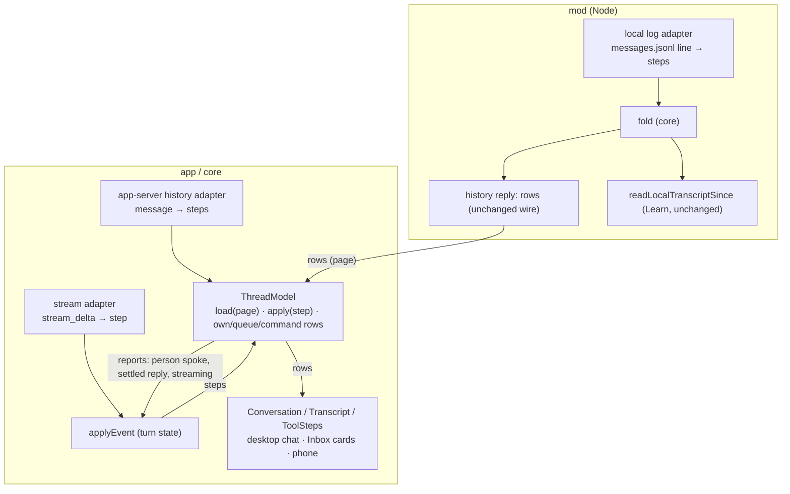
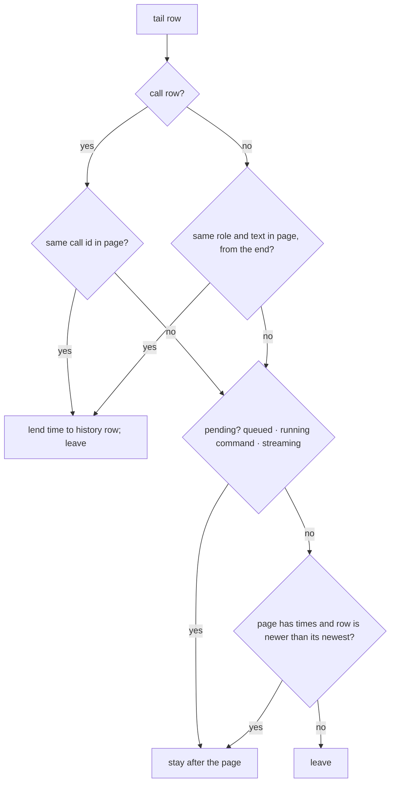
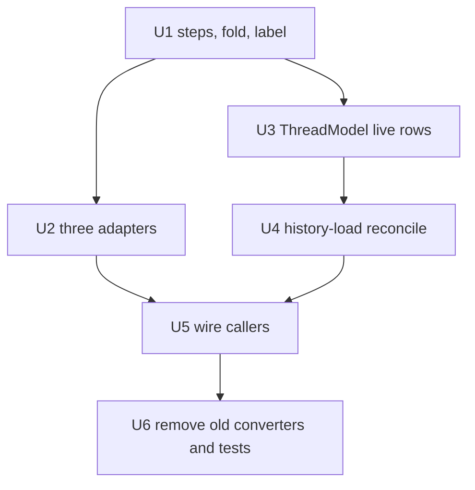

# ThreadModel - Plan

## Goal Capsule

- **Objective:** Every chat surface (a desktop chat, the Inbox card on the desktop and the phone, a chat on the phone) shows the same rows for the same conversation, wherever its history came from. Nothing that streamed in while a reload was running is lost. A change to how tool steps read is made and tested in one place.
- **Means:** One core module, ThreadModel, builds a chat's thread from neutral steps. The local log, app-server history and live stream become adapters that only parse their own dialect (KTD1, KTD2).
- **Authority:** Requirements own behaviour. KTDs own mechanism. A unit's Approach adds only what is local to it. `GLOSSARY.md` owns the vocabulary (ThreadModel, Step, Source, Tail, Handoff, Open call).
- **Stop conditions:** Stop and ask if keeping a row's object identity (R9) turns out to conflict with the step fold. Stop and ask if the mod's history reply would have to change shape (R8).
- **Execution profile:** Work on the user's current local branch, with commits there. No new branch, no push, no PR unless asked.

---

## Product Contract

### Summary

Move everything that turns Letta messages into chat rows into `core/attention/thread.ts`. It covers parsing results onto calls, approvals, your own and queued messages, slash-command rows, the streaming reply, and the reconcile that runs when a history page arrives. The three sources hand it steps. The mod runs the same fold and keeps sending rows, and the live state keeps only turn status.

### Problem Frame

A chat's rows are built in three places. `toTranscript` in `core/harness.ts` builds them from app-server history. `applyEvent` in `core/attention/model.ts` builds them from the live stream, with `settle`, `liveRows`, `beginCommand`, `finishCommand`, `takeQueued` and `cancelQueued` around it. `transcriptRows` in `mod/desks.ts` builds them from the local backend's `messages.jsonl`. `useAttention.loadThread` then stitches history and tail together with `fromHistory` and `carryTimes`.

Most of the last fortnight's chat work went through all three: skill names, Codex-style tools, attachments, approvals and inline widgets. They have drifted:

- Tool calls are deduplicated by id in history, by "same tool as the last row and no text since" live, and not at all in the local log.
- `toolLabel` and `toolInput` rank arguments in different orders.
- `stepName` recovers a tool's name by splitting its label.

The stitching also loses rows. `loadThread` empties the live tail after the history read returns. Anything that streamed in during the read and wasn't in the file the mod read disappears until the next load. Queued messages and running slash commands are dropped by the same step. The live rule also drops a second call of the same tool that follows the first with no text between, together with that call's result.

### Requirements

**Building the thread**

- R1. Every chat surface reads its rows from ThreadModel. No other module turns Letta messages into rows.
- R2. One conversation produces the same rows whether it is read from the local log, from app-server history, or as a live stream.
- R3. Each tool call is one row with its result attached. An approval request never adds a second row. A second call of the same tool, straight after the first, gets its own row and its own result.
- R4. A tool row's text keeps the `name · target` shape, derived from its step by one function. Find, `threadId`, `olderRowsAbove` and the Learn worker read that text.

**Reloading history**

- R5. When a history page arrives, live rows the page already covers give it their arrival times and go. A live row the page does not cover stays after it if it is still pending or arrived after the page's newest row; otherwise it goes.
- R6. Queued messages, running slash commands and the streaming reply survive a history load.

**What stays the same**

- R7. Apart from R3, R5 and R6, the rows shown are the rows shown today. Existing tests that describe rows keep their expectations after moving to ThreadModel's interface.
- R8. The mod's `history` reply, `readLocalTranscriptPage` and the Learn worker's local-log path (`readLocalTranscriptSince`) keep their shapes. The Learn worker's app-server ask still gets the agent's full reply, not the 700-character digest.
- R9. A row that has not changed since the last read keeps its object identity. A row that changed is a new object. The streaming reply is the last row. This is the invariant from 3146c82 that `Row`'s memo and `ToolSteps`' `===` check rely on.

### Key Decisions

- **Rows only change where the old behaviour was a defect.** The two fixes are the history-load rule and one row per tool call. Governs R3, R5, R6, R7.

### Success Criteria

- One test feeds the same conversation through all three adapters and gets equal rows.
- No callers remain for `toTranscript`, `transcriptRows`, `carryTimes`, `liveRows`, `settleCommands`, `takeQueued` or `cancelQueued`. Their behaviour lives behind ThreadModel's interface.
- `Live` holds no row fields: `tail`, `streamingText`, `streamingAt`, `toolArgs`, `toolsSeen`, `ownSends` and `queued` rows are gone from it.

### Scope Boundaries

- The Inbox's ranking inputs (`lastRole`, `lastAssistantText`, `lastAsk`, `userSpoke`) keep their values and meaning. Only their source moves (KTD9).
- The wire protocol between the mod and the app does not change.
- Considered and not built: keeping object identity for history rows across a reload. History rows are rebuilt on every load today and renders cope. Build it only if profiling a long chat shows a reload re-rendering every row as a real cost.
- Considered and not built: fixing the local-log page slice, which can separate a user message from its event rows at the page's top edge. That predates this work and no report points at it.

#### Deferred to Follow-Up Work

- Candidates 2 to 7 of the 2026-10-09 architecture review: a typed protocol table for `/ws` frames, one conversation adapter per chat host, one Inbox pass, focus feedback out of `useAttention`, message riders in the mod, and `sidebarModel` as the only chat-list module.

---

## Planning Contract

### Key Technical Decisions

- KTD1. **ThreadModel owns the whole thread:** history pages, the live tail, the streaming reply, slash-command rows, optimistic rows and the history-load reconcile. `useAttention` holds one per chat and reads its rows. (session-settled: user-approved — chosen over sharing only a message-to-rows function: the stitching between history and tail is where rows are lost, so it has to be inside.)
- KTD2. **Neutral steps cross the seam.** Each adapter parses its dialect into steps: user (raw text, markup included), assistant (text or a streamed chunk), call (name, arguments, id), approval (name, optional id), result (id, output, failed). One fold in core turns steps into rows. The mod runs the same fold over the local log and keeps sending rows. (session-settled: user-approved — chosen over each source building its own rows and over sending steps on the wire: one fold, and no wire change.) Conflict: the Learn worker's app-server ask (`mod/recall-worker.ts` `askViaAppServer`) runs the live fold to read the agent's reply from the tail. It moves to reading the full reply from ThreadModel (U5). Its local-log path and the wire are untouched.
- KTD3. **An approval attaches to the open call.** An approval step attaches to the latest call of the same tool that has no result and no text after it. Only when there is none does it become a call row of its own. Call steps with the same id are argument chunks of one call. A call step with a new id is always a new row. (session-settled: user-approved — chosen over matching by id and falling back to adjacency: one rule covers history, where the approval shares the call's id, and live, where its id differs or is missing.)
- KTD4. **The label is derived from the step.** One function makes `name · target` from a step, using one ranked list of argument keys (today `toolLabel` and `toolInput` disagree). `stepName` and `stepTarget` in `app/src/shared/toolSteps.ts` read the step and stop splitting the label. (session-settled: user-approved — chosen over dropping `text` from tool rows: Find, `threadId`, `olderRowsAbove` and the Learn worker read it.)
- KTD5. **The history-load reconcile keeps only pending or newer rows.** Calls are matched by id; other rows by role and text, from the end. A matched tail row lends the history row its time and leaves. An unmatched tail row stays after the history if it is pending (queued, a running slash command, the streaming reply) or its time is later than the page's newest timed row. Every other tail row leaves. When the page has no times at all, as app-server history can, only pending rows stay. (session-settled: user-approved — chosen over replacing the tail as today, which loses rows that streamed in during the load, and over keeping every unmatched row, which leaves rows Letta never echoes, such as the AskUserQuestion answers row, stuck below history.)
- KTD6. **Optimistic rows live in ThreadModel.** That means your sent message (with its echo key, today `ownSends`), queued messages, and the AskUserQuestion answers row. Skipping an echo is a reconcile rule, like KTD5. The send queue itself (`l.queued`, what goes out next) stays with the turn state, and its rows are found by the queued entry they belong to. (session-settled: user-approved — chosen over leaving them in the live state: then two modules would write rows.)
- KTD7. **The name is `ThreadModel`, in `core/attention/thread.ts`.** The `Thread` component in `app/src/chat/Conversation.tsx` keeps its name. (session-settled: user-approved — chosen over ChatLog and over renaming the component.)
- KTD8. **Tests are replaced at the interface.** Row assertions in today's converter tests move to `test/thread-model.test.ts`. Adapter tests check dialect parsing only. Converter tests that would duplicate them are deleted, not kept alongside. (session-settled: user-approved — chosen over keeping old and new side by side: the old ones pin internals that no longer exist.)
- KTD9. **`Live` holds one ThreadModel, and the turn state reads back from it.** `applyEvent` still takes every event: it updates turn state and hands stream steps to the thread. The thread reports what the turn state depends on:
  - whether a user message from a person arrived, and its text (for `lastAsk`, `lastRole`, `userSpoke`);
  - the assistant text it settled (for `lastAssistantText`);
  - whether a reply is streaming (for `chatStatusOf` and the repeated-status check from 339e630).

  The coupling then runs one way, and the Learn worker's `emptyLive()` plus `applyEvent` keeps working.
- KTD10. **One text rule for message parts.** All three adapters use the same function for joining text parts and treating images. Today the local log joins with a newline and inserts `[image]`, while `messageText` joins with nothing, so the reconcile's text matching misses across dialects. Which rule wins is picked in U2 so that rows read as they do today (R7). The agreement test pins it.
- KTD11. **Identity is kept per row.** A tail row is copied out once and reused until it changes, as `liveRows` does today. The comparison also covers `tool` and `files`, which `sameRow` ignores now and only gets away with because those branches replace the row object.

### High-Level Technical Design

The flow after the change. Steps are the only thing that crosses from a source into ThreadModel, and rows are the only thing that leaves it.



What happens to each live row when a history page arrives (KTD5):



How the fold treats each step (KTD3, KTD6), as directional pseudo-code:

```text
user(raw)         → harness events become event rows; the rest is a user row with its files,
                     unless it is the echo of an optimistic row, which it settles instead
assistant(chunk)  → extends the streaming reply
call(name,args,id)→ same id as a shown call: more argument text for that row
                     otherwise: settle the reply, then a new call row
approval(name,id?)→ the open call of that tool takes it; otherwise it is a call row
result(id,…)      → onto the row with that call id
```

### Assumptions

- The Mac's clock stamps live rows and the local backend's message times alike, so "newer than the page's newest row" (KTD5) compares like with like.

---

## Implementation Units



### U1. Steps, the fold and the tool label

- **Goal:** The step vocabulary and one pure fold from steps to rows in `core/attention/thread.ts`, with the single tool-row label function.
- **Requirements:** R3, R4, R7. KTD2, KTD3, KTD4.
- **Dependencies:** none.
- **Files:** `core/attention/thread.ts` (new), `core/harness.ts`, `app/src/shared/toolSteps.ts`, `test/thread-model.test.ts` (new).
- **Approach:**
  1. Define the step union and a fold that takes steps in order and yields rows, reusing `extractHarnessEvents`, `stripHarnessMarkup`, `messageFiles`, `toolStep` and `withResult` from `core/harness.ts`.
  2. Merge `toolLabel`'s and `toolInput`'s argument lists into one ranked list, keep `AskUserQuestion`'s question as its target, and make the label a function of the step.
  3. Have `stepName` and `stepTarget` read `row.tool`. Keep the label split only as a fallback for event rows, which have no step.
- **Patterns to follow:** `core/attention/transcript.ts` for row types. `test/tool-steps.test.ts` for how tool-step expectations are written.
- **Test scenarios:**
  - A call, then its approval with the same id, then its result: one row, with the output and the failed flag.
  - A call `t1`, then an approval with id `approval-9`, then an approval with no id: one row.
  - A call `t1`, then a call `t2` of the same tool with no text between: two rows, and a result for `t2` lands on the second.
  - A call, then assistant text, then an approval of the same tool: the approval becomes a row, because the call is no longer open.
  - An approval with no open call: one call row.
  - Arguments `{skill, description, prompt}`: label and input pick the same key.
  - A user step whose raw text carries a skill-loaded block and an attachment tag: one event row, then a user row with one file.
  - A user step that is only markup: event rows and no user row.
- **Verification:** The fold's rows equal today's `toTranscript` rows for every existing `toTranscript` fixture, except where R3 changes the count.

### U2. The three source adapters

- **Goal:** App-server history, the live stream and the local log each parse their dialect into steps and nothing more. The mod folds its steps into rows.
- **Requirements:** R2, R8. KTD2, KTD10.
- **Dependencies:** U1.
- **Files:** `core/harness.ts` (history adapter, replacing `toTranscript`'s body), `core/attention/thread.ts` or `core/attention/model.ts` (stream adapter: `stream_delta` to a step), `mod/desks.ts` (`transcriptRows` and `toolCalls` become the log adapter, and `readLocalTranscriptPage` and `readLocalTranscriptSince` fold its steps), `test/thread-model.test.ts`, `test/desks.test.ts`.
- **Approach:**
  1. Write one message-parts text function in core and route all three adapters through it (KTD10). Choose its join and image rule so the local log's rows read as they do today. That is the source users see first.
  2. In the local-log adapter, a `toolResult` line becomes a result step, so result pairing is done by the fold instead of the `calls` map. The page is sliced after the fold, as today.
  3. `readLocalTranscriptSince` keeps returning text-only rows: the fold runs and tool steps are left off, matching today's `steps = false`.
- **Patterns to follow:** The existing `toolResultOf` / `textParts` parsing in `mod/desks.ts`. The `mkdtempSync` JSONL fixtures in `test/desks.test.ts`.
- **Test scenarios:**
  - Agreement: one conversation is written three ways (local log lines, `conversation_messages_list` records, a `stream_delta` sequence). It has a user message with an attachment, assistant text, a Bash call with an approval and an error result, a skill-loaded notice, and a two-part text message. All three fold to equal rows, ignoring `at` where a source has none.
  - Local log: a `toolResult` line whose call sits before the page's slice still gets its output.
  - Local log: `thinking` parts, `session` and `compaction` lines, and invalid JSON produce nothing.
  - App-server history: a `tool_return_message` with `status: "error"` sets failed.
  - The Learn worker's text-only read still yields user and assistant rows only. The existing `recall-worker.test.ts` fixtures pass unchanged.
- **Verification:** `test/desks.test.ts` paging (`more`, limit) passes unchanged, and the agreement test passes.

### U3. ThreadModel's live rows

- **Goal:** ThreadModel holds the tail, the streaming reply, argument chunks, optimistic and queued rows and slash-command rows, and hands out rows with stable identity. `Live` keeps only turn state.
- **Requirements:** R6, R9. KTD1, KTD6, KTD9, KTD11.
- **Dependencies:** U1.
- **Files:** `core/attention/thread.ts`, `core/attention/model.ts`, `test/thread-model.test.ts`, `test/attention-model.test.ts`, `test/transcript-window.test.ts`, `test/commands.test.ts`, `test/attachments-files.test.ts`.
- **Approach:**
  1. Move `settle`, `beginCommand`, `runningRow`, `finishCommand`, `commandRunning`, `settleCommands`, `liveRows`, `updateToolInput` and the row half of `takeQueued` and `cancelQueued` into ThreadModel, together with the `tail`, `streamingText`, `streamingAt`, `toolArgs`, `toolsSeen` and `ownSends` fields.
  2. Give `Live` a `thread` field. `applyEvent` hands `stream_delta` and slash-command events to it as steps and sets `lastAsk`, `lastRole`, `lastAssistantText` and `userSpoke` from what it reports (KTD9).
  3. Add operations for the rows `useAttention` pushes today: a sent message with its echo key, a queued message, and the AskUserQuestion answers row.
  4. Keep the harness-events-before-settle order in the `user_message` branch as it is today (R7).
- **Execution note:** Move the row assertions out of `test/attention-model.test.ts` first and see them pass against the moved code before changing any behaviour.
- **Patterns to follow:** `emptyLive()` and the inline `delta` helpers in `test/attention-model.test.ts`. The `shown` / `streamingShown` WeakMaps in `core/attention/model.ts`.
- **Test scenarios:**
  - Streaming chunks, then a call: the reply settles into an assistant row before the call row, and the thread reports that settled text.
  - Your sent message, then its echo as a `user_message`: one user row. The thread reports a person spoke.
  - A queued message, then `takeQueued`: the row loses its queued flag and gets a time. `cancelQueued` on another queued message removes its row only.
  - `/reload` started, then the link drops and comes back: the running row reads as reloaded. Any other running command reads as failed.
  - An AskUserQuestion answers row appears at once as a user row.
  - Identity: two reads with no change give the same objects. After a result lands on a call, only that row is new. After a file is added to a row, that row is new.
  - Repeated `WAITING_ON_INPUT` with nothing streaming reports no change (339e630).
- **Verification:** The moved row tests pass with their original expectations. `Live` has no row fields.

### U4. The history-load reconcile

- **Goal:** A history page enters ThreadModel through one load operation that reconciles it with the tail by KTD5.
- **Requirements:** R5, R6. KTD5.
- **Dependencies:** U3.
- **Files:** `core/attention/thread.ts`, `core/attention/transcript.ts` (`carryTimes` folds in, `fromHistory` stays if still useful), `test/thread-model.test.ts`, `test/transcript-times.test.ts`.
- **Approach:**
  1. Loading a page replaces the history rows and reconciles the tail in one step. Nothing outside the thread empties the tail.
  2. A load that fails or comes back empty leaves the tail alone.
  3. `loadOlder` loads a bigger page through the same operation, so older rows arriving above keep the reader's place, as `useTranscriptScroll` does today.
- **Test scenarios:**
  - Page `[u1, a1, call c7]`, tail `[call c7 at 10:01, a2 at 10:03]`, page newest 10:02: the result is `[u1, a1, call c7 @10:01, a2]`.
  - The tail holds an AskUserQuestion answers row at 10:01 that the page lacks, with page newest 10:02: the row goes.
  - A queued row and a running `/compact` row the page lacks: both stay after the page, in order.
  - A page with no times: only pending rows stay. History rows take times from matched tail rows.
  - Two identical user texts in the tail match the page's last two, from the end.
  - A row streamed while the load was in flight, newer than the page's newest: it is still shown after the load.
- **Verification:** The `carryTimes` expectations in `test/transcript-times.test.ts` hold through the load operation.

### U5. Wire the callers to ThreadModel

- **Goal:** `useAttention`, the Learn worker and the status helpers read from ThreadModel. Every chat surface gets its rows from it unchanged.
- **Requirements:** R1, R8. KTD1, KTD2, KTD9.
- **Dependencies:** U2, U4.
- **Files:** `core/attention/useAttention.ts`, `core/attention/model.ts` (`chatStatusOf`), `mod/recall-worker.ts`, `test/recall-worker.test.ts`.
- **Approach:**
  1. `loadThread` passes the mod's page, or the app-server fallback through the history adapter, to the chat's ThreadModel load. The `histories` map and the `l.tail = []` line go.
  2. `conversation()` returns the thread's rows and status.
  3. `send`, `answer`, the queue loop and `execute` call ThreadModel's row operations instead of pushing to `l.tail`.
  4. `chatStatusOf` asks the thread whether a reply is streaming.
  5. `askViaAppServer` takes the full reply from the thread's last assistant row or its streaming text.
  6. The option type for `loadLocalHistory` gains `files`, which the wire already carries.
- **Patterns to follow:** The current `conversation()` return shape. Keep it, so `Conversation`, CatchUp and the phone need no change.
- **Test scenarios:**
  - The Learn worker's app-server ask with a reply over 700 characters resolves with the whole reply.
  - `chatStatusOf` reads thinking with no chunks yet, and streaming once one arrives.
- **Verification:** The desktop chat, the Inbox card and the phone chat show the same rows as before for an existing conversation with tool calls, an approval and an attachment. Check in the running app (`bun start`, phone build included).

### U6. Remove the old converters and their tests

- **Goal:** Nothing outside ThreadModel builds rows. Old converter tests are gone or moved, and the docs name the new module.
- **Requirements:** R1. KTD8.
- **Dependencies:** U5.
- **Files:** `core/harness.ts`, `core/attention/model.ts`, `core/attention/transcript.ts`, `mod/desks.ts`, `test/attention-model.test.ts`, `test/tool-steps.test.ts`, `test/transcript-times.test.ts`, `test/transcript-window.test.ts`, `test/attachments-files.test.ts`, `test/commands.test.ts`, `docs/architecture.md`, `GLOSSARY.md`.
- **Approach:**
  1. Delete the exports the success criteria list once they have no callers.
  2. Remove any test that only restates a ThreadModel test. Keep turn-state tests and render tests.
  3. Name `core/attention/thread.ts` in architecture.md's "Where the code lives".
- **Test expectation:** none. The behaviour is covered by U1 to U5. This unit removes code and duplicates.
- **Verification:** A search for the removed names finds no callers, and the suite, typecheck and lint pass.

---

## Verification Contract

| Gate | Command | Applies to |
|---|---|---|
| Tests | `bun test` | every unit |
| Types | `bun run typecheck` | every unit |
| Lint | `bun run lint` | every unit |
| React rules | `bun run doctor` | U5 (hook changes in `useAttention`) |
| Running app | `bun start`, then open a chat with tool calls on the desktop, on the Inbox card and on the phone | U5 |

`test/core-portability.test.ts` must keep passing: `core/attention/thread.ts` stays free of browser globals and imports only within `core/`.

## Definition of Done

- R1 to R9 hold, and the success criteria's search for removed names finds nothing.
- `test/thread-model.test.ts` holds the agreement test, the duplicate-approval cases, the reconcile cases and the identity cases.
- `GLOSSARY.md` and `docs/architecture.md` name ThreadModel as it was built.
- Code from abandoned attempts is removed, not left in the diff.
