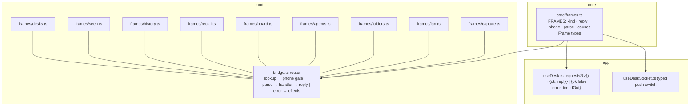
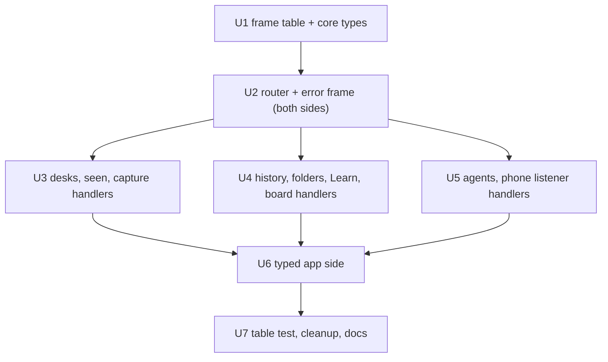

# Frame Table - Plan

## Goal Capsule

- **Objective:** A frame between the app and the mod is declared once, so a mismatch shows up as a type error or a failing test, never as an action that waits a minute and then fails. Any failed request reaches the person as a message, the same way on the Mac and the phone.
- **Means:** One frame table in `core/frames.ts` (KTD1, KTD2). The bridge becomes a router over per-feature frame handlers (KTD4). The app's `request()`, sends and push handling are typed from the same table (KTD3).
- **Authority:** Requirements own behaviour. KTDs own mechanism. A unit's Approach adds only what is local to it. `GLOSSARY.md` owns the vocabulary (Frame, Request, Send, Push, Frame table, Frame handler).
- **Stop conditions:** Stop and ask if keeping a frame's name or payload shape (R5) conflicts with the table. Stop and ask if a frame turns out to be sent by something other than the app (another client of `/ws`).
- **Execution profile:** Work on the user's current local branch, with commits there. No new branch, no push, no PR unless asked.

---

## Product Contract

### Summary

Declare every frame of the mod's `/ws` socket in `core/frames.ts`: its kind, its reply, whether a paired phone may send it, and a parser that turns the raw object into a typed payload. `mod/bridge.ts` becomes a router that sends each frame to a per-feature frame handler and sends the reply the table names. One `error` frame answers every failed request, and the app's `request()` returns a typed result. The phone allow-list, the reply list and the protocol documentation all come from the table, and the tests walk it.

### Problem Frame

The mod's protocol is spread across four places:

1. a 70-line comment at the top of `mod/bridge.ts`;
2. a 400-line `switch` in `createBridge().onMessage`, with nested switches for Learn, the board, agents and the phone listener;
3. a push `switch` in `app/src/desk/useDeskSocket.ts`, plus its `REPLY_FRAMES` set;
4. string literals in `app/src/desk/useDesk.ts`, where `request()` lives.

No frame type is shared between the two sides. `DeskStatus`, `DeskSummary` and `scopeOfId` are written twice. The phone allow-list and the reply list are separate string sets.

A missing reply name shipped once (b334e02): "Start the lesson" waited a minute and then said it failed. The test added after it runs a regex over `bridge.ts`, which misses a reply written in another shape. The same gap still exists: a phone refusal carries a `requestId`, but `error` is not in `REPLY_FRAMES`, so the refused request times out instead of failing.

Errors differ by family (`recall_error`, `task_error`, `agent_error`, plain `error`), and the app reads each one by hand. Some handlers send nothing when they fail:

- `folder_pick` when the picker rejects;
- `agent_get` when reading the memory tree throws;
- `lan_get` when the refresh rejects;
- `history_get` without a conversation id.

`BridgeDeps` has about 25 optional members, and `mod/index.ts` fills them with one-line lambdas.

### Requirements

**One declaration**

- R1. Every frame on `/ws` is declared once in the frame table: requests, sends and pushes alike. The phone allow-list, the reply list and the protocol's documentation are derived from it, not written again.
- R2. A request's reply is sent under the name the table gives it. A new request without a handler, or a handler without an entry, fails a test.
- R3. A paired phone may send only the frames the table marks for the phone. Every other frame is refused, as today.

**Failures reach the person**

- R4. Every request is answered: by its reply, or by one `error` frame carrying its `requestId` and a message. That includes a refused phone frame, a malformed payload and a handler that throws or rejects. The app shows the message where it shows a failure today.

**Nothing else changes on the wire**

- R5. Frame names and payload shapes stay as they are, apart from `recall_error`, `task_error` and `agent_error` becoming `error`.
- R6. Pushes keep their senders and their audience (scoped or to every socket). The `seen` push is built in one place.

### Key Decisions

- **Errors are the only wire change.** The app and the mod ship in the same release: the phone is served the mod's own build, and loki restarts a harness an older loki left running (7e1781b). So no compatibility layer is built. Governs R4, R5.

### Success Criteria

- `REPLY_FRAMES` and `PHONE_FRAMES` no longer exist as written sets, and the regex test in `test/desk-socket.test.ts` is gone.
- `mod/bridge.ts` holds only the router, with no feature logic.
- Asking the mod for something it refuses (a phone frame, a malformed payload) shows a message at once, not after the request's timeout.

### Scope Boundaries

- The mod's HTTP routes (`/pair`, `/me`, `/unpair`, `/uploads`, agent faces, the `/appserver` tunnel) are out of scope.
- Letta's app-server protocol (`core/attention/protocol.ts`) is out of scope.
- Analytics event names stay untyped strings. `capture` gets an entry and a parser, but typing the names is review candidate #6.
- Considered and not built: a version handshake between app and mod. Both ship in the same release (Key Decisions). Build it only if they ever ship separately.
- Considered and not built: removing the duplicate `lan_status` a `lan_set`/`lan_via_set`/`lan_serve_set` sender receives (a direct reply plus the broadcast). It is harmless, and R5 keeps sends' behaviour.
- Considered and not built: stopping the phone from sending `measure`, `widget_status` and `gesture`, which it does today and which the mod refuses. That predates this work; the refusals arrive as `error` pushes the app logs.

#### Deferred to Follow-Up Work

- Review candidates #3 to #7 (the conversation adapter, the Inbox pass, focus feedback, message riders, the chat list). #4's `seen` push is partly absorbed here (R6).

---

## Planning Contract

### Key Technical Decisions

- KTD1. **The table covers all three kinds.** Requests and their replies, sends, and pushes are each declared once. A send that is answered by a push (`seen_list` → `seen`, `list_desks` → `desks`, `desk_get` → `desk`, the `lan_*` frames → `lan_status`, `pair_begin` → `pair_code`, `devices_list` → `devices`) stays a send, and its entry names the push it causes, for documentation. (session-settled: user-approved — chosen over requests only and over requests plus a handler split: one place to look for any frame.)
- KTD2. **Each client-sent entry carries a hand-written parser.** It returns a typed payload or an error message, and it absorbs the `typeof` checks each `case` does today. Pushes and replies carry types only. The table holds `kind`, `reply` (requests), `phone` (default false), `parse`, and `causes` (sends: the push that answers). A reply may share its request's name (`memory_diff`, `reflection_state`, `skills_global`, `recall_export`). (session-settled: user-approved — chosen over types and routing only, and over a schema library: no new dependency, and handlers get checked input.)
- KTD3. **One `error { requestId, message }` frame answers every failed request.** `request(name, payload, timeoutMs)` returns `{ ok: true, reply }` or `{ ok: false, error, timedOut }`, typed from the table, and never throws. A send whose parse fails gets an `error` push without a `requestId`, as today. (session-settled: user-approved — chosen over a throwing `request()` and over keeping each family's error frame.)
- KTD4. **Frame handlers are feature modules that return their reply.** There is one module per feature, each taking only its own dependencies. A request handler returns `reply(payload, effects?)` or `fail(message)`, sync or async. A send or push handler uses the context. The router does the rest:
  1. looks up the entry;
  2. refuses a phone frame not marked for the phone;
  3. runs the parser;
  4. calls the handler;
  5. catches a throw or rejection as `fail`;
  6. sends the reply under the table's name;
  7. applies the effects (broadcasts, analytics).

  `BridgeDeps` becomes the set of modules. (session-settled: user-approved — chosen over one file of typed cases and over modules that send for themselves: the router guarantees the reply name and that every request is answered.)
- KTD5. **The name is `core/frames.ts`, `FRAMES`.** (session-settled: user-approved — chosen over `core/loki-protocol.ts` and `core/wire.ts`: "frame" is the architecture doc's word, and `core/attention/protocol.ts` is Letta's protocol.)
- KTD6. **Tests walk the table, plus one set per module.** `test/frames.test.ts` checks four things for every entry:
  1. exactly one handler answers it;
  2. a request's reply arrives under its name, through an in-memory client;
  3. a frame not marked for the phone is refused to a paired phone;
  4. the parser answers a malformed frame with an error, not a throw.

  Each frame handler has its own tests. The regex test is deleted. (session-settled: user-approved — chosen over keeping the existing tests and adding the table test beside them.)
- KTD7. **Shared payload types move into `core/`.** `core/` may import only `core/` (`test/core-portability.test.ts`). So the shapes the table names move into core as type-only declarations, and mod modules import them back:
  - `DeskStatus`, `DeskInfo`, `DeskSummary`, `InboxRow`, `LanStatus`, `LanVia`, `DeviceSummary`, `MemoryCommit`, `MemoryFile`, `MemorySkillInfo`, `RefreshOutcome`, `GlobalSkill`, `ReflectionState`, `Task`, `FolderCheck`, `RecentFolders`;
  - the validators the parsers need (`isAgentId`, `isLanVia`, `isGesture`).

  This removes the duplicates in `useDesk.ts` (`DeskStatus`, `DeskSummary`, `scopeOfId`).
- KTD8. **`request()` stays in `useDesk.ts`, and the socket stays in `useDeskSocket.ts`.** The waiter map resolves any frame carrying a pending `requestId` whose type is the entry's reply or `error`. `REPLY_FRAMES` is not needed. The push `switch` is typed by the table's push union.

### High-Level Technical Design



What the router does with one incoming frame, as directional pseudo-code:

```text
entry = FRAMES[msg.type]                      unknown          → error push (no requestId), as today
phone client and !entry.phone                 → error {requestId?, "<type> is not available on the phone"}
payload = entry.parse(msg)                    message string   → request: error {requestId, message}; send: error push
result = await handler(payload, ctx)          throw/rejection  → request: error {requestId, message}
request: send { type: entry.reply, requestId, ...result.reply }; then result.effects (broadcasts, track)
```

### Assumptions

- No client other than the app (desktop window, browser tab, phone) speaks `/ws`. The research found none (`native/` only holds `listen`; `test/lan.test.ts` uses its own stub handlers).

---

## Implementation Units



### U1. The frame table and the shared types

- **Goal:** `core/frames.ts` declares every frame, with parsers for client-sent frames, and the types it names live in core.
- **Requirements:** R1, R5. KTD1, KTD2, KTD5, KTD7.
- **Dependencies:** none.
- **Files:** `core/frames.ts` (new); the core homes of the moved types (`core/desk-core.ts` for desk shapes; the rest beside `core/frames.ts` in a types module, or in existing core files where one fits); `mod/agents.ts`, `mod/lan.ts`, `mod/bridge.ts`, `mod/tasks.ts`, `mod/folders.ts`, `mod/devices.ts`, `mod/skills.ts`, `mod/skill-sources.ts`, `mod/reflection.ts`, `mod/desks.ts` (import the moved types back); `test/frames.test.ts` (new).
- **Approach:**
  1. Write one entry for each frame in the research inventory: 49 client-sent and 18 pushes.
  2. Port each `case`'s field checks into its parser unchanged, including today's silent defaults (`folder_complete` without a prefix answers `[]`, `task_create`'s title is `String(msg.title ?? "")`). Two exceptions: `history_get` without a conversation id, and a request whose required field is missing, now answer `error` (R4).
  3. Mark `phone: true` exactly on today's `PHONE_FRAMES`.
- **Patterns to follow:** `core/analytics.ts` `isEventName`, and the validators in `mod/bridge.ts` (`isGesture`, `isNum`, `isPoint`).
- **Test scenarios:**
  - Every name in today's `PHONE_FRAMES` is marked for the phone, and no other.
  - Every name in today's `REPLY_FRAMES` is some request's reply.
  - `recall_grade` with grade 5 gives "a grade is 1 (again) to 4 (easy)"; with grade 3 and an id it gives `{ id, grade: 3 }`.
  - `history_get` without `conversationId` gives an error message. With a `limit` of 99999 it parses (the handler clamps).
  - Every parser given `{}`, `null` fields and wrong types returns a payload or a message and never throws.
- **Verification:** `core-portability.test.ts` passes with `core/frames.ts` in place.

### U2. The router and the single error frame

- **Goal:** `createBridge` routes through the table, every request is answered, and the app reads `error` as a request's failure.
- **Requirements:** R2, R3, R4. KTD3, KTD4, KTD8.
- **Dependencies:** U1.
- **Files:** `mod/bridge.ts`, `mod/frames/context.ts` (new: `reply`, `fail` and the handler context), `app/src/desk/useDesk.ts` (`request()` and the waiter resolution), `app/src/desk/useDeskSocket.ts` (the waiter branch), `test/bridge.test.ts`.
- **Approach:**
  1. Write the router (KTD4) with a registry the feature modules plug into.
  2. Until U3 to U5 land, the old `switch` stays as the fallback for frames no module answers yet, so each unit moves one group and keeps the bridge working.
  3. The waiter branch resolves a pending `requestId` on its reply or on `error`. `request()` returns the result object (KTD3).
  4. Each wrapper in `useDesk.ts` keeps its return shape by mapping `ok: false` to what it returned for a family error or a timeout before. The difference: an `error` now arrives at once, instead of after the timeout.
- **Execution note:** Start with failing tests: a phone refusal and a malformed `history_get` each answer `error` with the `requestId` at once.
- **Test scenarios:**
  - A paired phone sending `task_create` gets `error { requestId, "task_create is not available on the phone" }`, and the app's `request()` resolves `ok: false` without waiting for its timeout.
  - A handler that rejects (`folder_pick` whose picker throws) answers `error` with the message.
  - An unknown frame still answers an `error` push without a `requestId`.
  - A request that times out resolves `{ ok: false, timedOut: true }`.
- **Verification:** The existing `bridge.test.ts` wiring assertions pass, after updating the three that named `recall_error`/`task_error`/`agent_error`.

### U3. Desks, seen marks and analytics as frame handlers

- **Goal:** The desk, widget and gesture frames, the seen marks and `capture` move out of the switch into handler modules.
- **Requirements:** R2, R6. KTD4.
- **Dependencies:** U2.
- **Files:** `mod/frames/desks.ts` (`gesture`, `measure`, `arrange`, `trash`, `widget_status`, `desk_get`, `list_desks`, `pin_set`, `models_recent_add`), `mod/frames/seen.ts` (`seen_list`, `seen_mark`, `seen_unmark`, `viewed_mark`, `focus_add`), `mod/frames/capture.ts`, `mod/bridge.ts`, `mod/index.ts`, `test/frames-desks.test.ts`, `test/frames-seen.test.ts`, `test/analytics.test.ts`.
- **Approach:**
  1. `mod/frames/seen.ts` owns the one function that builds the `seen` push. `mod/index.ts`'s turn-start broadcast uses it instead of its own literal (R6).
  2. `onConnect`'s frames (`config`, `desk`, `models_recent`) stay with the router and use the desks module's frame builders.
  3. The `capture` once-key dedupe moves with `capture`.
- **Patterns to follow:** `test/bridge.test.ts`'s `client(scope)` and `fakeWidgets` helpers, reused as the in-memory client.
- **Test scenarios:**
  - The desk, measure, arrange, trash and seen-mark tests from `bridge.test.ts` (lines 36 to 282) pass, moved to the module tests.
  - The `seen` push from a turn start equals the one `seen_list` returns, including `focus`.
  - The capture tests in `analytics.test.ts` (accepted, malformed, `once` dedupe) pass against the module.
- **Verification:** No desk, seen or capture case is left in the switch.

### U4. History, folders, Learn and the board as frame handlers

- **Goal:** The request-heavy features move to handler modules, and their replies and errors go through the router.
- **Requirements:** R2, R4. KTD3, KTD4.
- **Dependencies:** U2.
- **Files:** `mod/frames/history.ts` (`history_get`, `inbox_list`), `mod/frames/folders.ts`, `mod/frames/recall.ts`, `mod/frames/board.ts`, `mod/bridge.ts`, `mod/index.ts`, `test/frames-recall.test.ts`, `test/frames-board.test.ts`, `test/frames-history.test.ts`, `test/bridge.test.ts`.
- **Approach:**
  1. Each `recall_*` frame gets its own handler. The `default:` that answered `recall_export` goes away (it is an entry of its own).
  2. `recall_changed` and `tasks_changed` become effects on the handlers that changed something.
  3. `history_get` keeps its clamp to `[HISTORY_PAGE, HISTORY_MAX]`.
- **Test scenarios:**
  - The recall round-trip from `bridge.test.ts` (lines 492 to 557) passes, with failures arriving as `error`.
  - `task_assign` without `desk` answers `error`. A successful assign replies `tasks_updated` and broadcasts `tasks_changed`.
  - `recall_lead_start` whose start rejects answers `error` with the message.
  - History and inbox replies from `bridge.test.ts` (lines 284 to 341) are unchanged.
- **Verification:** No history, folder, recall or task case is left in the switch.

### U5. Agents, skills and the phone listener as frame handlers

- **Goal:** The last groups leave the switch, and `BridgeDeps` becomes the set of modules.
- **Requirements:** R2, R3, R4. KTD4.
- **Dependencies:** U2.
- **Files:** `mod/frames/agents.ts` (`agent_get`, `memory_*`, `reflection_state`, `skills_global`, `skill_install`, `skill_refresh`), `mod/frames/lan.ts` (`lan_*`, `pair_begin`, `devices_list`, `device_forget`), `mod/bridge.ts`, `mod/index.ts`, `test/frames-agents.test.ts`, `test/frames-lan.test.ts`, `test/bridge.test.ts`.
- **Approach:**
  1. Remove the old `switch`.
  2. `createBridge` takes the handler modules. `mod/index.ts` builds each module from the dependencies it owns, replacing the one-line lambdas.
- **Test scenarios:**
  - `agent_get` whose memory tree throws answers `error`; today it sends nothing.
  - `lan_get` whose refresh rejects answers an `error` push.
  - The lan frame tests from `bridge.test.ts` (lines 379 to 482) pass against the module, including the refusal of `pair_begin` to a phone.
- **Verification:** `mod/bridge.ts` holds only the router (Success Criteria).

### U6. The app side, typed from the table

- **Goal:** `request()`, `send()` and the push switch are typed by `FRAMES`, and the hand-written duplicates go.
- **Requirements:** R1, R4. KTD3, KTD7, KTD8.
- **Dependencies:** U3, U4, U5.
- **Files:** `app/src/desk/useDesk.ts`, `app/src/desk/useDeskSocket.ts`, `app/src/shell/useBoard.ts`, `app/src/shell/useRecall.ts`, `app/src/agents/useAgentDetails.ts` (only where a wrapper's return type changes), `test/desk-socket.test.ts`.
- **Approach:**
  1. `request<N>()` takes a request name and its payload type, and returns the reply type the table gives.
  2. `send<N>()` takes a send name and its payload.
  3. The push switch narrows on the push union.
  4. Delete `REPLY_FRAMES` and the duplicated `DeskStatus`, `DeskSummary` and `scopeOfId` in `useDesk.ts`.
  5. Keep the wrappers' outward shapes (`useBoard`'s `{ ok, message }`, `useRecall`'s notices), so components do not change. A wrapper whose failure was indistinguishable from a timeout now passes the mod's message through where its caller already shows a message.
- **Test scenarios:**
  - A typecheck fixture: `request("recall_grade", { id: "x" })` without a grade does not compile. The reply of `request("history_get", …)` has `more: boolean`.
  - `useRecall`'s "nothing to restore" still appears when the mod answers `error` for `recall_restore`.
- **Verification:** `bun run typecheck` passes with no casts left in the wrappers' reply reads.

### U7. The table test, the regex test's removal and the docs

- **Goal:** The protocol is pinned by walking the table, and the documentation points at it.
- **Requirements:** R1, R2, R3. KTD6.
- **Dependencies:** U6.
- **Files:** `test/frames.test.ts`, `test/desk-socket.test.ts` (delete the regex test), `mod/bridge.ts` (the 70-line comment goes; a pointer to `core/frames.ts` stays), `docs/architecture.md` ("Two protocols on one page": loki's protocol is the frame table; drop the stale `snooze_*` frames and `seen { snooze }`), `GLOSSARY.md`.
- **Approach:** The table-walking test builds the real router with every module, using in-memory dependencies. It sends each entry's minimal valid frame, plus one malformed frame, as a desktop client and as a paired phone.
- **Test scenarios:**
  - Every entry: exactly one module answers it.
  - Every request: the reply arrives under its table name with the `requestId`.
  - Every entry not marked for the phone: a phone gets `error`.
  - Every parser: a malformed frame yields an error, not a throw.
  - A deliberately unregistered entry (a fixture table) makes the test fail, so the test proves it can catch the b334e02 class.
- **Verification:** No test reads `bridge.ts` as text.

---

## Verification Contract

| Gate | Command | Applies to |
|---|---|---|
| Tests | `bun test` | every unit |
| Types | `bun run typecheck` | every unit |
| Lint | `bun run lint` | every unit |
| React rules | `bun run doctor` | U2, U6 |
| Running app | `bun start`, then on the desktop and a paired phone: open a chat, grade a Learn card, start a lesson, assign a board task, open an agent page, and try a phone-refused action | U6 |

`test/core-portability.test.ts` must keep passing with `core/frames.ts` and the moved types in place.

## Definition of Done

- R1 to R6 hold, and the Success Criteria are true.
- `test/frames.test.ts` walks every entry, and each frame handler has its own tests.
- `docs/architecture.md` and `GLOSSARY.md` describe the frame table as built.
- Code from abandoned attempts is removed, not left in the diff.
