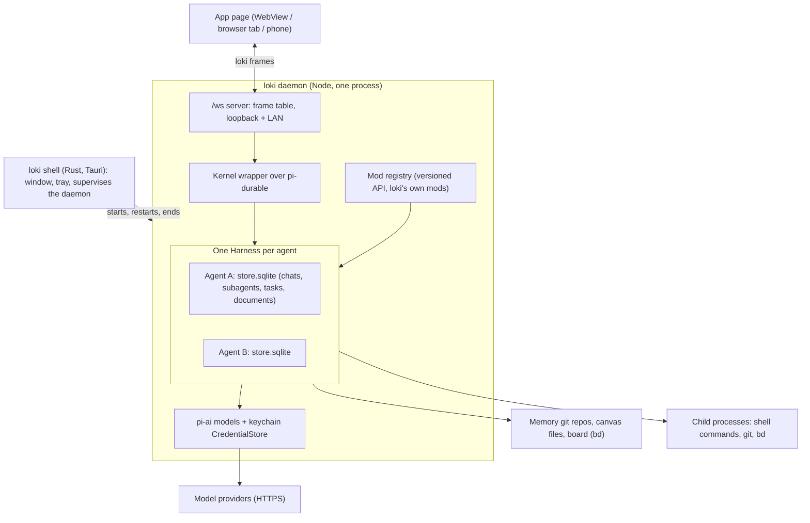
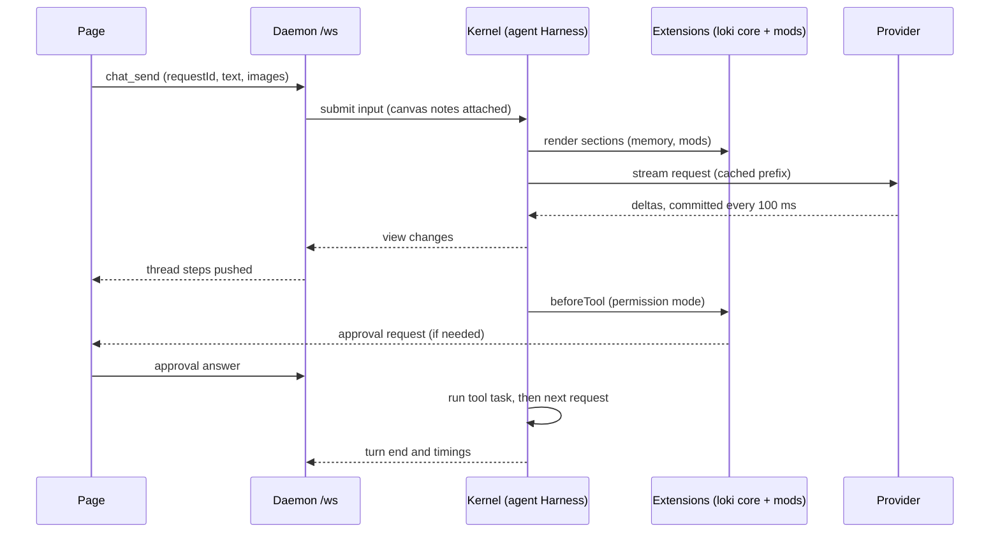
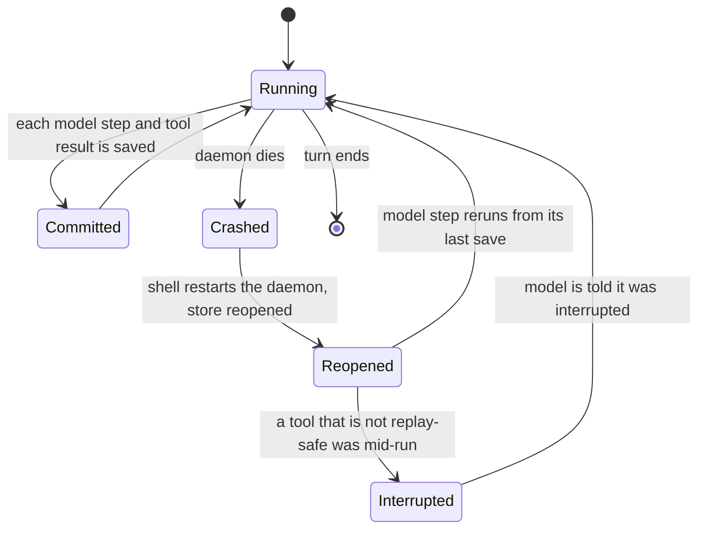
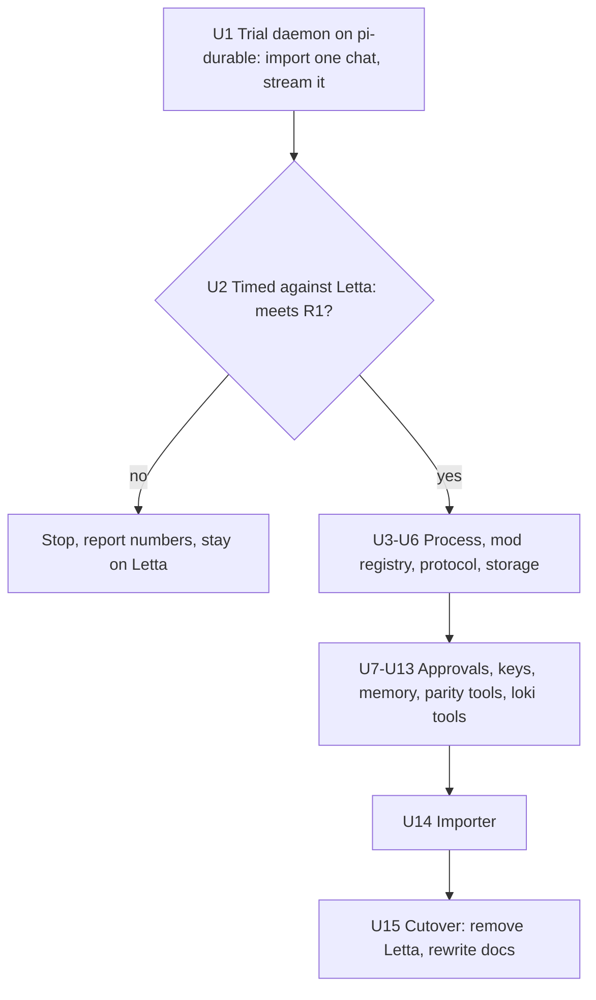

# Pi Harness - Plan

## Goal Capsule

- **Objective:** loki's agents answer faster than they do on Letta, and a chat survives a crash or restart in the middle of a turn. Every chat, Inbox card, board task, agent page, Learn card and phone screen keeps working, with no Letta installed. The person can extend the agent with mods that loki defines and versions.
- **Means:** One long-running loki daemon on Node that runs every chat on Pi's durable kernel, `pi-durable`, behind a loki wrapper (KTD1, KTD2). It speaks loki's own frame protocol to every client (KTD5). A measured trial decides whether the full port goes ahead (R1).
- **Authority:** Requirements own behaviour. KTDs own mechanism. A unit's Approach adds only what is local to it. `GLOSSARY.md` owns vocabulary, and `docs/architecture.md` is rewritten to match in U15.
- **Stop conditions:**
  1. Stop after U2 if the trial misses the bar in R1, and report the numbers. The port does not continue on a miss.
  2. Stop and ask if a Letta conversation cannot be written into pi-durable and then continued by the model (KTD6), because the importer's design rests on it.
  3. Stop and ask if the keychain binding cannot ship inside the packaged app on one of the three systems (KTD10).
  4. Stop and ask if a pi-durable upgrade is needed mid-port and it breaks the wrapper's API (KTD4).
- **Execution profile:** Work on the user's current local branch, with commits there. No new branch, no push, no PR unless asked. Units after the gate can land over several sessions. Letta stays the working backend until U15.

---

## Product Contract

### Summary

loki stops depending on Letta Code. The Rust shell starts and supervises one loki daemon. It is a Node process that runs each agent's chats on pi-durable, which saves every model turn and tool call before showing it, and resumes interrupted work after a crash. The daemon holds the tools, approvals, memory, reflection and mods. It serves the desktop, browser tab and phone over one protocol. A short trial on real chats comes first, and it must beat Letta on measured speed. A one-time import converts the person's agents, memory, conversations and keys, keeping their ids. Once everything works on the daemon, one cutover removes Letta from loki.

### Problem Frame

loki feels slow, and the slow part is not loki's to fix. Each turn passes through Letta's app-server and local backend, inside a Node process that Letta writes and updates on its own schedule. Letta's mod API and app-server protocol are unversioned, so loki hand-types both and keeps a version range in `core/compat.ts`. That arrangement has broken repeatedly:

1. Letta's dreaming sandbox failed silently on macOS.
2. A release reported a stale version string.
3. `LETTA_MODS_DIR` does not load mods.
4. Letta's switch to Bun dropped streamed answers until loki forced Node (cd427fb).

Letta Code is itself built on Pi: its backend calls `@earendil-works/pi-ai` and writes conversations in Pi's session format. Moving to Pi directly removes a middle layer. pi-durable adds what Letta never had: a turn cut off by a crash or a restart picks up where it stopped.

### Requirements

**Speed and the trial**

- R1. Before the full port, real chats run end-to-end on the daemon and are timed against Letta on the same prompt set. The port continues only if all of these hold:
  1. the daemon's median time to first token is lower than Letta's;
  2. its median harness overhead is lower than Letta's;
  3. its median gap between tool calls is no higher than Letta's.
- R2. Every turn records its time to first token, each tool call's time, and the harness's own overhead apart from the model. These go to `mod.log` and analytics, so a slowdown has a number.

**One owned process**

- R3. loki runs agents with no Letta Code installed. The window starts one daemon and restarts it if it dies. Quitting loki ends it on macOS, Windows and Linux.
- R4. The desktop window, a browser tab and a paired phone all talk to the daemon over one protocol. Nothing in loki speaks Letta's app-server protocol after cutover.
- R5. When the daemon restarts in the middle of a turn, the turn continues from where it stopped. A tool call that is not safe to repeat is reported to the model as interrupted instead of run twice. A message sent again after a reconnect is handled once.

**Mods**

- R6. Mods are written against a versioned loki mod API. Through it, a mod can:
  1. add tools;
  2. add sections to the agent's prompt;
  3. act before a tool runs and on turn events;
  4. answer its own frames.

  Editing a mod reloads it without restarting the daemon or dropping a running chat.
- R7. loki's own features (canvas, board, Learn, phone listener, agent pages) are mods on that same API.

**Everything that works today keeps working**

- R8. Chats, Inbox, Board, Agents, Learn, the phone and the Canvas behave as they do on Letta, including every existing chat's history.
- R9. Approvals, the four permission modes (strict, standard, acceptEdits, unrestricted) and question cards work as today, answered from any client.
- R10. Each agent keeps a git-backed memory folder, shown and editable on its Agents page. The agent reads and edits its memory with memory tools. Background reflection updates the memory under the settings the Reflection page shows.
- R11. On the day of cutover the following also work:
  1. skills and AGENTS.md context files;
  2. subagents;
  3. background tasks;
  4. scheduled tasks;
  5. web search;
  6. compaction;
  7. the commands `/compact`, `/clear`, `/remember` and `/reflect`.

**Keys and models**

- R12. Provider credentials live in the system keychain. API keys and ChatGPT sign-in work. Anthropic subscription sign-in is not offered.
- R13. Model choice and reasoning effort work per chat and per agent as they do today, using the models the person's providers offer.

**Import and cutover**

- R14. A one-time import brings across the following, each keeping its id:
  1. the person's own agents, without Letta's helper subagents;
  2. each memory folder, with its git history;
  3. every conversation of those agents;
  4. provider credentials;
  5. pins, permission modes and moved folders;
  6. scheduled tasks and reflection settings.

  loki's existing state still lines up afterwards: chats, widgets, marks, board stamps and Learn positions.
- R15. The import refuses to run while Letta is running against the same data, and running it again is safe.
- R16. After cutover loki contains no Letta install path, version range, cloud mode or app-server client.

### Key Decisions

- **Drop the shared-Letta design.** loki no longer runs the Mac's own Letta Code. Cloud mode goes, and agents are no longer shared with a terminal `letta`. (session-settled: user-approved — chosen over keeping the 2026-09-15 shared-Letta policy of plan 009: owning the harness is the point.) Governs R3, R16.
- **Pi, not OpenCode 2.** (session-settled: user-approved — chosen over building on OpenCode 2's server, which swaps one external server for another, splits mods across two processes and brings no agent memory.) Governs R4, R6.
- **The trial is a gate.** (session-settled: user-approved — chosen over committing to the full port up front, because speed is the reason for the move.) Governs R1.
- **Day-one parity set.** Subagents, background tasks, scheduled tasks and web search must work at cutover. (session-settled: user-directed — chosen over deferring any of them; the person picked all four.) Governs R11.
- **Keys move to the keychain.** loki now holds provider credentials, so the README's "loki never sees it" changes. (session-settled: user-approved — chosen over a plaintext file like Letta's `auth.json`.) Governs R12.
- **No compatibility with Letta mods.** (session-settled: user-approved — chosen over a shim for Letta's mod API.) Governs R6.

### Success Criteria

1. On the trial prompt set, the daemon's medians meet R1, and the cutover build still meets them.
2. Killing the daemon mid-turn and letting the shell restart it finishes the turn without the person resending anything.
3. A fresh clone on a Mac with no Letta installed reaches a working chat, following the fresh-clone recipe in memory updated for no Letta.
4. Every row of the parity checklist in U15 passes on the Mac and on a paired phone.

### Scope Boundaries

1. **Not built, considered:** deleting a chat's transcript from disk. pi-durable never deletes entries, so a chat is archived, as today. Deleting an agent removes its whole store (KTD6). Revisit if someone needs a single chat erased.
2. **Not built, considered:** running mods in separate worker threads. Mods run in the daemon's process. Revisit if a mod is seen blocking chats.
3. **Not built, considered:** supporting both backends long-term. Letta stays only until U15.
4. **Outside this plan:** new features for users. The port changes where things run, not what loki does.

#### Deferred to Follow-Up Work

1. Letta's channels and worktrees tools.
2. MCP servers. pi-durable has none built in, and nothing in R11 needs them.
3. The Pi CLI attaching to the daemon as a terminal client.

---

## Planning Contract

### Key Technical Decisions

- KTD1. **Run every chat on pi-durable's `Harness`, and only `daemon/kernel/` imports it.** (session-settled: user-directed — chosen over pi-coding-agent's `AgentSession`, which can open Letta's session files unchanged and ships skills and MCP; the person chose crash-resumable turns, multi-client steering and built-in subagents, accepting history conversion and an experimental API.) The kernel wrapper exposes loki's own operations: open an agent, create a chat, submit, steer, abort, page entries, watch. When pi-durable's API changes, only the wrapper changes. The pieces pi-durable provides come from it: model calls through `pi-ai`'s `createModels`, the tools `read`, `write`, `edit` and `bash`, compaction, steer and follow-up, child conversations, durable tasks and timers, hooks, and committed views.
- KTD2. **One daemon process, with one `Harness` and one SQLite file per agent.** (session-settled: user-approved — chosen over a process per chat, because speed comes first and mods sit beside the loop.) A Harness commits on one line, and SQLite runs synchronously on Node's main thread. One store per agent has three effects:
  1. It spreads those commits across agents.
  2. A storage failure closes only that agent's chats.
  3. Deleting an agent deletes a file.

  U2 measures how much the event loop stalls with several chats streaming at once. If it misses the threshold in U2, each Harness moves into its own worker thread before U3 (Open Question 1).
- KTD3. **Node 22.19 or newer, not Bun.** (session-settled: user-approved — chosen over Bun, because Bun's fetch dropped streamed answers, cd427fb.) pi-durable's SQLite backend uses Node's built-in `node:sqlite`. Unit tests stay on `bun test`, using pi-durable's `MemoryStorage` and the `faux` provider. A Node-run test leg covers SQLite and real HTTP streaming.
- KTD4. **Pin every `@earendil-works/*` package to one exact version.** Pi's policy makes every minor release breaking, and pi-durable is labelled experimental; main already breaks 1.1.0. An upgrade is its own commit. It runs the wrapper's tests, the import fixtures and the trial prompt set.
- KTD5. **Clients talk to the daemon's `/ws` only, with every frame declared in the frame table (`core/frames.ts`, plan 016).**
  1. The chat frames that replace the app-server protocol go into that table: send, steer, abort, approvals, answers, models, agents, providers, reflection, memory files and skills.
  2. Pushes carry ThreadModel steps, built from pi-durable's committed view and its event stream.
  3. The Rust shell's authenticated app-server link (`appserver.rs` `Link`) goes. It existed only because Letta's app-server wanted a bearer header a browser cannot send, and the page already reaches the mod's `/ws` with the token.
  4. The phone allow-list marks the chat frames the phone uses today through the `/appserver` tunnel.
- KTD6. **Each agent's store holds its chats, and a loki index document keeps Letta's ids.**
  1. Each agent's store is `~/.loki/stores/<agentId>.sqlite` (pi-durable SQLite, WAL), and its record and memory keep Letta's layout under `~/.loki/backend/` (`agents/<name>.json`, `memfs/<agentId>/memory/`, a git repo). (As built; the plan first had them together under `~/.loki/agents/<agentId>/`.)
  2. pi-durable assigns its own numeric conversation ids. A session-scoped index document maps each loki chat id (`conv-…`, or `default` for the agent's main chat) to its pi-durable conversation.
  3. A conversation-scoped `loki.chat` document holds the title, archive flag, model override, folder and permission mode. The index and `loki.chat` are written in the same commit that creates the chat.
  4. Agent records stay loki JSON (`~/.loki/agents/<agentId>/agent.json`), keeping the Letta fields loki reads.
  5. Readers that parsed `messages.jsonl` (`mod/desks.ts`, `mod/folders.ts`) page entries through the kernel wrapper instead.
  6. Learn's cursors become entry ids.
- KTD7. **loki's root moves from `~/.letta/loki` to `~/.loki`.** The import moves the existing folder and leaves a link at the old path: a symlink, or a junction on Windows. Paths in agents' memories and old widget references then still resolve. `mod/paths.ts` and `src-tauri/src/lib.rs` `loki_dir` keep their `LOKI_*` overrides.
- KTD8. **Approvals are a `beforeTool` hook in loki's core extension, recorded in a task memo.**
  1. The hook decides by permission mode and the tool's annotations. If a person is needed, it pushes an approval and waits.
  2. An abort cancels the wait. The memo means a resumed turn never asks twice.
  3. Each tool call is its own task, so parallel calls can each raise an approval at once.
  4. loki adds its core extension to every conversation's extension list, including subagents' lists. A test pins that, because a conversation without it would run with no approvals.
- KTD9. **The prompt order is fixed for caching:**
  1. instructions;
  2. mod sections;
  3. the agent's memory section;
  4. history.

  pi-durable re-renders sections each request and writes only the changes into the transcript, so the cached prefix holds. Canvas gestures and the board notice stay appended to the person's message, as `attachDeskContext` does today. `cacheRetention` is chosen from U2's measurements.
- KTD10. **Credentials live in the OS keychain through a Node keyring binding (`@napi-rs/keyring`), behind pi-ai's `CredentialStore`.**
  1. There is one entry per provider.
  2. pi-ai's OAuth refresh writes the new tokens back through the store's `modify`.
  3. ChatGPT sign-in is kept.
  4. Anthropic subscription sign-in is left out, because pi-ai implements it by presenting itself as Claude Code.
  5. The binding's prebuilt native files ship with the daemon bundle for all three systems (Goal Capsule stop 3).
- KTD11. **Reflection is a loki background task that never runs during a turn.**
  1. It runs on the agent's settings: `trigger off|step-count|compaction-event`, `stepCount` and `merge`.
  2. It runs once the chat is quiet, as a pi-durable child conversation with only the memory tools.
  3. It commits to the memory repo as "Reflection".
  4. It reports through the existing `reflection_state` frame shape.
- KTD12. **Subagents are pi-durable task-owned child conversations.** An abort of the parent cascades to them, and they are not agent records. The `role:subagent` filtering goes away for new data, and the importer drops Letta's helper records.
- KTD13. **Background shell tasks are loki tools over child processes the daemon holds.**
  1. The tools are a backgrounded bash, `TaskOutput`, `write_stdin`, `Monitor` and `TaskStop`.
  2. Each task is tracked by a pi-durable background task, so a daemon restart reports the task as ended instead of leaving it hanging.
  3. When a task finishes, it sends a `<task-notification>` follow-up to the chat, which `core/harness.ts` already renders.
- KTD14. **Scheduled tasks are pi-durable background tasks that sleep with `runtime.sleep` until due.** When a schedule comes due, it submits the "Scheduled task" prompt into its chat. Schedules survive restarts without a separate cron store. A slot missed while loki was closed fires once at the next start. The Inbox's `AskedBy: "schedule"` (`core/attention/priority.ts`) keeps working. The import reads `~/.letta/crons.json`.
- KTD15. **Mods are pi-durable extensions installed in a loki registry.** A mod edit re-bundles the mod, using the technique in `mod/boot.ts`, and calls `registry.install()` under the same name. Running work keeps the old code until its current step ends, and the next step uses the new code. Conversations store extension names, so every chat picks up the new version.
- KTD16. **Letta stays the backend until U15.** A development switch (`LOKI_BACKEND=pi`) selects the daemon while the port is under way. U15 is the single cutover that deletes the Letta paths. (session-settled: user-approved — chosen over a long period supporting both backends.)
- KTD17. **The mod API is seeded from `mod/letta-types.ts`.** It keeps `tools.register`, `events.on`, `diagnostics.report` and `signal`, and adds `prompt.section`, `beforeTool` and `frames.handle`, all under an `apiVersion`. Internally each mod becomes one pi-durable extension, through `defineExtension` with tools, sections and hooks. A mod built for a newer major `apiVersion` is refused, and the refusal is named in Settings.
- KTD18. **The daemon holds a lockfile on each agent store and watches every Harness for failure.**
  1. pi-durable has no cross-process lock, and two owners of one store would run tool calls twice. A second loki (a dev build beside the installed app) therefore attaches to the running daemon instead of opening the stores. This is what loki does with Letta today.
  2. A storage error closes a Harness. The daemon reopens it after the old one has closed, logs the failure, and shows the affected chats as reconnecting.
- KTD19. **Skills and AGENTS.md are a loki extension.** It lists each skill's name and description as a prompt section, offers a `Skill` tool that loads a skill's full text, and adds the AGENTS.md files from the chat's folder as a section. pi-durable has none of this, and pi-coding-agent's loader is not fully exported.

### High-Level Technical Design

Processes after cutover:

One message, from send to reply:

A turn interrupted by a restart:

The order of the port and its gate:

### Assumptions

1. The installed Letta's logs are representative of what the importer will meet. On this Mac (Letta Code 0.31.14), `messages.jsonl` is Pi session v3 and `auth.json` uses pi-ai's credential shapes.
2. Letta's four permission modes can be expressed through tool annotations (read-only, destructive) plus a list of file-mutating tools. U7 records the exact table.

---

## Implementation Units

| U-ID | Title | Key files | Depends on |
|---|---|---|---|
| U1 | Trial daemon on pi-durable | `daemon/kernel/`, `daemon/import/`, `core/attention/pi-steps.ts` | none |
| U2 | Timing and the gate | `daemon/timing.ts`, `scripts/trial.ts` | U1 |
| U3 | Daemon process and supervision | `src-tauri/src/harness.rs`, `scripts/build-daemon.ts` | U2 |
| U4 | Mod registry and versioned mod API | `daemon/mods/`, `mod/index.ts` | U3 |
| U5 | Chat protocol on the frame table | `core/frames.ts`, `core/attention/*` | U4 |
| U6 | Agent stores, chats and recovery | `daemon/kernel/stores.ts`, `mod/desks.ts` | U4 |
| U7 | Approvals, modes and question cards | `daemon/mods/approvals.ts` | U5, U6 |
| U8 | Providers, keys and models | `daemon/credentials.ts`, `app/src/settings/Providers.tsx` | U5 |
| U9 | Memory and reflection | `daemon/mods/memory.ts`, `daemon/mods/reflection.ts` | U6 |
| U10 | Skills, subagents, tools and commands | `daemon/mods/skills.ts`, `daemon/mods/subagents.ts` | U7 |
| U11 | Background tasks and scheduled tasks | `daemon/mods/tasks-bg.ts`, `daemon/mods/schedule.ts` | U7 |
| U12 | Web search | `daemon/mods/web-search.ts` | U8 |
| U13 | loki's own tools, canvas notes and Learn | `mod/tools.ts`, `mod/recall-worker.ts` | U6, U7 |
| U14 | One-time import from Letta | `daemon/import/` | U6, U8, U9, U11 |
| U15 | Cutover and removal of Letta | `src-tauri/src/*`, `core/compat.ts`, docs | all above |

### U1. Trial daemon on pi-durable

**Goal:** Real chats stream through a pi-durable daemon into the existing chat view. One of them is a converted Letta conversation, so the trial measures real behaviour and proves the import path.

**Requirements:** R1 (enables), R5, KTD1, KTD2, KTD3, KTD4, KTD6

**Dependencies:** none

**Files:**
1. Create `daemon/main.ts`, the Node entry.
2. Create `daemon/kernel/index.ts`, the only module that imports pi-durable. It opens an agent store, creates and finds chats through the index document, submits, steers, aborts, pages entries and watches.
3. Create `daemon/package.json`, with pinned `@earendil-works/pi-ai`, `pi-durable` and `chord`.
4. Create `daemon/import/convert.ts`, which converts one Pi session v3 log into pi-durable entries.
5. Create `core/attention/pi-steps.ts`, which turns pi-durable entries and view changes into ThreadModel `Step`s using structural types only, with no package imports (`test/core-portability.test.ts`).
6. Modify `mod/server.ts` to accept a trial frame set behind `LOKI_BACKEND=pi`.
7. Test files: `test/pi-steps.test.ts`, `test/kernel.test.ts` and `test/import-convert.test.ts`.

**Approach:**
1. The daemon runs beside Letta's harness on its own port. Credentials come read-only from Letta's `auth.json` for the trial.
2. Convert one real Letta conversation into a trial store:
   1. Write a baseline instructions entry first, so the first live turn does not append the whole prompt after the history.
   2. Linearise the session tree by following `parentId` from the newest entry back to the header.
   3. Write user, assistant, tool-result and compaction entries with `tx.appendEntry`.
3. Continue that chat with a new message, to prove stop condition 2.
4. Open three chats on two agents at once, to exercise KTD2.
5. Kill the daemon mid-turn and reopen, to see R5 happen.

**Patterns to follow:** `scripts/harness.ts` (running the mod outside Letta), `mod/boot.ts` (bundling), and the `*Deps` injection used across `mod/`.

**Test scenarios:**
1. A Letta-written log fixture converts into pi-durable entries in order: header, user, assistant with a tool call, tool result, compaction. Folded into steps, it gives the same rows `logSteps` gives today.
2. A converted conversation accepts a new message, and the model request starts with the baseline instructions followed by the history.
3. A log with a branch (two children of one entry) imports only the path to the newest entry.
4. Streamed partials and a tool result fold into one assistant row, one call row and one result row, in order.
5. Reopening a store whose turn was cut off mid-generation resumes it. A non-replay-safe tool cut off mid-run gives the model an interrupted result.
6. Two agents' chats run concurrently without crossing messages, folders or stores.
7. The same `requestId` sent twice creates one user message.

**Verification:** A trial chat on the Mac streams a reply with a tool call into the existing chat view. A converted Letta chat opens with its history and continues. Three chats run at once. A killed daemon finishes its turn after restart.

### U2. Timing and the gate

**Goal:** Measure the daemon against Letta on the same prompts and decide R1.

**Requirements:** R1, R2, KTD2, KTD9

**Dependencies:** U1

**Files:**
1. Create `daemon/timing.ts`. Per turn, it records:
   - time to first token;
   - each tool call's time;
   - harness overhead (turn time minus provider streaming time);
   - event-loop delay;
   - resident memory.
2. Create `scripts/trial.ts`, which runs a fixed prompt set against Letta's app-server and the trial daemon with the same model.
3. Create `docs/research/2026-10-pi-trial.md` for the results.
4. Test file: `test/timing.test.ts`.

**Approach:**
1. The prompt set:
   1. a plain question;
   2. a turn with three dependent tool calls;
   3. a turn with parallel reads;
   4. a long chat of about 100 KB of history;
   5. three chats streaming at once.
2. Run each prompt five times on each backend, with the same model and provider.
3. Try `cacheRetention` `short` and `long`, and record cache tokens alongside the times.
4. Record the 99th-percentile event-loop delay during the concurrent run. If it exceeds 50 ms, the Harnesses move to worker threads before U3 (Open Question 1).
5. Write the medians, the event-loop result and the R1 verdict to the research note.

**Test scenarios:**
1. Turn events with known timestamps give the expected time to first token, per-tool times and harness overhead.
2. A turn with no tool calls reports no tool time and an overhead equal to turn time minus streaming time.

**Verification:** The research note holds medians for both backends and states whether R1 is met. On a miss, work stops here (Goal Capsule).

### U3. Daemon process and supervision

**Goal:** The shell starts, restarts and ends the daemon in place of `letta server` when `LOKI_BACKEND=pi`.

**Requirements:** R3, R5, KTD3, KTD16, KTD18

**Dependencies:** U2

**Files:**
1. Modify `src-tauri/src/harness.rs` so it can start `node <data>/daemon/daemon.mjs`, reusing the Job Object and parent-death logic.
2. Modify the setup branch in `src-tauri/src/lib.rs`, and `src-tauri/src/bootstrap.rs`. Node discovery and `NODE_MIN` stay.
3. Modify `src-tauri/src/install.rs`, which places the daemon bundle.
4. Create `scripts/build-daemon.ts`, mirroring `scripts/build-mod.ts`, and add the bundle to the `package.json` scripts.
5. Create `daemon/lock.ts`.
6. Test files: `test/build-daemon.test.ts`, `test/lock.test.ts` and inline Rust tests in `harness.rs`.

**Approach:**
1. Port 41414, the LAN port and the token file stay as they are.
2. When the daemon exits unexpectedly, restart it with a capped backoff and log it to `mod.log`. On restart, each agent store resumes its unfinished work (R5).
3. Recognise a leftover daemon from an earlier crash by its command line plus process start time, as `appserver.rs` does for `letta server` today.
4. The daemon takes a lockfile per agent store. A stale lock, whose process is gone, is taken over.
5. The bundle carries the keychain binding's prebuilt native file for each system (KTD10).

**Test scenarios:**
1. The command built for the daemon names Node, the bundle and the token file on each system.
2. A daemon that exits is restarted, and two exits in quick succession back off.
3. A leftover daemon with a matching command line and start time is stopped. One with a different start time is left alone.
4. A second daemon cannot open a store the first holds. A lock whose process is gone is taken over.
5. The bundle loads under Node and has the `createRequire` banner that `test/build-mod.test.ts` pins.

**Verification:** `bun start` with `LOKI_BACKEND=pi` brings up the window on the daemon. Killing the daemon mid-turn brings it back and the turn finishes. Quitting loki leaves no daemon running, checked on macOS and in Windows and Linux CI.

### U4. Mod registry and versioned mod API

**Goal:** Mods load into the daemon on a versioned API and reload live, and loki's own features run as mods.

**Requirements:** R6, R7, KTD15, KTD17

**Dependencies:** U3

**Files:**
1. Create `daemon/mods/api.ts`, the versioned API types, replacing `mod/letta-types.ts`.
2. Create `daemon/mods/registry.ts`, which handles loading, the version check, `defineExtension` and install, and reload.
3. Modify `mod/index.ts`, so that `activate` registers through the new API.
4. Modify `mod/boot.ts` (re-bundle on reload) and `mod/tools.ts` (TypeBox schemas).
5. Test files: `test/mod-registry.test.ts` and `test/mod-api.test.ts`.

**Approach:**
1. Map the mod API's events onto pi-durable hooks:
   - `events.on("turn_start")` maps to the `beforeRequest` hook on the first request of a turn;
   - `turn_end` maps to `onYield`;
   - `compact_end` maps to `beforeCompact` and the compaction entry.
2. `frames.handle` registers frame handlers with the router from plan 016.
3. Mods load from loki's own mods folder (`~/.loki/mods/`) plus loki's built-in mods.
4. A mod that throws while loading is reported through `diagnostics`, and the other mods still load.
5. The same registry is passed to every agent's Harness, so one install reaches every chat.

**Patterns to follow:** `scripts/harness.ts`'s fake `letta` object, whose shape becomes the test double for the API. Frame handlers follow `mod/frames/*`.

**Test scenarios:**
1. A mod that registers a tool, a prompt section and a `beforeTool` hook has all three reach a chat.
2. Editing a mod's file during a running turn finishes the current step on the old code, and the next step uses the new code.
3. A mod declaring a newer major `apiVersion` is refused, and the refusal reaches diagnostics.
4. A mod that throws on load does not stop loki's built-in mods.
5. One mod install reaches chats in two different agents' stores.

**Verification:** loki's canvas, board, Learn and phone features run as mods on the daemon. A mod edit shows up in the next step without a restart.

### U5. Chat protocol on the frame table

**Goal:** Everything the page asked Letta's app-server for now goes over loki's frames to the daemon.

**Requirements:** R4, R5, R8, R13, KTD5

**Dependencies:** U4

**Files:**
1. Modify `core/frames.ts` and `core/frame-types.ts`. Add the chat, agent, model, provider, reflection, memory-file and skill frames, with phone flags.
2. Create `daemon/frames/chat.ts` and `daemon/frames/agents.ts`.
3. Replace `core/attention/protocol.ts` with a client over the frame socket.
4. Modify `core/attention/model.ts` (re-key `applyEvent` on loki pushes), `core/attention/useAttention.ts`, and `app/src/shell/transport.ts`, where the Tauri app-server relay goes.
5. Test files: `test/frames-router.test.ts` (extended), `test/attention-model.test.ts` and `test/chat-frames.test.ts`.

**Approach:**
1. Map each request in the app-server table (research §1c) to one frame:
   - `runtime_start`, `create_conversation` and `change_device_state` become open chat, create chat and set folder;
   - `input` becomes send, answer approval and answer question;
   - `abort_message` becomes abort;
   - `update_model` and `list_models` become set model and list models;
   - the rest map one to one.
2. Every send carries a `requestId`, so a resend after a reconnect is handled once (R5).
3. Pushes carry steps, loop status, permission mode and folder, and approval and question requests.
4. A message sent while a turn runs is queued as a pi-durable follow-up, matching today's queue.
5. While `LOKI_BACKEND` is unset, the page keeps using Letta. The switch picks one protocol client at boot.

**Test scenarios:**
1. Every new frame has exactly one handler, and the phone allow-list includes the chat frames the phone uses today.
2. A message sent while a turn is running is queued, then sent when the turn ends.
3. Abort during streaming ends the turn, and the partial reply stays in the thread marked as cut off.
4. A send repeated with the same `requestId` after a reconnect shows one message.
5. A failed request answers with the shared `error` frame, and the app shows it as a message.
6. Reconnecting the socket re-subscribes to open chats, and the thread does not duplicate rows.

**Verification:** With `LOKI_BACKEND=pi`, sending, aborting, queueing, model and effort switching, rename, archive and folder moves work against the daemon, from the Mac and from a paired phone.

### U6. Agent stores, chats and recovery

**Goal:** The daemon owns agent records, one store per agent and the loki chat index (KTD6) under `~/.loki` (KTD7), and recovers from a store failure (KTD18).

**Requirements:** R5, R8, R14 (enables), KTD6, KTD7, KTD18

**Dependencies:** U4

**Files:**
1. Create `daemon/kernel/stores.ts`, which opens, closes, watches and reopens each agent's Harness.
2. Create `daemon/store/agents.ts`.
3. Modify `mod/paths.ts` (the root moves to `~/.loki`, with the overrides kept) and `loki_dir` in `src-tauri/src/lib.rs`.
4. Modify `mod/desks.ts`, `mod/folders.ts`, `mod/agents.ts` and `mod/pins.ts`. Their readers page entries through the kernel, and pins become loki state.
5. Test files: `test/stores.test.ts` and `test/store-agents.test.ts`, plus updates to `test/desks.test.ts`, `test/folders.test.ts` and `test/agents.test.ts`.

**Approach:**
1. An agent record keeps Letta's fields that loki reads: id, name, description, system, tags, model, model_settings and hidden.
2. Creating an agent creates its store, its memory git repo and its main chat (`default`).
3. A chat's title, archive flag, model override, folder and permission mode live in its `loki.chat` document.
4. The chat list reads the index document of each agent store. There is no scan of pi-durable's tables.
5. New ids use Letta's prefixes (`agent-local-…`, `conv-…`), so `isAgentId` (`core/frames.ts`) and the scopes keep working.
6. Set `contextRetentionMs` low and close a store that has been idle for a long time, because pi-durable's document cache only empties on close.

**Test scenarios:**
1. Creating an agent writes its record, store, memory repo and main chat, and the agent appears in the chat list.
2. A chat's title, archive flag, model override, folder and mode round-trip, and survive a daemon restart.
3. `recentFolders` reads folders from the `loki.chat` documents.
4. A Learn cursor at an entry id returns only entries after it.
5. A forced storage error closes that agent's Harness, the daemon reopens it, and the other agents' chats keep streaming.
6. Paths honour every existing `LOKI_*` override.

**Verification:** On the daemon, new agents and chats appear across Chats, Inbox and Agents, and survive a restart. A store failure in one agent leaves the others running.

### U7. Approvals, permission modes and question cards

**Goal:** Tool calls ask the person exactly when the chat's mode says to, and question cards work.

**Requirements:** R9, KTD8

**Dependencies:** U5, U6

**Files:**
1. Create `daemon/mods/approvals.ts`, the `beforeTool` hook, memo and mode table, in loki's core extension.
2. Create `daemon/mods/ask.ts`, the `AskUserQuestion` tool.
3. Modify `app/src/chat/PermissionMode.tsx`, only if labels change.
4. Test file: `test/approvals.test.ts`.

**Approach:**
1. The mode table sorts tools by their annotations and a list of mutating tools:
   - `unrestricted` asks for nothing;
   - `acceptEdits` asks for commands, not file edits;
   - `standard` asks for commands, and for edits outside the chat's folder and loki's widget folder;
   - `strict` asks for every tool that is not read-only.
2. Write the table into `GLOSSARY.md`.
3. loki's widget folder is always writable without asking, so the canvas keeps working (research §4a).
4. `AskUserQuestion` pushes a question and waits for the answers, which come back as the tool's result.

**Test scenarios:**
1. In each mode, a read, an edit inside the folder, an edit outside it and a shell command each ask or run as the table says.
2. An edit in loki's widget folder runs without asking in `strict`.
3. Denying an approval gives the model a refusal result carrying the person's message.
4. Aborting while an approval waits cancels it, and the card goes away on every client.
5. An approval answered, then a daemon restart before the tool ran, runs the tool without asking again.
6. Two parallel calls each raise their own approval, and answering one does not answer the other.
7. Answering from the phone resolves an approval the desktop also shows.
8. A subagent's tool calls pass through the same hook.
9. A question card's answers reach the model as the tool result.

**Verification:** Approvals and question cards behave as on Letta, on the Mac and the phone.

### U8. Providers, keys and models

**Goal:** Credentials live in the keychain, and models list and switch from pi-ai's registry.

**Requirements:** R12, R13, KTD10

**Dependencies:** U5

**Files:**
1. Create `daemon/credentials.ts`, the keychain-backed `CredentialStore`.
2. Create `daemon/frames/providers.ts`: connect, disconnect, list and ChatGPT sign-in.
3. Modify `core/models.ts`, which maps pi-ai models to `ModelEntry`; `reasoningEffortFromSettings` stays.
4. Modify `app/src/settings/Providers.tsx` and `README.md` (the key wording).
5. Test files: `test/credentials.test.ts` and `test/models.test.ts`.

**Approach:**
1. Connecting a key checks it with a small request before saving it.
2. ChatGPT sign-in runs pi-ai's OAuth flow and pushes the sign-in URL for the page to open.
3. The Anthropic subscription method is filtered out of the provider list (KTD10).
4. Secrets never appear in logs or analytics.

**Test scenarios:**
1. A saved key reads back through the store, and deleting the provider removes it.
2. An OAuth refresh writes the new tokens back, and a concurrent refresh loses neither write.
3. The provider list has no Anthropic subscription method.
4. Model entries carry the reasoning-effort levels the model supports, and a chat's chosen effort survives a restart.
5. A bad key is refused with the provider's reason, and nothing is stored.

**Verification:** A new key, the ChatGPT sign-in and model switching work from Settings, and the keychain holds the secrets.

### U9. Memory and reflection

**Goal:** Agents read and edit their own memory, and reflection updates it in the background.

**Requirements:** R10, R11 (`/remember`, `/reflect`), KTD9, KTD11

**Dependencies:** U6

**Files:**
1. Create `daemon/mods/memory.ts`: the memory section, and the memory tools read, write and patch, each a git commit.
2. Create `daemon/mods/reflection.ts`.
3. Modify `mod/reflection.ts`, so that reflection state comes from the daemon instead of Letta's `state.json`.
4. Modify `app/src/agents/ReflectionPage.tsx`, only if fields change.
5. Test files: `test/memory-mod.test.ts` and `test/reflection.test.ts`.

**Approach:**
1. Compile the memory section from the agent's memory folder:
   - files under `system/` when that folder exists, otherwise the root markdown files;
   - other files are listed by path, for the agent to read on demand.
2. A memory edit changes the section from the next request. pi-durable writes only the change, so the cached prefix holds.
3. Reflection counts steps per chat. When the trigger is met and the chat has been quiet for 10 minutes (Learn's `QUIET_MS`), it runs once as a child conversation. Its commits are authored "Reflection", so the Agents page timeline reads as today.
4. `/remember` writes a note through the memory tool, and `/reflect` starts reflection now.

**Test scenarios:**
1. An agent with `system/persona.md` and `system/human.md` gets both in its memory section. Other files are listed by path only.
2. An agent with only root markdown files gets those in its memory section.
3. A memory write commits to the agent's repo under the agent's name, and the next request sees the change.
4. Reflection set to step-count 25 runs once after 25 steps and 10 quiet minutes, and never during a turn.
5. Reflection set to off never runs, and `/reflect` runs it anyway.
6. Reflection's own conversation never appears as a chat.

**Verification:** The Agents page shows memory, the commit timeline and reflection state for a daemon-run agent, and `/reflect` produces a "Reflection" commit.

### U10. Skills, subagents, tools and commands

**Goal:** Skills and AGENTS.md load, skills install, the agent can start helper agents, the extra file tools Letta offered are there, and the commands in R11 work.

**Requirements:** R11, KTD12, KTD19

**Dependencies:** U7

**Files:**
1. Create `daemon/mods/skills.ts`: the skills and AGENTS.md sections, the `Skill` tool, and a loki installer replacing `letta install`.
2. Create `daemon/mods/subagents.ts`, the `Agent` tool over child conversations.
3. Create `daemon/mods/files.ts`, with grep, find, ls and image viewing, which pi-durable lacks.
4. Create `daemon/frames/commands.ts`.
5. Modify `mod/skills.ts` and `mod/skill-sources.ts` (the installer and the commit identity), and `core/attention/commands.ts` (the command list).
6. Test files: `test/skills-mod.test.ts`, `test/subagents.test.ts`, `test/files-mod.test.ts` and `test/commands.test.ts`.

**Approach:**
1. Skills come from `~/.agents/skills` and each agent's `memory/skills`. The `<skill_content>` markup stays recognised for imported history.
2. A subagent runs as a task-owned child conversation with the parent's folder and mode. Its steps fold under the parent's call row, and its final text becomes the tool result.
3. `/compact` runs pi-durable's compaction. `/clear` starts a fresh context in the same chat. `/init` and `/doctor` leave the palette.

**Test scenarios:**
1. A global skill and an agent's memory skill both appear to the agent. Enabling or disabling one changes what the next request sees.
2. A `Skill` call returns the skill's full text, and the thread shows it as one skill row.
3. An `AGENTS.md` in the chat's folder appears as a section.
4. Installing a skill commits it to the agent's memory, and refreshing it from upstream updates it.
5. A subagent call runs a child conversation, returns its final text, and leaves no agent record or chat.
6. Aborting the parent aborts a running subagent.
7. grep and find return matches within the chat's folder.
8. `/compact` writes a compaction entry, and the thread shows the compaction row.

**Verification:** Skills, helper agents, the file tools and the four commands work on the daemon.

### U11. Background tasks and scheduled tasks

**Goal:** Long-running commands run in the background, and scheduled prompts fire into their chats.

**Requirements:** R11, KTD13, KTD14

**Dependencies:** U7

**Files:**
1. Create `daemon/mods/tasks-bg.ts`, which holds the child processes and implements `TaskOutput`, `write_stdin`, `Monitor` and `TaskStop`.
2. Create `daemon/mods/schedule.ts`, with the schedule tools (create, list, delete) and the sleeping background tasks.
3. Test files: `test/tasks-bg.test.ts` and `test/schedule.test.ts`.

**Approach:**
1. Background processes belong to the daemon and are killed when the daemon stops. After a restart, their tracking tasks report them as ended.
2. When a task finishes, it sends one `<task-notification>` follow-up to its chat.
3. When a schedule comes due, it submits the "Scheduled task" prompt marked as sent by the schedule, so the Inbox ranks it as `schedule`.

**Test scenarios:**
1. A backgrounded command keeps running after its turn ends, and `TaskOutput` returns its output so far.
2. A finished task sends one task-notification, and the thread shows it as an event row.
3. `TaskStop` ends the process and its children.
4. After a daemon restart, a task that was running is reported as ended, not left running.
5. A schedule due now fires once, marked as sent by the schedule.
6. A schedule missed while loki was closed fires once at the next start, not once per missed slot.

**Verification:** A background task and a scheduled task each work on the daemon. The Inbox ranks the scheduled turn as it does on Letta.

### U12. Web search

**Goal:** The agent can search the web.

**Requirements:** R11

**Dependencies:** U8

**Files:**
1. Create `daemon/mods/web-search.ts`.
2. Modify `app/src/settings/Providers.tsx` for a search key, if one is needed.
3. Test file: `test/web-search.test.ts`.

**Approach:** One `web_search` tool, with a fixed input and result shape: titles, links and snippets. The backend is chosen in Open Question 2, and the tool's shape does not depend on it.

**Test scenarios:**
1. A search returns titles, links and snippets in the fixed shape.
2. With no search backend available, the tool returns a clear error naming what to set up, and the turn continues.

**Verification:** The agent answers a question that needs a web search, on the daemon.

### U13. loki's own tools, canvas notes and Learn

**Goal:** The following run on the daemon:
1. `desk_state`, `loki_camera` and `loki_task`;
2. canvas gestures riding the next message;
3. the Learn worker.

**Requirements:** R7, R8, KTD9

**Dependencies:** U6, U7

**Files:**
1. Modify `mod/tools.ts`, which registers through the mod API and takes the calling chat's id from the kernel.
2. Modify `mod/gestures.ts`, where `attachDeskContext` works on pi-ai user content.
3. Modify `mod/recall-worker.ts`. `askViaAppServer` and `startLessonViaAppServer` become in-process kernel calls: a hidden chat with no reflection, compacted after the ask. Cursors become entry ids.
4. Modify `core/attention/content.ts`, so that images become pi-ai `{type:"image", data, mimeType}`.
5. Test files: `test/tools.test.ts`, `test/gestures.test.ts`, `test/recall-worker.test.ts` and `test/content.test.ts`.

**Approach:** The worker keeps its `WorkerDeps` injection. Only `ask`, the lesson start and `readSince` change.

**Test scenarios:**
1. A gesture recorded before a message is attached to that message as `<loki-desk>`, and not attached again.
2. `desk_state` called from a chat returns that chat's widgets.
3. `loki_task` stamps the task with the calling agent and chat.
4. The Learn worker reads only entries after each chat's cursor, sends one ask per agent and reads the whole reply.
5. Starting a lesson creates a `[Learn]` chat with its info card.
6. An image attached in the composer reaches the model as an image part.

**Verification:** The canvas, the board through the agent, and Learn all work on the daemon.

### U14. One-time import from Letta

**Goal:** The person's agents, memory, conversations, keys and settings move from Letta to loki once, keeping their ids.

**Requirements:** R14, R15, KTD6, KTD7, KTD10, KTD14

**Dependencies:** U6, U8, U9, U11

**Files:**
1. Create `daemon/import/letta.ts`, which builds on `daemon/import/convert.ts` from U1.
2. Create `daemon/frames/import.ts`.
3. Create `app/src/settings/Import.tsx`, the import screen shown at first start on the daemon.
4. Test file: `test/import-letta.test.ts`, with fixtures in `test/fixtures/letta-backend/`.

**Approach:**
1. Refuse while a Letta process is running. Detect it the way `appserver.rs` finds Letta today, and name the process to quit.
2. Move `~/.letta/loki` to `~/.loki`, and leave a link at the old path (KTD7).
3. For each agent with a memory folder and no `role:subagent` tag:
   1. Write its record.
   2. Copy its memory repo whole, with git history and without `memory-worktrees/`.
   3. Create its store.
   4. Convert each of its conversations into a pi-durable conversation, recorded in the index under its Letta id.
4. While converting a conversation, record each source line's new entry id, and rewrite Learn's line cursors to entry ids.
5. Move the entries of `providers/auth.json` into the keychain. Skip Anthropic subscription entries and report them.
6. Carry pins, `permissionModeMap`, `cwdMap`, reflection settings and `crons.json` into loki's state and the `loki.chat` documents.
7. Record each finished conversation. A second run converts only conversations that are missing, and never touches a chat the daemon has written since.
8. Leave Letta's own files untouched.

**Test scenarios:**
1. From a fixture with two user agents and five helper subagents, only the two user agents are imported.
2. Every message of a converted conversation folds into the same rows as its source, and a Learn cursor rewritten to an entry id resumes at the same message.
3. Chats, widgets, Inbox marks and board stamps keyed by Letta ids resolve to the imported agents and chats.
4. A compacted conversation keeps its summary, and the model's context starts at the compaction, as on Letta.
5. An API key and a ChatGPT OAuth credential land in the keychain. An Anthropic subscription entry is skipped and reported.
6. With Letta running, the import refuses and names it.
7. Running the import twice leaves the result unchanged. A chat the daemon wrote between the runs is not overwritten.
8. `~/.letta/loki` resolves to `~/.loki` after the move, including on Windows with a junction.

**Verification:** On this Mac, the import brings across the nine user agents and their conversations. Every existing chat opens with its full history and its Canvas, and continues.

### U15. Cutover and removal of Letta

**Goal:** loki runs only on the daemon, the Letta paths are gone, and the docs describe the new system.

**Requirements:** R3, R4, R16, and a final check of R5–R14

**Dependencies:** U1–U14

**Files:**
1. Delete:
   1. `mod/gate.ts`, `mod/app-server.ts` and `mod/letta-types.ts`;
   2. `core/compat.ts` and the Letta parts of `core/attention/protocol.ts`;
   3. `src-tauri/src/appserver.rs` (the relay and the finder) and `src-tauri/src/scratch.rs`;
   4. the Letta install in `src-tauri/src/bootstrap.rs`.
2. Modify `src-tauri/src/install.rs`, so there is no Letta shim.
3. Modify `app/src/shell/Welcome.tsx`, `app/src/shell/bootstrap.ts`, `app/src/settings/Settings.tsx` and `app/src/shell/useHarnessFacts.ts`. Letta facts become daemon and Pi facts.
4. Modify `core/harness.ts`. `protocolStep` and `historySteps` go; Letta markup recognition stays for imported history.
5. Modify `.github/workflows/ci.yml`: a Node test leg on all three systems, and the daemon bundle is built.
6. Modify `docs/architecture.md` (rewritten), `README.md`, `PRODUCT.md`, `GLOSSARY.md`, and `skills/loki/SKILL.md` for the widget path under `~/.loki`.
7. Remove the `LOKI_BACKEND` switch.
8. Tests: delete `test/app-server.test.ts` and the tests that only cover Letta, and update the others.

**Approach:**
1. Before deleting anything, run the parity checklist on the daemon. It covers each section's main flows, every R11 item and a mid-turn restart, on the Mac and a paired phone.
2. Update the memory notes `update-policy`, `fresh-clone-e2e` and `harness-direction` to the new design.

**Test scenarios:**
1. Nothing in the repository imports a deleted module. `rg -i letta` finds only:
   - the importer;
   - Letta markup recognition for imported history;
   - the docs that explain the move.
2. A fresh clone with no Letta installed and an empty HOME reaches a working chat.
3. The trial prompt set still meets R1 on the cutover build.

**Verification:** The parity checklist passes, CI is green on all three systems, and the rewritten `docs/architecture.md` matches the processes that actually run.

---

## Risks and Dependencies

| Risk | Effect | Mitigation |
|---|---|---|
| pi-durable is experimental, and minor releases break by policy (main already breaks 1.1.0) | Upgrades break the daemon | Exact pins, one wrapper module, upgrades as deliberate commits (KTD1, KTD4) |
| Synchronous SQLite commits on Node's main thread | Event-loop stalls with several chats streaming | One store per agent (KTD2); U2 measures it, with worker threads as the fallback |
| One storage error closes a whole Harness | That agent's chats stop | The daemon reopens it and shows the chats as reconnecting (KTD18) |
| No cross-process lock in pi-durable | Two daemons run the same tool calls twice | A lockfile per store, and a second loki attaches instead (KTD18) |
| Letta's history may not convert cleanly | The import loses or misorders messages | U1 converts and continues a real chat first, and it is a stop condition |
| pi-durable keeps its document cache until close | Memory grows in a long-running daemon | Low `contextRetentionMs`, idle stores closed, memory recorded per turn (U2, U6) |
| Open upstream issue 10411: tasks waiting on each other deadlock | A subagent or reflection hangs | Child tasks never wait on their owner. Hangs show in analytics as turns that never end |
| The keychain binding's native file fails to ship in the bundle | No credentials on one system | Prebuilt binaries per system (U3), and a stop condition |
| The import runs while Letta still writes the same agents | Diverging copies | U14 refuses while Letta runs |
| Pi's ChatGPT sign-in changes or is withdrawn | ChatGPT accounts stop working | API keys remain, and the provider list shows the failure |

---

## Open Questions

1. **Deferred to U2:** whether each Harness runs on the main thread or in a worker thread. This is decided by the measured event-loop delay against the 50 ms threshold in U2.
2. **Resolved in U12:** web search reads DuckDuckGo's HTML results with no key, as Letta Code's web_search did; pi-ai has no search of its own.
3. **Deferred to U2:** `cacheRetention` `short` or `long`, chosen by measured cost and speed.

---

## Verification Contract

| Gate | Command or check | Applies to |
|---|---|---|
| Unit tests | `bun test` | every unit |
| Node tests (SQLite, real streaming) | the Node test leg, run locally from U1 and added to CI in U15 | U1, U2, U3, U6, U8, U14 |
| Types and lint | `bun run typecheck`, `bun run lint` | every unit |
| React hooks | `bun run doctor` | units touching `app/` |
| Rust shell | `cargo test --manifest-path src-tauri/Cargo.toml` | U3, U15 |
| Phone bundle | `bun run build:app`, then check on the phone | U5, U7, U13, U15 |
| Speed gate | `scripts/trial.ts`, medians checked against R1 | U2, U15 |
| Crash resume | kill the daemon mid-turn and watch the turn finish | U1, U3, U15 |
| Running app | `bun start` with `LOKI_BACKEND=pi`, flows exercised in the window | every unit after U3 |
| Fresh clone | the fresh-clone recipe, with no Letta on PATH | U15 |

---

## Definition of Done

1. R1 was met at U2 and still holds at U15.
2. Every requirement R2–R16 is met and covered by the unit that owns it.
3. The parity checklist passes on the Mac and on a paired phone, and CI is green on macOS, Linux and Windows.
4. No Letta code path remains outside the importer and the recognition of Letta markup in imported history.
5. `docs/architecture.md`, `README.md`, `PRODUCT.md`, `GLOSSARY.md` and the loki skill describe the daemon.
6. Code from abandoned attempts during the port is removed, not left in the diff.

---

## Appendix

### Sources

1. Repo research for this plan:
   - every place loki touches Letta;
   - per-file move-or-adapt verdicts for `mod/` and `core/`;
   - Letta's on-disk formats;
   - tool-use counts from this Mac's logs.
2. Pi research for this plan, from `github.com/earendil-works/pi` at 1.1.0:
   - `packages/durable/README.md` and `packages/durable/docs/spec.md`;
   - `packages/durable/src/harness/harness.ts` and `src/storage/sqlite/node.ts`;
   - the examples, and upstream's `packages/coding-agent/src/experimental/durable/`;
   - `packages/ai/src/api/anthropic-messages.ts`, for the subscription sign-in behaviour;
   - `.pi/skills/release.md`, the versioning policy.
3. Plans 009 (shared Letta, reversed here), 015 (ThreadModel, the seam) and 016 (frame table, the protocol's home).
4. Commit cd427fb (why Node, not Bun).
