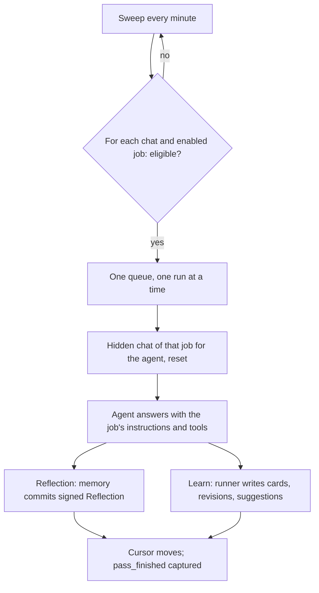
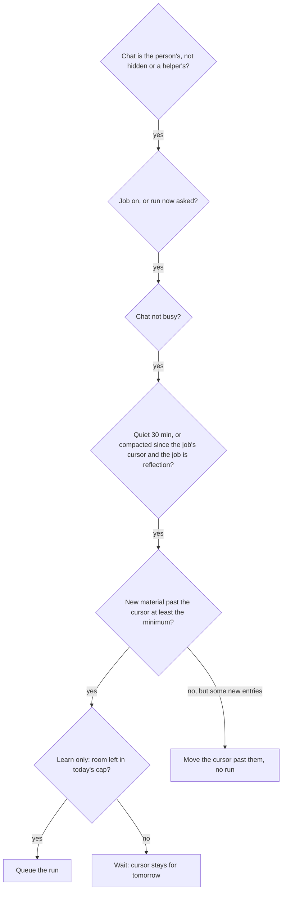

# Background Passes - Plan

## Goal Capsule

- **Objective:** The person reviews Learn cards on most days because the cards are worth keeping, and agents make fewer mistakes because their memory is kept current, with no attention asked of the person for either.
- **Means:** Reflection and Learn become two jobs on one background-pass runner in loki's daemon, with the same process and different objectives (KTD1).
- **Product authority:** This plan covers reflection and Learn only. Optimus (a managed agent that suggests harness improvements) and any other managed agents are not active scope. The Product Contract wins on behavior; the KTDs win on mechanism within it.
- **Execution profile:** Work on the current branch `deepak.mishra` and commit there, one commit per unit, naming only that unit's files. No new branch, push or PR.
- **Stop conditions:** Stop and ask if a unit would read or rewrite the person's existing cards, review history or memory (R17), or if the switch-over would start runs over old chats in bulk (KTD7).
- **Open blockers:** None.

---

## Product Contract

### Summary

Reflection and Learn run on one background-pass mechanism. It decides when to run, remembers where each chat was last read, runs the job as the agent itself in a hidden chat, and measures every run. Each job brings only its objective, tools, output and steering. Learn's objective narrows to concepts, principles and lasting domain knowledge, so it stops writing cards about one-off task details.

### Problem Frame

Learn has written 208 cards since 2026-09-10. 181 of them were never reviewed, nearly every review happened in the first two days, and the person deletes most of the cards they see, because they record one-off details from a task rather than anything worth remembering. No change to the Learn screen will bring the person back while the cards are like that.

Reflection keeps each agent's memory, but it only runs on a chat once 25 answers have built up since its last pass. A chat that ends sooner is never reflected on, which is likely why two of the three agents got one memory commit each in the week to 2026-10-10. The person has no view into how well reflection works and does not want one; it should simply work.

The two were built separately under Letta-era constraints. Learn was written in the mod because Letta owned the agent loop; reflection was ported into the daemon as a copy of Letta's design. Their different triggers, cursors, hidden chats, state files and settings pages follow from that history, not from their purposes. Since the 2026-10-10 cutover, loki owns the daemon, and neither constraint applies.

Product Contract preservation: changed: R3, AE3 — "before compaction" became "right after compaction", because loki keeps a chat's full history through compaction, so nothing is lost, and a run inside the compaction would hold the chat up (confirmed with the person at planning). Outstanding Questions resolved in place into KTD5, KTD6, KTD7; the mistakes signal moved to Scope Boundaries.

### Key Decisions

- **One mechanism, two independent jobs.** Each job reads a chat's new material with its own objective, so each can be tuned, measured and switched off on its own. (session-settled: user-directed — chosen over Learn working from reflection's memory changes, and over one run producing both outputs: the person wants the same process with different objectives.) Governs R1, R5.
- **One shared trigger: quiet and new, plus reflection on compaction.** Short chats get reflected on, and runs happen soon after the person stops. (session-settled: user-directed — chosen over one daily pass and over keeping today's triggers: today short chats are never reflected on.) Governs R2, R3.
- **Learn keeps concepts, principles and lasting domain knowledge only.** One-off task details were why the cards got deleted. (session-settled: user-directed — chosen over also keeping repeatable how-tos and decisions with their reasons.) Governs R11.
- **Both jobs stay invisible to the person.** Quality is the mechanism's job, measured for loki rather than shown. (session-settled: user-directed — chosen over a run log, a weekly digest, or inbox cards for notable runs.) Governs R7, R16.
- **Card form stays as it is until the cards are worth having.** The person was unsure whether flashcards, lessons or both are the right form, so only what gets picked changes now. (session-settled: user-approved — chosen over switching to lessons only or linking lessons to cards.) Governs R12.
- **A few cards a day at most, and existing cards untouched.** (session-settled: user-approved — chosen over keeping 25 a day and over a one-time cleanup of the 181 unreviewed cards.) Governs R13, R17.

### Requirements

**Shared mechanism**

- R1. Reflection and Learn run on one background-pass mechanism in the daemon, and a job is defined only by its objective, tools, output and steering.
- R2. A job runs on a chat once the chat has been quiet for about 30 minutes and holds real new material since that job's last pass in it; an exchange too small to hold anything (a thanks, an acknowledgement) does not count as new material.
- R3. Reflection also runs on a chat as soon as its context has been compacted and the chat is not busy, over the material it has not yet read.
- R4. Each job remembers, per chat, where it last read, so it reads every stretch once and skips none.
- R5. A run works as the agent itself (its model, persona and memory) in a hidden chat that never appears as a chat, a desk or an inbox card.
- R6. A run never starts while its chat is busy and never slows the person's own turns.
- R7. Every run is measured in loki's telemetry: job, agent, chat, how much it read, what it changed, duration, cost and outcome. None of it is shown to the person.
- R8. Both jobs hold to one quality bar, durable rather than one-off, and a run that finds nothing durable changes nothing.

**Reflection job**

- R9. Reflection's objective is to keep the agent's memory true and useful for its future chats: what it learned about the person, their work and preferences, decisions made, and what to do differently, editing what is there before adding.
- R10. Reflection changes memory only through the memory tools, its commits stay signed "Reflection" and reversible in git, and it is on by default.

**Learn job**

- R11. Learn's objective is concepts and principles the person met, and domain knowledge that stays true for months; one-off task details, passing state and the mechanics of the agent's own work are excluded.
- R12. Learn's output keeps its current form: cards and learning suggestions in the Learn section, including revisions to cards the person keeps failing.
- R13. Learn writes at most about 5 new cards a day across all agents, as a ceiling rather than a target.
- R14. Deleted cards and dismissed learning suggestions keep steering Learn as examples of what not to write.
- R15. Learn is off by default on a new install, and this Mac's current setting carries over.

**Settings and existing data**

- R16. Each job's settings shrink to on/off, plus Learn's daily cap; existing settings carry over, and nothing else about the jobs is exposed.
- R17. Existing cards, review history and memory are left as they are.

### Acceptance Examples

- AE1. **Covers R2, R9.** **Given** a chat that ended after 12 answers, **when** it has been quiet for 30 minutes, **then** reflection runs on it once (today it never would).
- AE2. **Covers R2.** **Given** a chat whose only new exchange since the last pass is "thanks", "you're welcome", **when** it goes quiet, **then** neither job runs on it.
- AE3. **Covers R3, R6.** **Given** a long busy chat that gets compacted, **when** its turn ends, **then** reflection reads the not-yet-reflected material without waiting for 30 quiet minutes and without delaying the person's next turn.
- AE4. **Covers R8, R11.** **Given** a stretch that is all task detail (which file was edited, which command failed), **when** Learn runs on it, **then** it writes no card, and its cursor moves past the stretch.
- AE5. **Covers R13, R4.** **Given** Learn has written 5 cards today, **when** another chat settles, **then** no card is written until tomorrow, and that chat's material is read for cards then rather than skipped.
- AE6. **Covers R16, R4.** **Given** Learn is switched off for a week and back on, **when** it next runs, **then** it starts from where it last stopped in each chat.

### Success Criteria

- The person reviews cards on most days (at least 5 days in 7), read from review history in `~/.loki/recall/schedule/`; today there have been 3 reviews since 2026-09-13.
- Most new cards survive their first review rather than being deleted (cards written after the switch, against `~/.loki/recall/rejected/`).
- Agents make fewer mistakes. No signal measures this yet; see Scope Boundaries.

### Scope Boundaries

**Deferred for later**

- Optimus and any other managed agent, including reading across agents.
- A signal for "agents make fewer mistakes" (how often the person corrects an agent, or an agent asks for what its memory should hold). The per-run telemetry here (R7) is what it would build on.
- Changing the card form (lessons only, or lessons linked to cards).
- Learn working from reflection's memory changes, the fallback if new cards are still deleted at a high rate.
- Any change to how due cards reach the person.

**Not in scope**

- A run log, digest or inbox card about background runs.
- Re-judging or cleaning up existing cards.
- Catching up old chats a job never read (KTD7): old short chats stay unreflected. Revisit only if the person asks for a backlog pass.
- A pass-level timeout or retry policy beyond "a failed run leaves the cursor, and the next sweep tries again" (KTD3); add one only if telemetry shows runs hanging.

### Dependencies / Assumptions

- Per-turn telemetry (`daemon/telemetry.ts`, commit 7f57a23) already measures reflection and Learn turns by origin; R7 builds on it.
- Assumed: 30 minutes of quiet and 300 characters of new transcript text (Learn's current `MIN_NEW_CHARS`) are the starting values, held as constants in one place.
- Assumed: more reflection runs than today cost little next to the person's own turns; R7 makes this checkable.

### Sources / Research

- `daemon/reflection.ts` — today's reflection: `stepCount: 25` trigger after a 10-minute in-memory quiet timer, hidden `reflection-<chat>` chats reset each run, memory tools only, settings in `~/.loki/state/reflection.json`, cursor `reflected_through` in `~/.loki/reflection/<agent>/<chat>/state.json`.
- `mod/recall-worker.ts`, `mod/recall.ts` — today's Learn worker on a mod timer: one ask per agent over packed slices of many chats, replays of failing cards, `dailyCap: 25`, off by default, one persistent `recall-<agent>` writer chat with full tools, compacted after each ask, cursors and settings together in `~/.loki/recall/worker.json`.
- `core/recall/extract.ts` — Learn's prompt and answer parser, already pure; `core/recall/model.ts` has `writerChatId` and `isWriterChat`.
- `daemon/chats.ts` — `ChatProjection` keeps every entry through compaction and emits a `compaction` entry kind after the fact; `since()` returns rows and the entry-count cursor both jobs use.
- `daemon/chat-backend.ts` — the busy signal (`LiveDoc` run), `ask()`, `/reflect`, and the reflection settings frames.
- `daemon/mods/api.ts` — `compact_end` is declared but never emitted; no mod API change is needed because the daemon already imports mod code.
- `test/reflection-pass.test.ts` — the end-to-end pattern: real stores on `MemoryStorage`, pi-ai's faux provider, short real timers.

---

## Planning Contract

### Key Technical Decisions

- KTD1. **One runner in the daemon, jobs as plain definitions.** A new `daemon/passes.ts` owns the sweep, eligibility, queue, hidden chat, cursors and measuring; a job supplies its name, instructions, tools, how to build its input from new material, and what to do with the answer. Learn's runner leaves the mod; the mod keeps the Learn files, frames, lessons and screens. Reflection's and Learn's pure parts stay in `core/`. Governs R1.
- KTD2. **A one-minute sweep, not per-chat timers.** Each minute the runner scans the chat projection for chats whose last entry is at least 30 minutes old and holds enough new material for some enabled job. Today's in-memory quiet timers are lost on every daemon restart; a sweep re-derives everything from stored entries, so a restart loses nothing. Governs R2, R4.
- KTD3. **One run at a time across all agents.** Eligible runs go on one queue, so a burst of quiet chats can't burst cost or rate limits. A failed run reports the error and leaves the cursor, so the next sweep tries again. Governs R6, R7.
- KTD4. **Compaction is a "run now" flag, read after the fact.** A committed `pi.compaction` entry marks the chat for reflection, and the next sweep runs it as soon as the chat is not busy, skipping the 30-minute wait. pi-durable's `beforeCompact` hook runs inside the compaction task, so a run there would stall the chat; the projection keeps all entries, so reading afterwards loses nothing. Governs R3.
- KTD5. **One hidden chat per job per agent, reset before each run.** Ids stay `reflection-<agent>` and `recall-<agent>` (today's `writerChatId`), so the checks keyed on those prefixes keep working: the "Reflection" commit author, the mod hiding writer chats, telemetry's origin. Resetting replaces Learn's compact-after-ask and reflection's one-chat-per-chat. Governs R5.
- KTD6. **Learn runs with no tools and one chat per run.** It answers in the existing JSON shape and the runner writes cards, revisions and learning suggestions through the existing store. Packing many chats into one ask (`packSlices`, `scoreStretch`) goes; up to five failing cards of the same agent ride along for revision, as today. Governs R11, R12, R14.
- KTD7. **Switch-over keeps today's cursors, and a chat a job never read starts from now.** Reflection's `reflected_through` and Learn's card cursors carry over; a chat with no cursor for a job (including Letta-imported reflection state without `reflected_through`) is seeded at its current length. This avoids a burst of runs over 70-odd old chats on first start. (session-settled: user-approved — chosen over reading every old chat once: no cost burst, at the price of old short chats never being reflected on.) Governs R4, R17.
- KTD8. **Settings and cursors move to daemon-owned files.** Settings go in `~/.loki/state/passes.json` (`reflection.enabled`, `learn.enabled`, `learn.dailyCap`) and cursors plus Learn's daily count in `~/.loki/state/pass-cursors.json`, both written only by the daemon. Today `worker.json` mixes settings and cursors and is written by both the mod's frames and the worker without a lock. The old files are read once for migration and left in place. Governs R15, R16.
- KTD9. **Learn's cap of 25, the old default, becomes 5; any other value is kept.** Learn's separate model and sweep-interval settings are dropped, because it runs on the agent's own model (R5). "Run now" and `/reflect` stay, and both run even when the job is off. (session-settled: user-approved — chosen over keeping the model and interval settings.) Governs R13, R16.
- KTD10. **A run is marked by its request id, and reports what it wrote.** Each run submits with `pass:<job>:<chat>:<entries>`, which telemetry maps to the job's origin. When the run ends, the runner captures one `pass_finished` event: job, agent, chat, entries read, items written (memory commits, or cards, revisions and suggestions), outcome (`changed`, `nothing`, `capped` or `failed`), duration and turn id, joined to the turn's `turn_finished` for tokens and cost. Governs R7.

### High-Level Technical Design

How a run happens, from sweep to outputs:

When a chat is eligible for a job (each check must pass, in this order):

### Assumptions

- The person's memory repos stay git repos with the existing memory tools; nothing here changes how memory is written.
- pi-durable's `reset()` on a hidden chat clears its context without losing the agent's persona or memory sections, as reflection relies on today.

### Sequencing

U1 first (the runner and its state files), then U2 (migration) before any job runs on real data. U3 and U4 move the jobs onto the runner and can go in either order. U5 (settings surfaces) follows U2. U6 (telemetry) follows U1. U7 (docs) goes last.

---

## Implementation Units

### U1. Background-pass runner and its state

**Goal:** One runner in the daemon that sweeps, decides eligibility, queues, runs a job in its hidden chat as the agent, and moves cursors.

**Requirements:** R1, R2, R4, R5, R6, R8; KTD1, KTD2, KTD3, KTD5, KTD8.

**Dependencies:** None.

**Files:**
- `daemon/passes.ts` (new: runner and job interface)
- `daemon/passes-state.ts` (new: `passes.json` settings and `pass-cursors.json` cursors and daily count, atomic writes)
- `daemon/main.ts` (construct, start the sweep after stores attach, stop it on shutdown)
- `test/passes.test.ts` (new)

**Approach:**
1. A job definition carries: name, hidden-chat id for an agent, instructions, tool filter, `build(newMaterial, agent)` returning the prompt or nothing, and `apply(answer, run)` returning what it wrote.
2. Each sweep walks the chat projection and applies the eligibility checks in the High-Level Technical Design order. It skips hidden chats and helper agents (`isSubagent`) and uses the `LiveDoc` run as the busy signal.
3. New material is the projection's `since(chat, agent, cursor)` rendered with today's `formatTranscript`; under the minimum, the cursor moves silently (AE2).
4. A run configures the job's hidden chat for the agent (instructions, narrowed tools, the agent's model), resets it, submits with the request id from KTD10, waits, and passes the last answer to `apply`. On success the cursor moves to the entry count read; on failure it stays and the error is reported.
5. `runNow(job, agent, chat)` bypasses the on/off check and the quiet wait, but not the busy check. `/reflect` and Learn's "Run now" use it.
6. Constants live at the top of `daemon/passes.ts`: 30 minutes quiet, a one-minute sweep, a 300-character minimum.

**Patterns to follow:** `daemon/reflection.ts` for the hidden-chat configure/reset/submit/wait cycle and tool narrowing; `daemon/schedule.ts` for a minute-tick loop that is stopped on shutdown.

**Test scenarios:**
- Covers AE1. A chat with 12 answers whose last entry is older than the quiet window gets exactly one run of an enabled job, and its cursor ends at the entry count.
- Covers AE2. A chat whose only new text is under the minimum gets no run, and its cursor moves past it.
- A chat with a running turn is skipped, then picked up on a later sweep once idle.
- Hidden chats, helper agents' chats and a disabled job produce no runs.
- Two eligible chats run one after the other, never at once.
- A run whose model call fails leaves the cursor unchanged, and the next sweep retries it.
- A daemon restart (a new runner over the same stores and state files) neither reruns a finished stretch nor loses an unread one.
- `runNow` runs a disabled job on a quiet chat at once.

**Verification:** The runner's tests pass on `MemoryStorage` with the faux provider, and `daemon/main.ts` starts and stops it cleanly.

### U2. Switch-over from today's settings and cursors

**Goal:** On first start after this change, carry settings and cursors over without rereading, skipping or bursting.

**Requirements:** R4, R15, R16, R17; KTD7, KTD8, KTD9.

**Dependencies:** U1.

**Files:**
- `daemon/passes-state.ts` (migration on first load when `passes.json` is absent)
- `test/passes-migrate.test.ts` (new)

**Approach:**
1. Reflection: `trigger: "off"` becomes off, and any other trigger becomes on. Each chat's `reflected_through` becomes its reflection cursor.
2. Learn: `enabled` carries over. `dailyCap` 25 becomes 5 and any other value is kept. `cursors` (the card cursors) become Learn cursors; `leadCursors` are dropped. Today's `written` count carries over.
3. Any chat with no cursor for a job is seeded at its current entry count (KTD7). This needs the stores attached, so migration runs after the first projection load and before the first sweep.
4. The old files are read only; they stay on disk untouched.

**Test scenarios:**
- Reflection settings with `trigger: "off"` migrate to reflection off; with `step-count` to on.
- Learn's `dailyCap: 25` migrates to 5; `dailyCap: 8` stays 8; `enabled: true` stays on.
- A reflection state file with `reflected_through: 40` gives cursor 40; one without it (Letta-imported) gives the chat's current length.
- A chat with no state for either job gets both cursors at its current length, and the first sweep after migration starts no run on it.
- A second start with `passes.json` present does not migrate again.
- The old `reflection.json`, reflection `state.json` files and `worker.json` are unchanged after migration.

**Verification:** Running the migration against a copy of a real `~/.loki` state layout yields seeded cursors and starts no runs on the first sweep.

### U3. Reflection as a job

**Goal:** Reflection runs on the runner with its objective sharpened to the durable bar.

**Requirements:** R3, R8, R9, R10; KTD4, KTD5.

**Dependencies:** U1, U2.

**Files:**
- `daemon/reflection.ts` (becomes the reflection job definition; its timers, step counting and state files go)
- `daemon/passes.ts` (compaction flag)
- `daemon/chat-backend.ts` (`/reflect` through `runNow`)
- `daemon/memory.ts` (the "Reflection" author check, kept on the `reflection-` prefix)
- `test/reflection-pass.test.ts` (rewritten onto the runner)

**Approach:**
1. Instructions keep today's text and add the durable bar (R8): keep what stays true and will matter in later chats; leave out one-off task details; change nothing when nothing qualifies.
2. Tools stay the memory tools only.
3. A committed compaction entry sets a per-chat flag the eligibility check reads (KTD4). The flag clears when the run succeeds.
4. The hidden chat becomes `reflection-<agent>`. The old per-chat hidden chats are left as they are.

**Patterns to follow:** today's `daemon/reflection.ts` run cycle and `MEMORY_TOOLS`.

**Test scenarios:**
- Covers AE1. A quiet 12-answer chat gets a reflection run whose memory commit is authored "Reflection".
- Covers AE3. A compacted chat is reflected on as soon as its turn ends, without waiting for the quiet window.
- A reflection answer with no memory tool calls leaves memory unchanged and moves the cursor.
- `/reflect` runs with reflection switched off.
- The reflection hidden chat never appears in the chat list or inbox.

**Verification:** The rewritten end-to-end test passes, and on this Mac a quiet short chat gets a "Reflection" commit within a sweep of the quiet window passing.

### U4. Learn as a job

**Goal:** Learn runs on the runner per chat, with its objective narrowed and its cap lowered.

**Requirements:** R8, R11, R12, R13, R14; KTD6, KTD9.

**Dependencies:** U1, U2.

**Files:**
- `daemon/learn.ts` (new: the Learn job definition, using `mod/recall.ts`'s store for reads and writes)
- `core/recall/extract.ts` (prompt rewritten around the new objective; packing helpers removed)
- `mod/recall-worker.ts` (the worker and its tick go; what lessons still need stays)
- `mod/index.ts` (stop constructing the worker and its timer)
- `test/learn-job.test.ts` (new, replacing most of `test/recall-worker.test.ts`)
- `test/recall-extract.test.ts`

**Approach:**
1. The prompt states the objective: concepts and principles the person met, and domain knowledge that stays true for months. It names the exclusions (one-off task details, passing state, the agent's own work mechanics) and says an empty answer is right when nothing qualifies (R8, R11).
2. Each run gets one chat's new material, up to five of the agent's failing cards with their source replays, overlapping existing cards, the rejected pile and dismissed suggestions (R14).
3. `apply` writes through the existing store as today: new cards up to the cap's room, revisions keep `previous[]`, suggestions are deduped against open, started and dismissed ones. The daily count lives in `pass-cursors.json`.
4. When the cap is full, Learn is not eligible, and its cursor stays for tomorrow (AE5).
5. Tools: none. The hidden chat is `recall-<agent>`.

**Patterns to follow:** today's `RecallWorker` write path (dedupe with `similarFront`, `store.add`, `store.edit`, `store.addLead`) and `parseExtraction`.

**Test scenarios:**
- Covers AE4. An answer with no cards for a task-detail stretch writes nothing, and the cursor moves past it.
- Covers AE5. With 5 cards written today, a newly settled chat is not run, and it is run the next day from the same cursor.
- A card whose front matches a rejected card is not written.
- A failing card from another chat of the same agent comes back revised, with its old wording kept in `previous[]`.
- Suggestions dedupe against dismissed ones and respect the open-pile limit.
- An unparseable answer writes nothing, reports the error and leaves the cursor.
- The prompt names the new objective and the exclusions (a check on the prompt text).

**Verification:** Learn tests pass, the mod no longer runs its own timer, and the Learn section still lists cards and suggestions.

### U5. Settings surfaces

**Goal:** Each job shows only on/off, plus Learn's cap, and both read and write the daemon's settings.

**Requirements:** R15, R16; KTD8, KTD9.

**Dependencies:** U2.

**Files:**
- `core/frames.ts`, `core/attention/protocol.ts`, `core/attention/chat-client.ts` (reflection settings frames become pass settings: per job `enabled`, Learn `dailyCap`, plus run now)
- `mod/frames/chat.ts`, `mod/frames/recall.ts`, `mod/frames/agents.ts`, `mod/reflection.ts` (serve from the daemon; drop the step counters)
- `daemon/chat-backend.ts` (settings get/set and run now on the runner)
- `app/src/agents/ReflectionPage.tsx` (an on/off switch and a line on what reflection does)
- `app/src/recall/RecallParts.tsx` (`WorkerStrip`: on/off, cards a day, run now; drop sweep interval and model; rewrite the intro copy that says "every ten minutes")
- `core/recall/model.ts` (`WorkerStatus` without `tickMinutes` and `model`)
- `test/frames.test.ts`, `test/frames-agents.test.ts`, `test/recall.test.ts`

**Approach:**
1. One settings shape for both jobs, owned by the daemon (KTD8). The mod's Learn frames forward to it instead of writing `worker.json`.
2. The Reflection page loses its trigger and step-count controls and its per-chat counters. That page was built for Letta's reflection settings, and the person asked for nothing about the jobs to be shown beyond on/off (R16).

**Test scenarios:**
- Turning reflection off through the frame stops sweeps from running it, while `/reflect` still works.
- Setting Learn's cap to 3 through the frame limits the next day's cards to 3.
- "Run now" from the Learn frame runs Learn on settled chats with new material, even when Learn is off.
- The settings frames reject an unknown job or a negative cap.

**Verification:** Both screens show only the agreed controls, and changing them reaches `~/.loki/state/passes.json`.

### U6. Run telemetry

**Goal:** Every run is measured by job, with what it wrote, and none of it is shown to the person.

**Requirements:** R7; KTD10.

**Dependencies:** U1.

**Files:**
- `daemon/telemetry.ts` (`originOf` reads `pass:<job>:` request ids, keeping the old prefixes for history)
- `daemon/passes.ts` (capture `pass_finished`)
- `core/analytics.ts` (event catalogue entry; a background-pass line in the report's harness section: runs, outcomes and cost per job)
- `test/telemetry.test.ts`, `test/analytics.test.ts`

**Test scenarios:**
- A reflection run's turn gets origin `reflection` and a Learn run's turn gets origin `recall`, from the request id.
- A run that wrote 2 cards and 1 revision captures `pass_finished` with those counts, outcome `changed`, and the run's turn id.
- A run that wrote nothing captures outcome `nothing`; a failed run captures `failed`; a capped day captures no run.
- The report's harness section shows per-job runs and cost from sample events.

**Verification:** After a run on this Mac, `events.jsonl` holds a `pass_finished` line (properties checked by name, never content) and a matching `turn_finished`.

### U7. Docs

**Goal:** The docs describe one background-pass mechanism and the new Learn objective.

**Requirements:** R1, R11.

**Dependencies:** U3, U4, U5.

**Files:**
- `docs/architecture.md` (the reflection and Learn paragraphs)
- `docs/learn.md`, `docs/manual.md`
- `GLOSSARY.md` (a "Background pass" entry)

**Test expectation:** none — documentation only.

**Verification:** No doc mentions the 25-answer trigger, the ten-minute sweep, Learn's model or interval settings, or the mod running Learn.

---

## Verification Contract

| Check | Command or step | Applies to |
|---|---|---|
| Unit and integration tests | `bun test` | U1–U6 |
| Node test leg | `bun run test:node` | all |
| Types | `bun run typecheck` | all |
| Lint | `bun run lint` | all |
| App and mod bundles | `bun run build:app`, `bun run build:mod` | U5 |
| Live switch-over | Restart the daemon on this Mac; `~/.loki/state/passes.json` and `pass-cursors.json` appear, the old files are unchanged, and the first sweep starts no runs on old chats | U2 |
| Live run | A short chat left quiet for 30 minutes gets a "Reflection" commit and a `pass_finished` event; with Learn on, a settled chat yields at most the capped number of cards | U3, U4, U6 |

## Definition of Done

- Every unit's test scenarios exist and pass, and every command in the Verification Contract passes.
- The live switch-over and live run checks pass on this Mac without rereading old chats or touching existing cards, review history or memory (R17).
- No timer, step counter, packing helper or settings control from the old reflection and Learn paths remains, and no abandoned code from discarded attempts is left in the diff.
- Each unit is committed on `deepak.mishra` with only its own files named.
